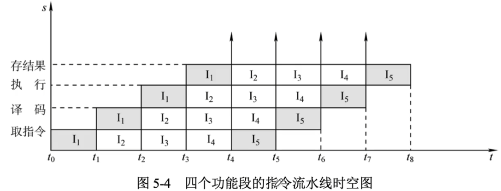
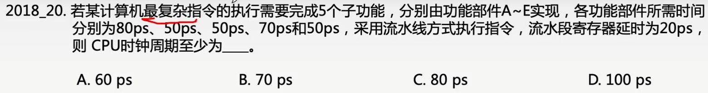
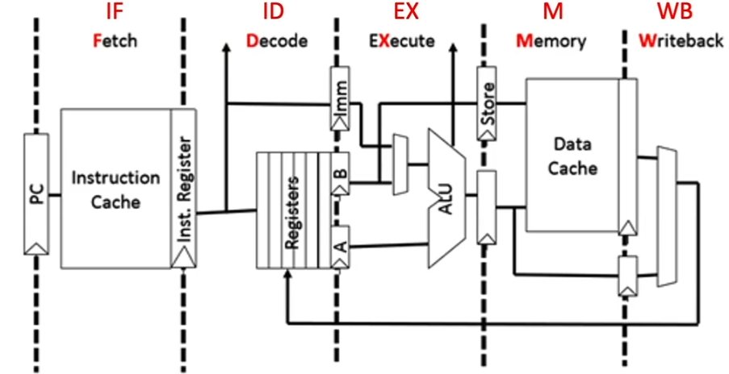
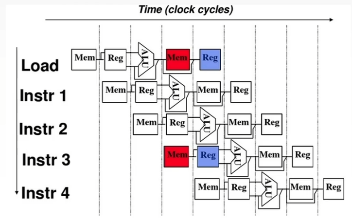
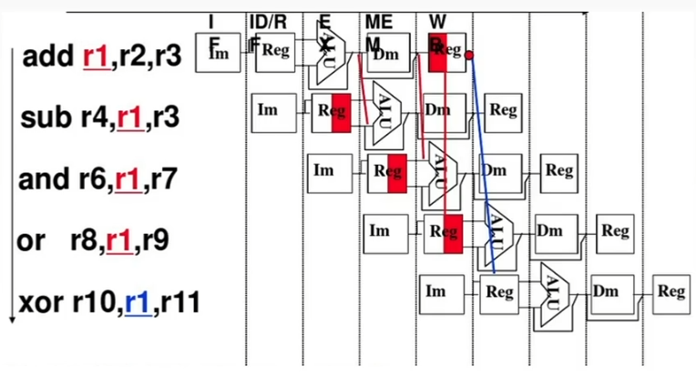
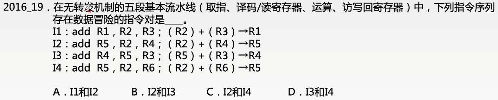
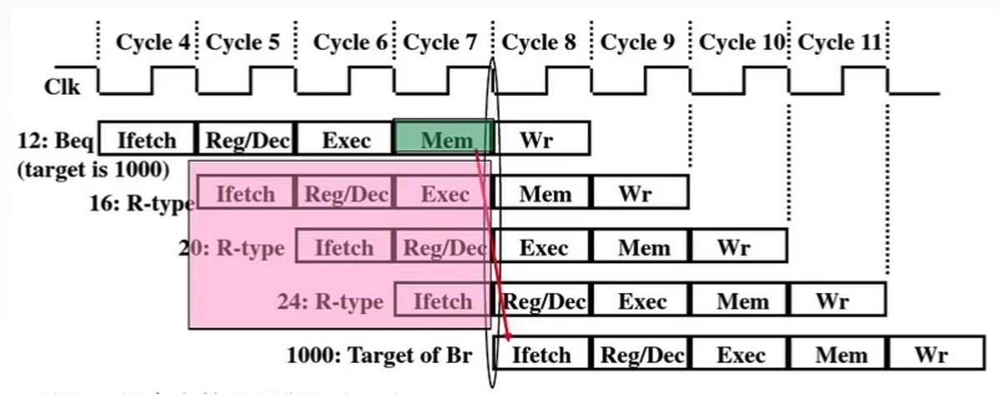
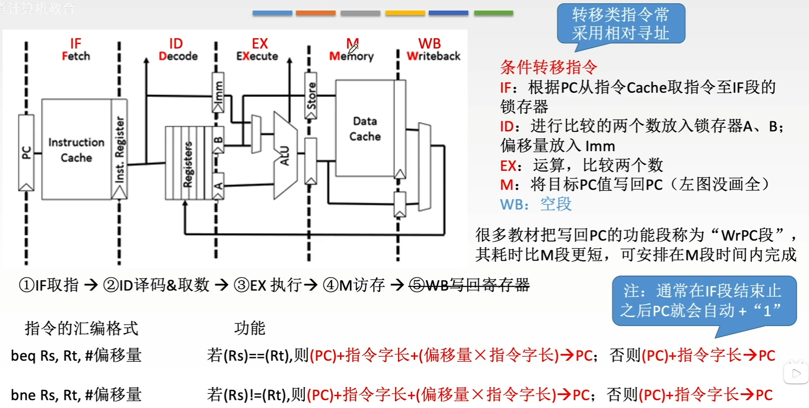

# 指令流水线

### 指令流水线

将一条指令的执行过程分成多个子过程，每个子过程与其他子过程通过各自独立的功能部件并行执行。

下图所示为四个功能段的指令流水线的时空图。

流水线的每个子过程由专用的功能段实现，各功能段所需时间应尽量相等。否则，时间长的功能段将成为流水线的瓶颈。

### 五段式指令流水线

流水线每一个功能段部件后面都要有一个缓冲寄存器，或称为锁存器，其作用是保存本流水段的执行结果，提供给下一流水段使用。

理想情况下，每个机器周期（功能段）只消耗一个时钟周期。

### 流水线阻塞的因素

- 结构相关

  由于多条指令在同一时刻争用同一资源而形成的冲突称为结构相关。

  解决办法有以下两种：

  1. 前一指令访存时，使后一条相关指令（以及其后续指令）暂停一个时钟周期。
  2. 单独设置数据存储器和指令存储器，使两项操作各自在不同的存储器中进行，这属于资源重复配置。

- 数据相关

  数据相关指在一个程序中，存在必须等前一条指令执行完才能执行后一条指令的情况，那么这两条指令即为数据相关。

  解决办法有以下两种：

  1. 把遇到数据相关的指令及其后续指令都暂停一至几个时钟周期，直到数据相关问题消失后再继续执行。

  2. 设置相关专用通路，即不等前一条指令把计算结果写回寄存器组，下一条指令也不再读寄存器组，而是直接把前一条指令的ALU的计算结果作为自己的输入数据开始计算过程，使本来需要暂停的操作可以继续执行，称之为数据旁路技术。

     

- 控制相关（控制冲突）

  当流水线遇到转移指令和其他改变PC值的指令而造成断流时，会引起控制相关。

  解决办法由以下几种：

  1. 尽早判断转移是否发生，今早生成转移目标地址。
  2. 预取转移成功和不成功两个控制流方向上的目标指令。
  3. 加快和提前形成条件码。
  4. 提高转移方向的猜准率。

  

### 条件转移指令的执行过程

### 命题重点

1. CPU的组成，CPU内部寄存器的特点，用户可见与不可见寄存器。
2. 指令的执行过程、周期划分，指令周期的数据流。
3. 数据通路，能根据指令功能和节拍安排写出实现相应功能的流程和控制信号。
4. 硬布线控制器的原理，微操作命令安排。
5. 微程序控制器的工作原理，相关的基本概念，微指令的字段直接编码方式，微指令的格式，微操作命令及节拍安排，微程序控制器和硬布线控制器的特点。
6. 指令流水线的原理、特点，影响指令流水线的因素及解决方法，特别是数据相关，解决数据相关有两种方法：①推迟后续指令；②数据旁路技术。