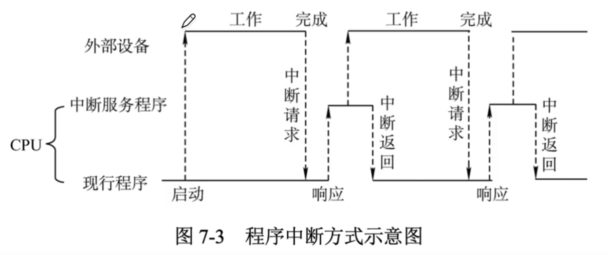
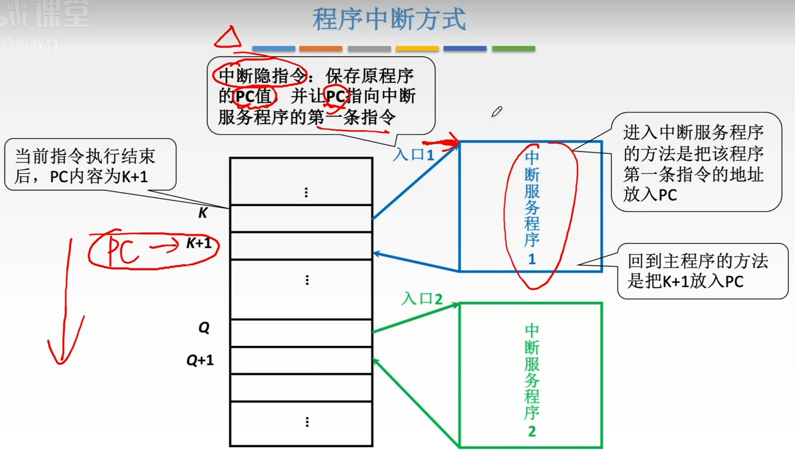
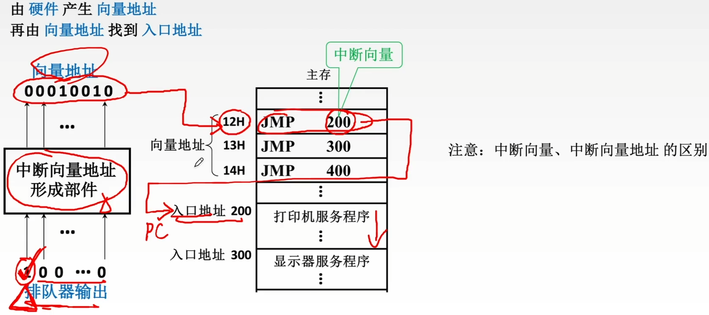
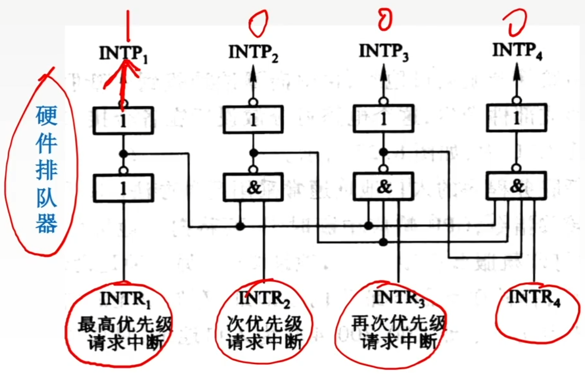
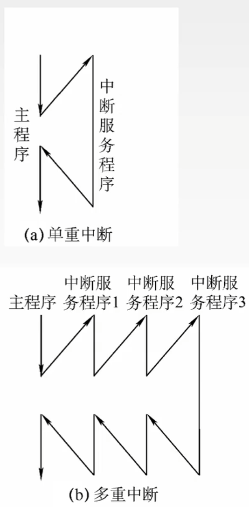
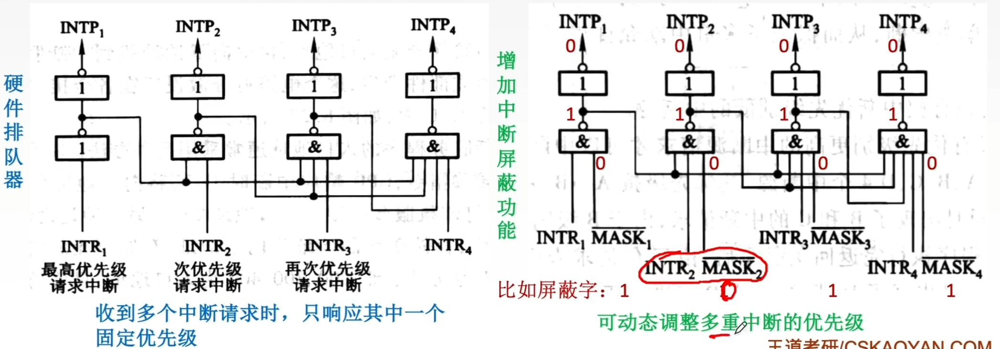

# 程序中断方式

### 程序中断方式

程序中断是指在计算机执行现行程序的过程中，出现某些急需处理的异常情况或特殊请求，CPU暂时中止现行程序，而转去对这些异常情况或特殊请求进行处理，在处理完毕后CPU又自动返回到现行程序的断点处继续执行。

### 中断的分类

根据中断源的类别，可把中断源分为内中断和外中断两种。

| 中断类型         | 定义                          | 列举                                                         |
| ---------------- | ----------------------------- | ------------------------------------------------------------ |
| 外中断 中断 | CPU和内存以外的部件引起的中断 | I/O设备发出的I/O中断 外部信号的中断（如用户按Esc键） 定时器引起的时钟中断（如时间片中断） |
| 内中断 异常 | CPU和内存内部产生的中断       | 地址非法、校验错、页面失效、存取访问控制错、算术操作溢出、数据格式非法、除数为零、非法指令、用户程序执行特权指令、用户态到内核态的切换 |

**Key**：是否与当前执行的指令有关

**2016_22** 异常是指令执行过程中在处理器内部发生的特殊事件，中断是来自处理器外部的请求事件。下列关于中断或异常情况的叙述中，错误的是 A

A “访存时缺页”属于中断

B “整数除以0”属于异常

C “DMA传送结束”属于中断

D “存储保护错”属于异常

### 中断隐指令

1. 关中断。在中断服务程序中，为了保护中断现场（即CPU主要寄存器中的内容）期间不被新的中断所打断，必须关中断，从而保证被中断的程序在中断服务程序执行完毕之后能接着正确地执行下去。
2. 保存断点。为了保证在中断服务程序执行完毕后能正确地返回到原来的程序，必须将原来程序的断点（即程序计数器（PC）的内容）保存起来。可以存入堆栈，也可以存入指定单元。
3. 引出中断服务程序。实质就是查找出中断服务程序的入口地址并传送给程序计数器（PC）。常用的查找方法是硬件向量法，通过硬件产生中断向量地址（中断类型号），而中断向量地址中存放着中断服务程序的入口地址。

### 中断处理过程 硬件向量法

### 单重中断与多重中断

多重中断和单重中断的区别在于中断在保护现场之后需要开中断，以便在执行某个中断服务程序的过程中可以响应级别更高的中断请求，而在恢复现场之前又要关中断，以保证恢复现场的过程中不能被新的中断请求打断。

|              | 多重中断                                                     | 单重中断                                                     |
| ------------ | ------------------------------------------------------------ | ------------------------------------------------------------ |
| 中断隐指令   | 关中断 保存断点（PC）及旧PSW 取中断服务程序入口地址及新PSW | 关中断 保存断点（PC）及旧PSW 取中断服务程序入口地址及新PSW |
| 中断服务程序 | 保护现场 送新屏蔽字 开中断                         | 保护现场                                                     |
|              | 服务处理 （允许响应更高级别请求）                       | 服务处理 （不允许响应更高级别请求）                     |
|              | 关中断 恢复现场及原屏蔽字 开中断 中断返回     | 恢复现场 开中断 中断返回                           |

|              | 单重中断         | 多重中断         |
| ------------ | ---------------- | ---------------- |
| 中断隐指令   | 关中断           | 关中断           |
|              | 保存断点（PC）   | 保存断点（PC）   |
|              | 送中断向量       | 送中断向量       |
| 中断服务程序 | 保护现场         | 保护现场和屏蔽字 |
|              | \                | 开中断           |
|              | 执行中断服务程序 | 执行中断服务程序 |
|              | \                | 关中断           |
|              | 恢复现场         | 恢复现场和屏蔽字 |
|              | 开中断           | 开中断           |
|              | 中断返回         | 中断返回         |

### 中断屏蔽技术

中断屏蔽技术主要用于多重中断，CPU要具有多重中断的功能，须满足下列条件。

1. 在中断服务程序中提前设置开中断指令
2. 优先级别高的中断源有权中断优先级别低的中断源

每个中断源都有一个屏蔽触发器，1表示屏蔽该中断源的请求，0表示可以正常申请，所有屏蔽触发器组合在一起，便构成一个屏蔽字寄存器，屏蔽字寄存器的内容称为屏蔽字。

**2018_22** 下列关于外部I/O中断的叙述中，正确的是 C

A 中断控制器按所接受中断请求的先后次序进行中断优先级排队

B CPU响应中断时，通过执行中断隐指令完成通用寄存器的保护

C CPU只有在处于中断允许状态时，才能响应外部设备的中断 请求

D 有中断请求时，CPU立即暂停当前指令执行，转去执行中断服务程序

**2017_22** 下列关于多重中断系统的叙述中，错误的是 B

A 在一条指令执行结束时响应中断

B 中断处理期间CPU处于关中断状态

C 中断请求的产生于当前指令的执行无关

D CPU通过采样中断请求信号检测中断请求

**2018_43** 假定计算机的主频为500MHz，CPI为4。现有设备A和B，其数据传输率分别为2MB/s和40MB/s，对应I/O接口中各有一个32位数据缓冲寄存器。请回答下列问题，要求给出计算过程。

（1）若设备A采用定时查询I/O方式，每次输入/输出都至少执行10条指令。设备A最多间隔多长时间查询一次才能不丢失数据？CPU用于设备A输入/输出的时间占CPU总时间的百分比至少是多少？
$$
\frac{32bit}{2MB} = 2\mu s
$$

$$
\begin{align}
\frac{1s}{2\mu s} &= 5*10^5\\
5*10^5*10*4 &= 2*10^7\\
\frac{2*10^7}{500M} &= 4%
\end{align}
$$

（2）在中断I/O方式下，若每次中断响应和中断处理的总时钟周期数至少为400，则设备B能否采用中断I/O方式？为什么？
$$
\frac{4B}{40MB/s}<400*\frac{1}{500M}s
$$
（3）若设备B采用DMA方式，每次DMA传送的数据块大小1000B，CPU用于DMA预处理和后处理的总时钟周期为500，则CPU用于设备B输入/输出的时间占CPU总时间的百分比最多是多少？