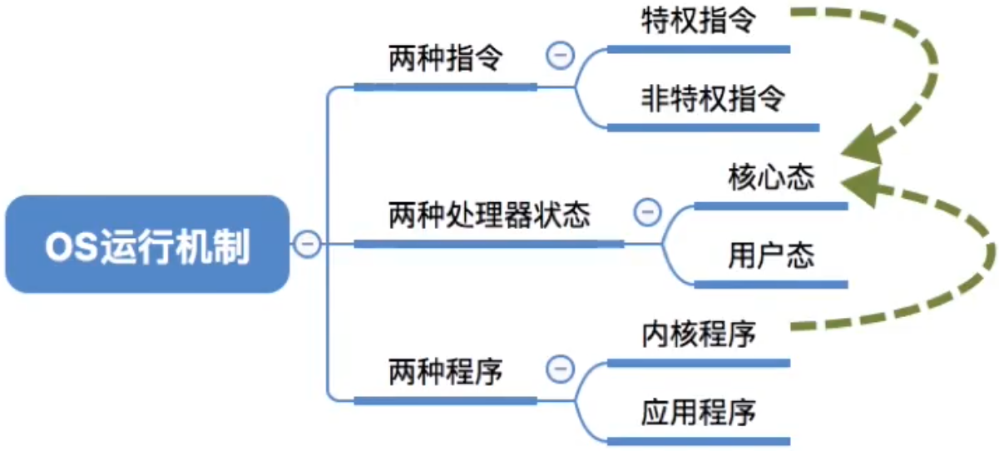
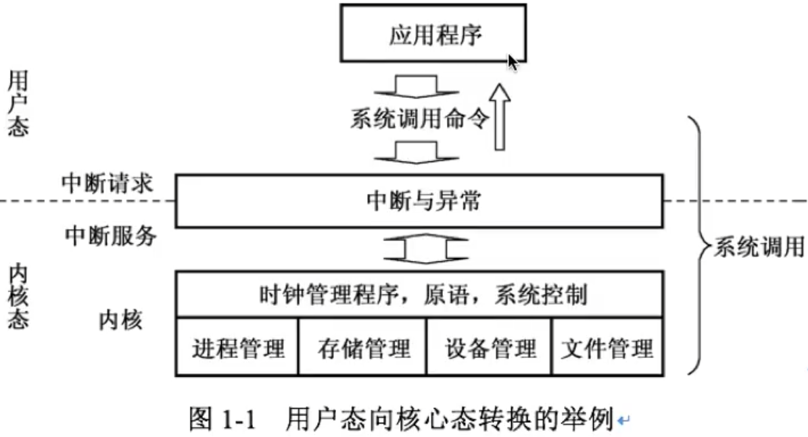

# 用户态与核心态

#### 用户态与核心态

在计算机系统中，通常运行着两类程序：系统内核程序和应用程序，为了保证内核程序不被应用程序破坏，为计算机设置了两种状态：核心态（也成为管态）和用户态（也成为目态）。内核程序在核心态运行，而应用程序只能在用户态运行。

在CPU上会执行两种程序，内核程序和普通应用程序。正在执行内核程序，说明此时是操作系统正在控制CPU。正在执行应用程序，说明此时是应用程序正在控制CPU。

核心态与用户态的切换，本质上是操作系统与普通应用程序对CPU控制权的切换。

下面列举一些由用户态转向核心态的例子：

1. 用户程序要求操作系统的服务，即系统调用，如图所示

   

2. 发生一次中断

3. 用户程序产生了一个错误状态

4. 用户程序中企图执行一条特权指令