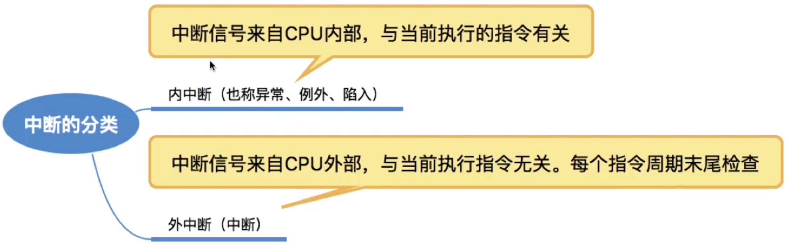

# 中断、异常

中断的本质作用：将CPU的控制权交给操作系统，因此中断发生后CPU状态需要转为核心态。

### 中断处理和子程序调用的区别

子程序调用是程序设计者事先在主程序中安排一条调用指令CALL，子程序的调用时间是固定的。主程序调用子程序的过程完全属于软件处理过程，不需要专门的硬件电路。

中断与子程序调用的区别

| 调用类型 | 中断                         | 子程序调用                 |
| -------- | ---------------------------- | -------------------------- |
| 入口地址 | 由中断隐指令根据中断向量得到 | 由调用程序根据寻址方式得到 |
| 保存环境 | 保存PC、PSW、通用寄存器      | 保存PC、通用寄存器         |
| 进程状态 | 从用户态转换为核心态         | 没有状态变化               |

有中断请求时，先由中断隐指令完成中断前程序的状态保存，主要工作有：

1. 关中断
2. 保存PC、PSW
3. 根据中断向量引出对应的中断服务程序（即中断处理程序，数据操作系统内核），通用寄存器的保护由中断服务程序完成。当中断服务程序运行结束后再开中断。

注：有的系统支持“多重中断”，即在执行中断处理程序的过程中，如果有新的中断到来，依然会暂停当前的中断处理程序，转而处理新到达的中断。多重中断系统在保护被中断进程现场时关中断，执行中断处理程序时开中断。