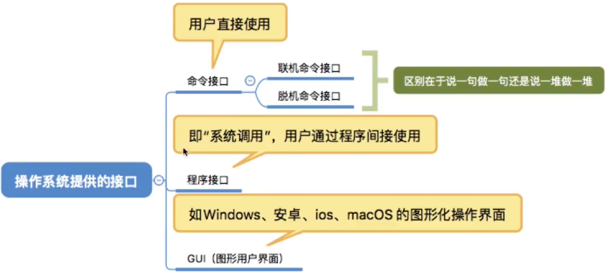
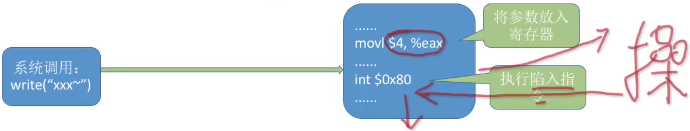

# 系统调用

重点掌握：

1. 什么时候需要进行系统调用
2. 系统调用的过程

### 系统调用

系统中的各种共享资源都由操作系统统一掌管，因此在用户程序中，凡是与资源有关的操作（如存储分配、进行I/O传输以及管理文件等），都必须通过系统调用方式向操作系统提出服务请求，并由操作系统代为完成。系统调用按功能大致可分为如下几类：

- 设备管理。完成设备的请求或释放，以及设备启动等功能。
- 文件管理。完成文件的读、写、创建及删除等功能。
- 进程控制。完成进程的创建、撤销、阻塞及唤醒等功能。
- 进程通信。完成进程之间的消息传递或信号传递等功能。
- 内存管理。完成内存的分配、回收以及获取作业占用内存区大小及始址等功能。

显然，系统调用运行在系统的核心态。通过系统调用的方式来使用系统功能，可以保证系统的稳定性和安全性，防止用户随意更改或访问系统的数据或命令。系统调用命令是由操作系统提供的一个或多个子程序模块实现的。

可能会影响到其他进程的操作，必然需要通过系统调用请求操作系统代为完成

**2017** 执行系统调用的过程包括如下主要操作：

1. 返回用户态
2. 执行陷入（trap）指令
3. 传递系统调用参数
4. 执行相应的服务程序

正确的执行顺序是 **C**

A 2314

B 2431

C 3241

D 3421

陷入指令，又称访管指令、trap指令。用于实现系统调用，用户程序通过陷入指令主动将CPU控制权还给操作系统。执行陷入指令后，CPU状态由用户态转为核心态。

