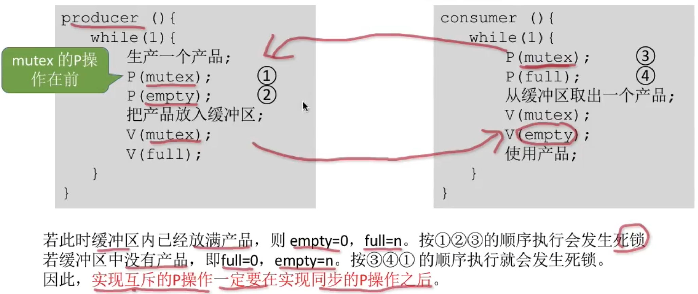
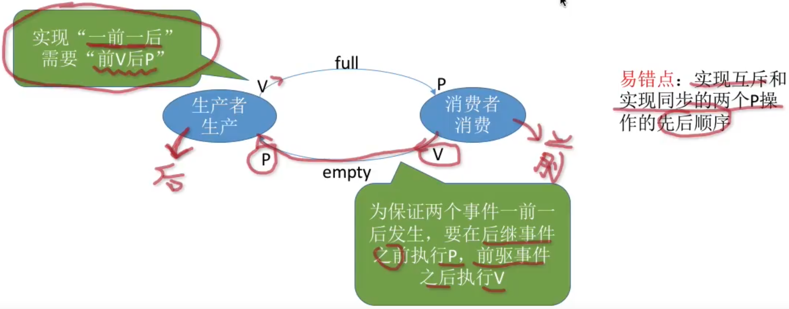
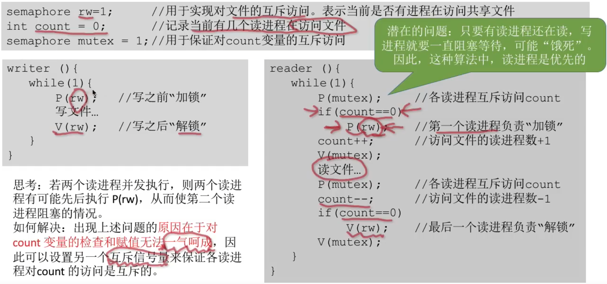
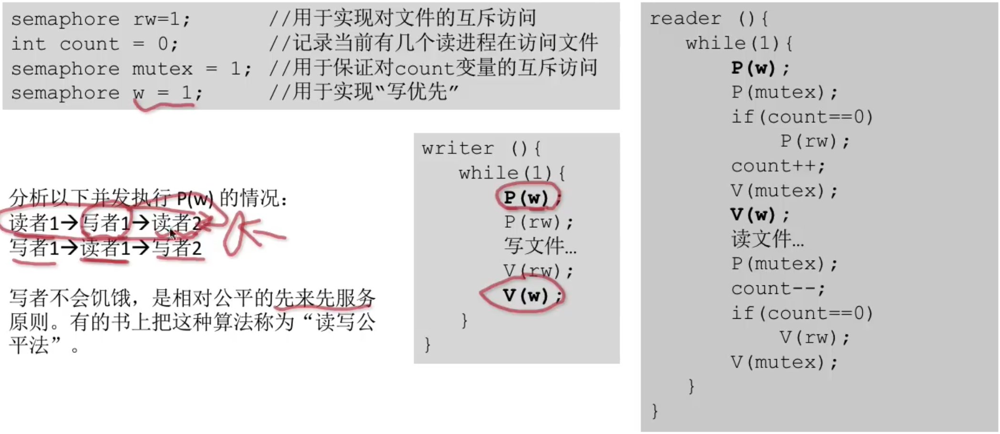
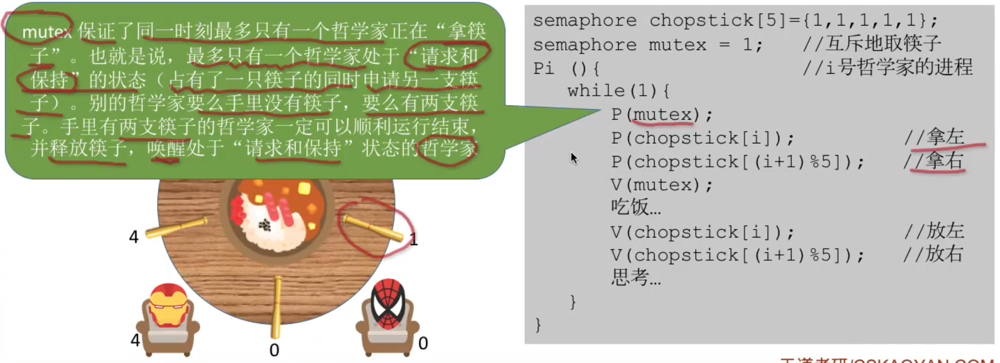

# 经典同步问题

### 生产者-消费者问题

生产者、消费者共享一个初始为空、大小为n的缓冲区。

只有缓冲区没满时，生产者才能把产品放入缓冲区，否则必须等待。

只有缓冲区不空时，消费者才能从中取出产品，否则必须等待。

缓冲区是临界资源，各进程必须互斥地访问。

```c++
semaphore mtex = 1;  //互斥信号量，实现对缓冲区的互斥访问
semaphore empty = n; //同步信号量，表示空闲缓冲区的数量
semaphore full = 0;  //同步信号量，表示产品的数量，也即非空缓冲区的数量
```

```c++
producer(){
    while(1){
        生产一个产品；
        P(empty); //消耗一个空闲缓冲区
        P(mutex);
        把产品放入缓冲区；
        V(mutex);
        V(full); //增加一个产品
    }
}
```

```c++
consumer(){
    while(1){
        P(full); //消耗一个产品（非空缓冲区）
        P(mutex);
        从缓冲区取出一个产品；
        V(mutex);
        V(empty); //增加一个空闲缓冲区
        使用产品；
    }
}
```



生产者消费者问题是一个互斥、同步的综合问题。

最难的是发现题目中隐含的两对同步关系。

缓冲区满时，生产者进程需要等待消费者进程取走产品；缓冲区空时，消费者进程需要等待生产者进程放入产品。这是两个不同的”一前一后问题“（即两个同步问题），因此也需要设置两个同步信号量。



### 读者-写者问题

有读者和写者两组并发进程，共享一个文件，当两个或两个以上的读进程同时访问共享数据时不会产生副作用，但若某个写进程和其他进程（读进程或写进程）同时访问共享数据时则可能导致数据不一致的错误。因此要求

1. 允许多个读者可以同时对文件执行读操作；
2. 只允许一个写者往文件中写信息；
3. 任一写着在完成写操作之前不允许其他读者或写者工作；
4. 写者执行写操作前，应让已有的读者和写者全部退出。

写者与写者需要互斥，写者与读者也需要互斥，但读者和读者不互斥。

解决”读者与写者互斥，但读者与读者不互斥“的核心在于设置了一个计数器count用来记录当前正在访问共享文件的读进程数。我们可以用count的值来判断当前进入的进程是否是第一个/最后一个读进程，从而做出不同的处理。





读者-写者问题为我们解决复杂的互斥问题提供了一个参考思路。

其核心思想在于设置了一个计数器count用来记录当前正在访问共享文件的读进程数。我们可以用count的值来判断当前进入的进程是否是第一个/最后一个读进程，从而做出不同的处理。

另外，对count变量的检查和赋值不能一气呵成导致了一些错误，如果需要实现”一气呵成“，自然应该想到用互斥信号量。

最后，还要认真体会我们是如何解决”写进程饥饿”问题的。

绝大多数的PV操作大题都可以用之前介绍的几种生产者-消费者问题的思想来解决，如果遇到更复杂的问题，可以想想能否用读者写者问题的这几个思想来解决。

### 哲学家进餐问题

一张圆桌上坐着5名哲学家，每两个哲学家之间的桌上摆一根筷子，桌子的中间是一碗米饭。哲学家们倾注毕生的精力用于思考和进餐，哲学家在思考时，并不影响他人。只有当哲学家饥饿时，才试图拿起左、右两根筷子（一根一根地拿起）。如果筷子已在他人手上，则需等待。饥饿的哲学家只有同时拿起两根筷子才可以开始进餐，当进餐完毕后，放下筷子继续思考。



哲学家进餐问题的关键在于解决进程死锁。

这些进程之间只存在互斥关系，但是与之前接触到的互斥关系不同的是，每个进程都需要同时持有两个临界资源，因此就有“死锁“问题的隐患。

如果在考试中遇到了一个进程需要持有多个临界资源的情况，应该参考哲学家问题的思想，分析题中给出的进程之间是否会发生循环等待，是否会发生死锁。