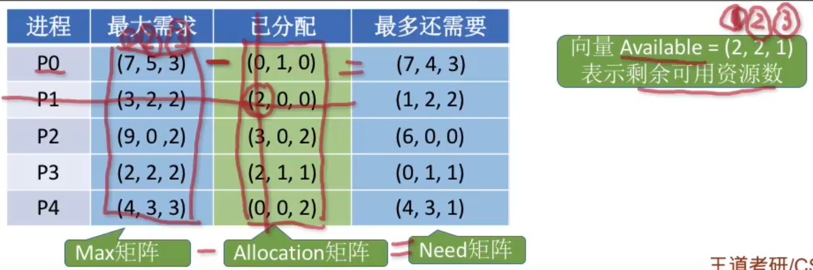
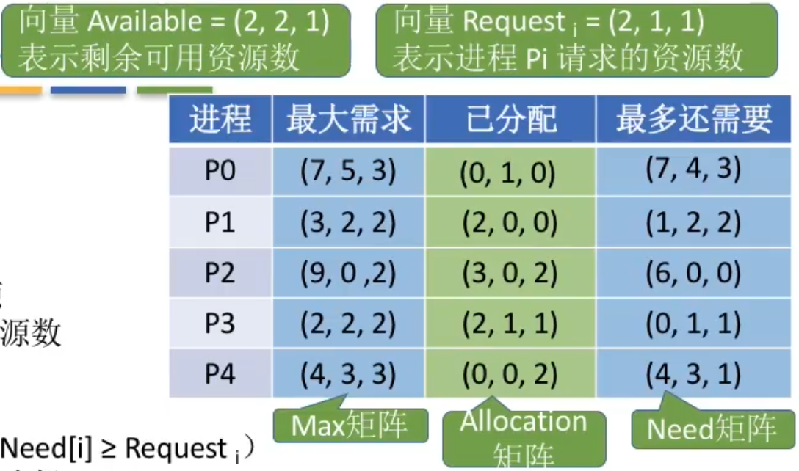

# 死锁

### 死锁条件

产生死锁必须同时满足以下四个条件，只要其中任一个条件不成立，死锁就不会发生。

- 互斥条件：在一段时间内某资源仅为一个进程所占有。此时若有其他进程请求该资源，则请求进程只能等待。
- 不剥夺条件：进程所获得的资源在未使用完毕之前，不能被其他进程强行夺走，即只能由获得该资源的进程自己来释放。
- 请求和保持条件：进程已经保持了至少一个资源，但又提出了新的资源请求，而该资源已被其他进程占有，此时请求进程被阻塞，但对自己以获得的资源保持不放。
- 循环等待条件：存在一种进程资源的循环等待链，链中每一个进程已获得的资源同时被链中下一个进程所请求。

1. 预防死锁。破坏死锁产生的四个必要条件中的一个或几个。
2. 避免死锁。用某种方法防止系统进入不安全状态，从而避免死锁（银行家算法）
3. 死锁的检测和解除。允许死锁的发生，不过操作系统会负责检测出死锁的发生，然后采取某种措施解除死锁。（Key：资源分配图--两种结点？两种边分别代表什么？什么是”可完全简化“？）

### 系统安全状态

安全状态，是指系统能按某种进程推进顺序（P1, P2, ..., Pn），为每个进程Pi分配其所需资源，直至满足每个进程对资源的最大需求，使每个进程都可顺序地完成，此时称P1，P2，...，Pn为安全序列。如果系统无法找到一个安全序列，则称系统处于不安全状态。

并非所有地不安全状态都是死锁状态，但当系统进入不安全状态后，便可能进入死锁状态；反之，只要系统处于安全状态，系统便可以避免进入死锁状态。

### 银行家算法的数据结构

| 数据结构                      | 描述                                                         |
| ----------------------------- | ------------------------------------------------------------ |
| 可利用资源矢量 Available | 含有M个元素的数组，其中的每一个元素代表一类可用的资源数目。Available[j]=K，则表示系统中现有Rj类资源K个 |
| 最大需求矩阵 Max         | NxM矩阵，定义了系统中N个进程中的每一个进程对M类资源的最大需求。Max[i, j]=K，则表示进程i需要Rj类资源的最大数目K |
| 分配矩阵 Allocation      | NxM矩阵，定义了系统中每一类资源当前已分配给每一进程的资源数。Allocation[i, j]=K，则表示进程i当前已分得Rj类资源的数目为K |
| 需求矩阵Need                  | NxM矩阵，表示每个进程尚需的各类资源数。Need[i, j]=K，则表示进程i还需要Rj类资源的数目为K |

数据结构：

长度为m的一维数组Available表示还有多少可用资源

n*m 矩阵 Max 表示各进程对资源的最大需求数

n*m 矩阵 Allocation 表示已经给各进程分配了多少资源

Max - Allocation = Need 矩阵表示各进程最多还需要多少资源

用长度为m的一维数组Request表示进程此次申请的各种资源数

银行家算法步骤：

1. 检查此次申请是否超过了之前声明的最大需求数（需确保Need[i]>=Request_i）
2. 检查此时系统剩余的可用资源是否还能满足这次请求（需确保Available>=Request_i）
3. 试探着分配，更改各数据结构（Available -= Request_i; Allocation[i]+=Request_i; Need = Max - Allocation）
4. 用安全性算法检查此次分配是否会导致系统进入不安全状态

安全性算法步骤：

检查当前的剩余可用资源是否能满足某个进程的最大需求，如果可以，就把该进程加入安全队列，并把该进程持有的资源全部回收。

不断重复上述过程，看最终是否能让所有进程都加入安全序列。

注意：系统处于不安全状态未必死锁，但死锁时一定处于不安全状态。系统处于安全状态一定不会死锁。