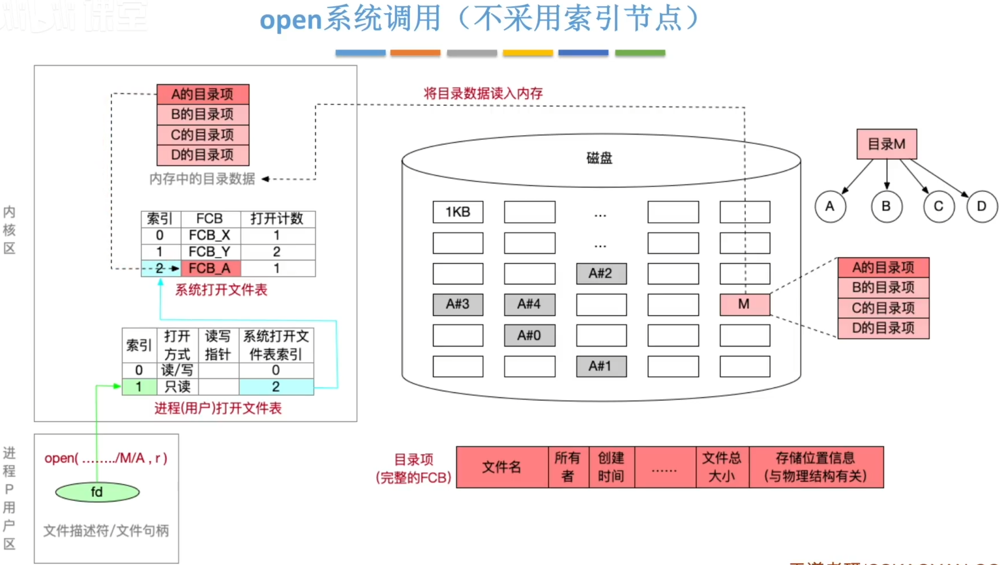
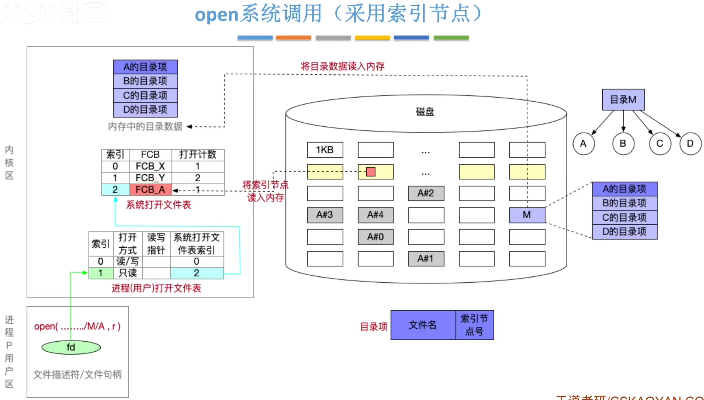
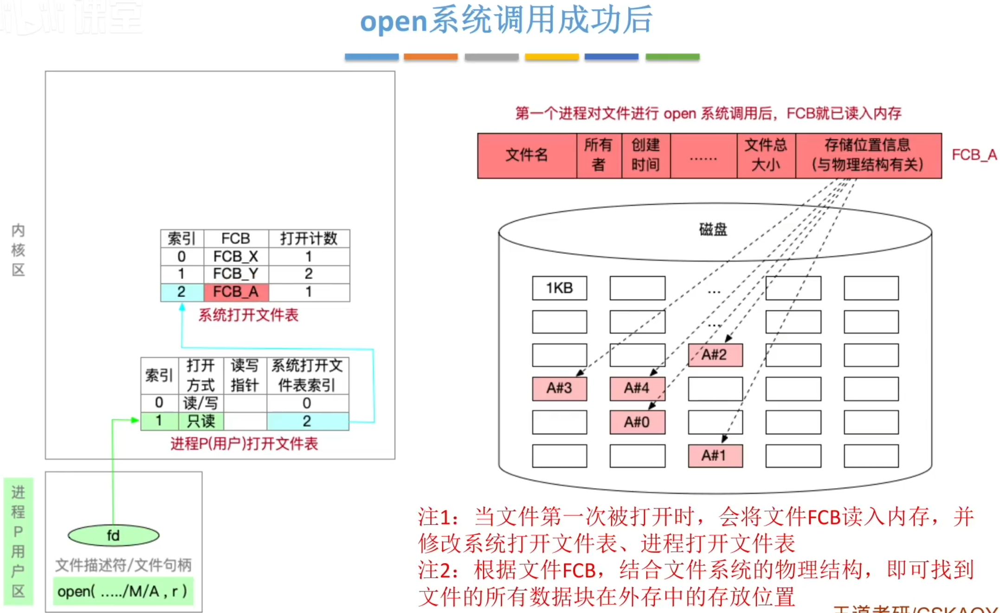
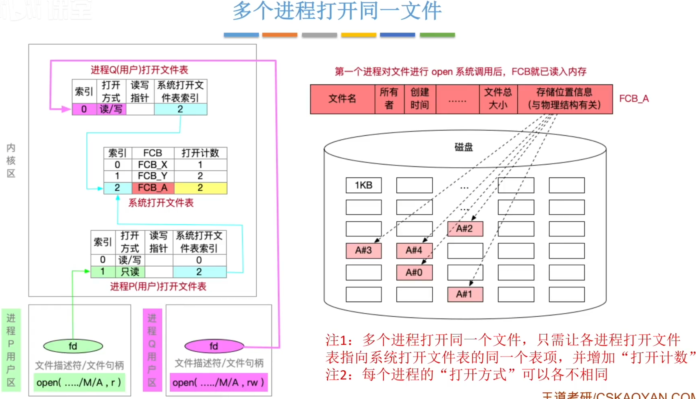
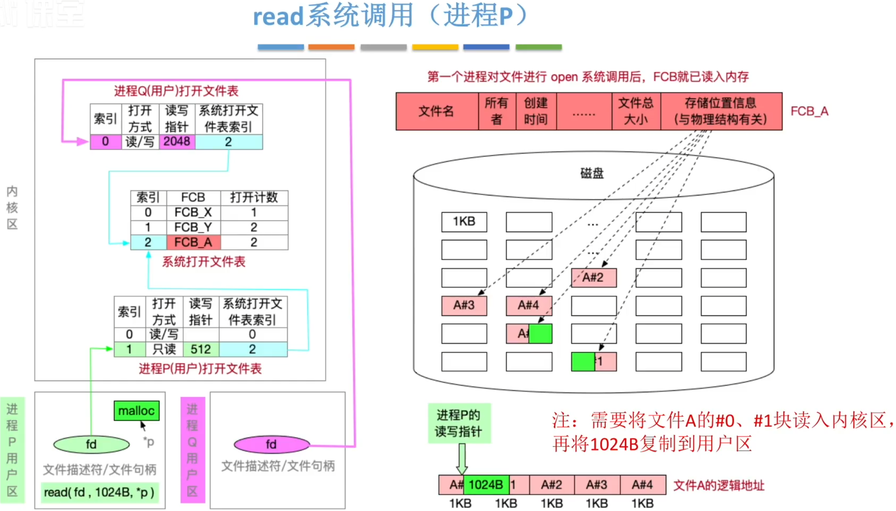
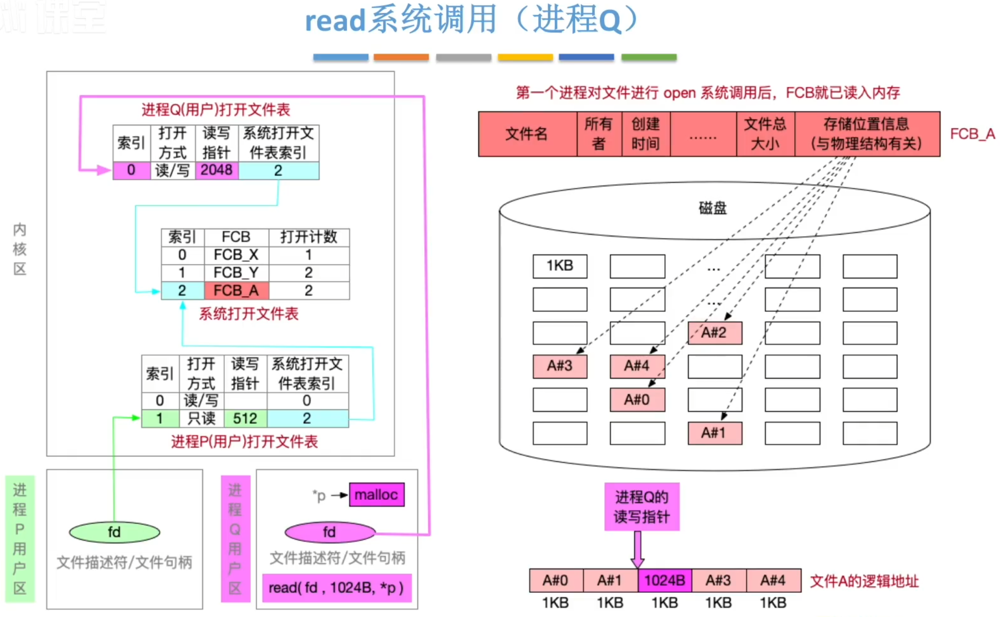

# 文件的操作

### open系统调用

必要的系统调用参数：

- 路径+文件名
- 打开方式。如：读、读&写

open系统调用的处理过程：

1. 根据路径，将各级目录数据读入内存，逐层查找并读入目标文件FCB
2. 检查”打开方式“是否被允许（文件保护）
3. 将文件FCB复制到”系统打开文件表“的表项中，令打开计数加1
4. 在”进程（用户）打开文件表“中新建一个表项，并指向”系统打开文件表”对应表项
5. 给用户进程返回文件描述符fd（类似于指针）

###  seek系统调用

必要的系统调用参数：

- 文件描述符fd（必须先open打开文件）
- 读写指针偏移地址（逻辑地址）

seek系统调用的处理过程：

1. 根据文件描述符fd找到“进程打开文件表”中对应的表项
2. 修改读写指针位置

### read系统调用

必要的系统调用参数：

- 文件描述符fd
- 想要读多少个字节？
- 读入的数据存到哪儿？（起始指针）

read系统调用的处理过程：

1. 根据文件描述符fd找到“进程打开文件表”中对应的表项
2. 根据读写指针位置，结合系统调用参数，将文件数据从外存读入内存（需进行功能文件逻辑地址到物理地址转换）

 

write系统调用 

