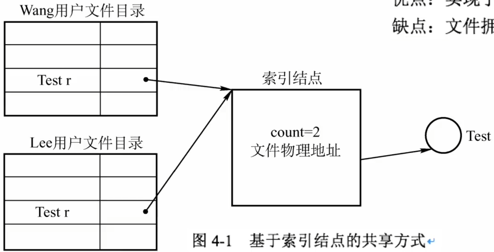
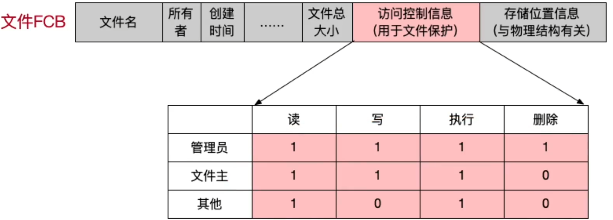

# 文件共享和保护

### 文件共享

1. 硬链接文件共享

   

   硬链接共享采用索引结点方式。在树形结构的目录中只设置文件名及指向相应索引结点的指针。共享文件的用户目录中都设置指向该文件索引结点的指针。在索引结点中还应有一个链接计数count，用于表示链接到本索引结点（亦即文件）上的用户目录项的数目，当count>1时，文件拥有者不能将文件删除。如图。

   优点：实现了异名共享

   缺点：文件拥有者不能删除与他人共享的文件

2. 符号链（软链接）

   在利用符号链实现文件共享时，只有文件的拥有者才拥有指向其索引结点的指针。当用户B要共享用户A的一个文件F时，可以由系统在用户B的目录下创建一个只包含被共享文件F的路径名的LINK类型的新文件。称这样的链接方法为符号链接

   优点：文件拥有者可以删除被他人共享的文件。

   缺点：当其他用户读共享文件时，需要根据路径名的各个分量逐个查找，访问开销大。

### 文件保护

考察重点：访问控制信息

访问控制信息的位数 = 角色数量 *  文件操作类型

**2009** 文件系统中，文件访问控制信息存储的合理位置是

A 文件控制块

B 文件分配表

C 用户口令表

D 系统注册表

**2009** 设文件F1的当前引用计数值为1，先建立F1的符号链接（软链接）文件F2，再建立F1的硬链接文件F3，然后删除F1。此时，F2和F3的引用计数值分别是

A 0、1

B 1、1

C 1、2

D 2、1

**2017** 某文件系统中，针对每个文件，用户类别分为4类：安全管理员、文件主、文件主的伙伴、其他用户；访问权限分为5中：完全控制、执行、修改、读取、写入。若文件控制块中用二进制串表示文件权限，为表示不同类别用户对一个文件的访问权限，则描述文件权限的位数至少应为

A 5

B 9

C 12

D 20

**2020** 若多个进程共享一个文件F，则下列叙述中，正确的是

A 各进程只能用”读“方式打开F

B 在系统打开文件表中仅有一个表项包含F的属性

C 各进程的用户打开文件表中关于F的表项内容相同

D 进程关闭F时，系统删除F在系统打开文件表中的表项