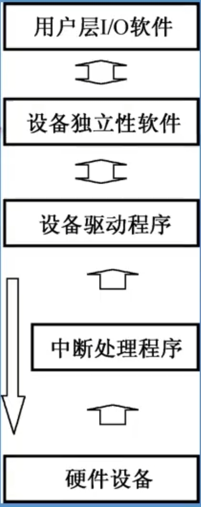

# I/O软件的层次结构

| I/O软件层次结构 | 说明                                                         |
| --------------- | ------------------------------------------------------------ |
| 用户层I/O软件   | 实现与用户交互的接口，用户可直接调用在用户层提供的、与I/O操作有关的库函数，对设备进行操作。用户层软件必须通过一组系统调用来取得操作系统服务。 |
| 设备独立性软件  | 实现用户程序与设备驱动器的统一接口、设备命令、设备保护，以及设备分配与释放等，同时为设备管理和数据传送提供必要的存储空间。其功能有： 执行所有设备的公有操作 向用户层（或文件层）软件提供统一接口 |
| 设备驱动程序    | 实现系统对设备发出的操作指令，驱动I/O设备工作，为I/O内核子系统隐藏设备控制器之间的差异。它是I/O进程与设备控制器之间的通信程序，常以进程形式存在。 设备驱动程序： 向上层提供一组标准接口，用于接受上层软件发来的抽象I/O要求，转换为具体要求后，发送给设备控制器，驱动I/O设备工作 将由设备控制器发来的信号传送给上层软件 |
| 中断处理程序    | 用于保存被中断的CPU环境，转入相应的中断处理程序进行处理，处理完并恢复被中断进程的现场后，返回到被中断的进程。 中断处理层的主要工作有：进行进程上下文的切换，对处理中断信号源进行测试，读取设备状态和修改进程状态等 |
| 硬件设备        | 引入控制器后，系统可以通过几个简单的参数完成对控制器的操作，而具体的硬件操作则由控制器调用相应的设备接口完成，使CPU从繁重的设备控制操作中解放出来 |

