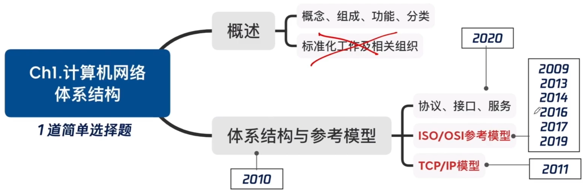
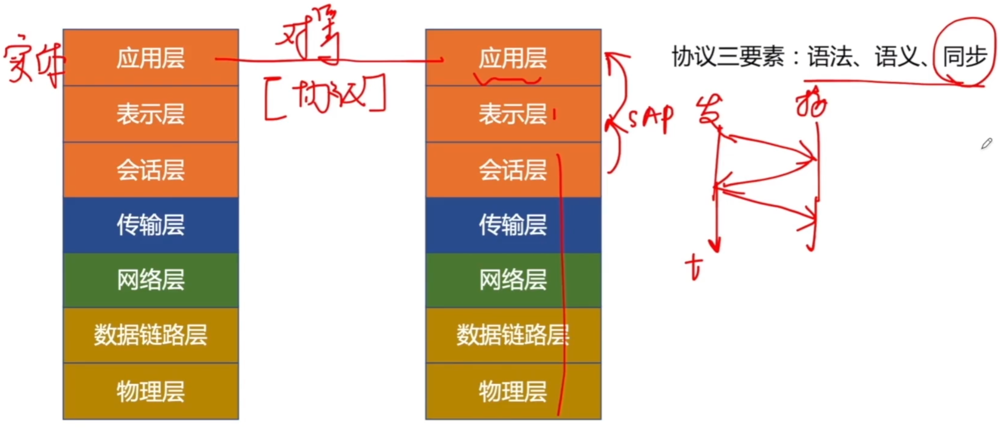
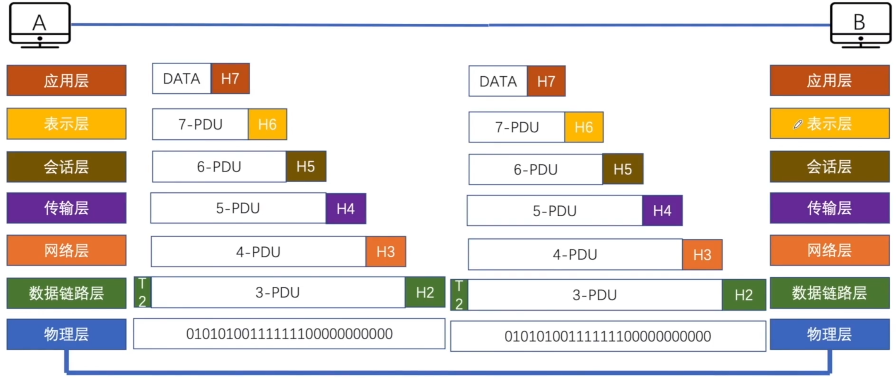
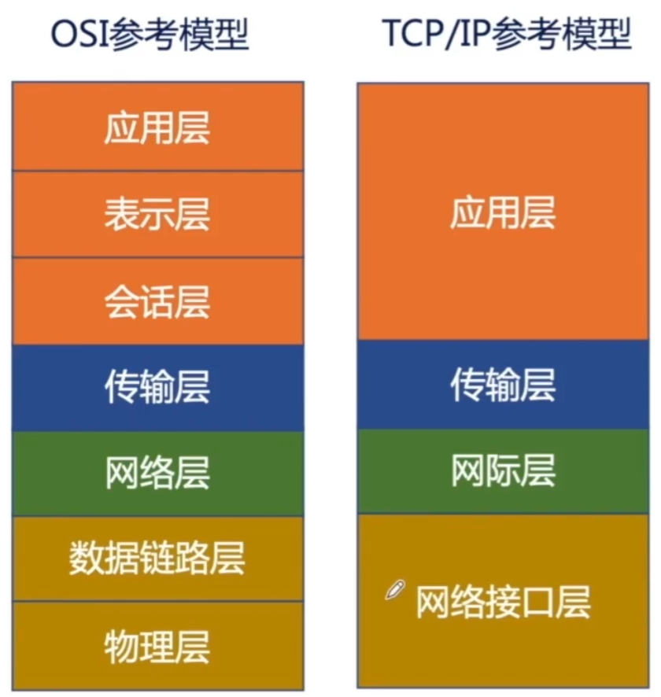
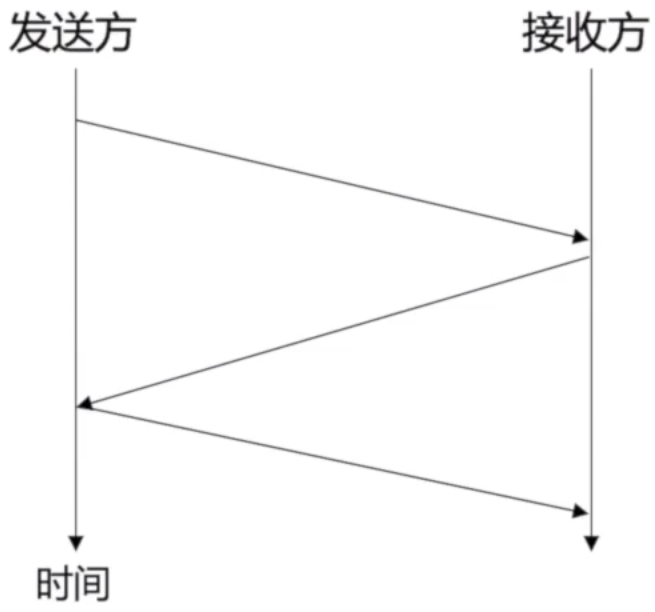

# 计算机网络的分层结构

### 考点分布

### 计算机网络概念

计算机网络：利用通信线路和通信设备将地理位置分散的、具有独立功能的多台计算机连接起来，按照某种协议进行数据通信、实现资源共享的信息系统。（还有负载均衡、分布式处理、提高系统可靠性等功能）

### 计算机网络分类

1. 按分布范围分
   - 广域网WAN
   - 城域网MAN
   - 局域网LAN
   - 个域网PAN
2. 按使用者分
   - 公用网
   - 专用网
3. 按交换技术分
   - 电路交换
   - 报文交换
   - 分组交换
4. 按拓扑结构分
   - 总线型
   - 星型
   - 环型
   - 网状型
5. 按传输技术分
   - 广播式网络 共享公共通信信道
   - 点对点网络 使用分组存储转发和路由选择机制

### 协议、服务、接口（访问服务点SAP）

### 通信过程

### OSI与TCP/IP参考模型

1. OSI定义三点：服务、协议、接口
2. OSI先出现，参考模型先于协议发明，不偏向特定协议
3. TCP/IP设计之初就考虑到异构网互联问题，将IP作为重要层次

|        | ISO/OSI参考模型 | TCP/IP模型      |
| ------ | --------------- | --------------- |
| 网络层 | 无连接+面向连接 | 无连接          |
| 传输层 | 面向连接        | 无连接+面向连接 |

物联网淑惠适用

- 应用层 所有能和用户交互产生网络流量的应用程序。
- 表示层 处理通信系统中交换信息的表示方式，对数据进行翻译、转换数据格式、加密解密和压缩。
- 会话层 向表示层实体/用户进程提供建立连接并在连接上有序地传输数据，建立管理和终止会话。
- 传输层 负责主机中两个进程的通信，即端到端的通信，实现流量控制、差错控制和复用分用。
- 网络层 把分组从源端传到目的端，实现路由选择、流量控制、差错控制、拥塞控制。
- 数据链路层 把网络层传下来的数据报组装成帧，实现流量控制和差错控制，控制对共享信道的访问。
- 物理层 在物理介质上实现比特流的透明传输。

**2020** 下图描述的协议要素是 C

A 语法

B 语义

C 时序

D 语法、语义和时序

**2019** OSI参考模型的第五层（自下而上）完成的主要功能是 **C**

A 差错控制

B 路由选择

C 会话管理

D 数据表示转换

**2017** 假设OSI参考模型的应用层欲发送400B的数据（无拆分），除物理层和应用层之外，其他各层在封装PDU时均引入20B的额外开销，则应用层数据传输效率约为 **A**

A 80%

B 83%

C 87%

D 91%

**2016** 在OSI参考模型中，R1、Switch、Hub实现的最高功能层分别是 **C**

A 2、2、1

B 2、2、2

C 3、2、1

D 3、2、2

**2014** 在OSI参考模型 中，直接为会话层提供服务的是 **C**

A 应用层

B 表示层

C 传输层

D 网络层

**2013** 在OSI参考模型中，下列功能需由应用层的相邻层实现的是 B

A 对话管理

B 数据格式转换

C 路由选择

D 可靠数据传输

**2011** TCP/IP 参考模型的网络层提供的是 **A**

A 无连接不可靠的数据报服务

B 无连接可靠的数据报服务

C 有连接不可靠的虚电路服务

D 有连接可靠的虚电路服务

**2010** 下列选项中，不属于网络体系结构所描述的内容是 **C**

A 网络的层次

B 每层使用的协议

C 协议的内部实现细节

D 每层必须完成的功能

**2009** 在OSI参考模型中，自下而上第一个提供端到端服务的层次是 **B**

A 数据链路层

B 传输层

C 会话层

D 应用层