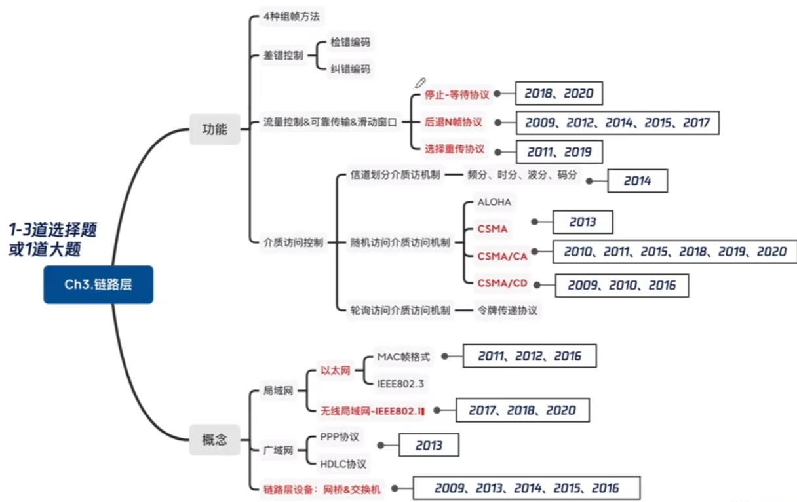
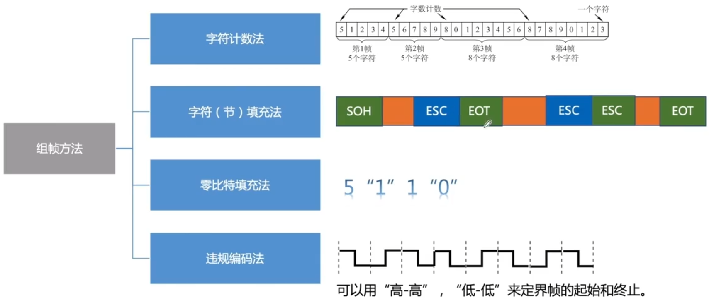
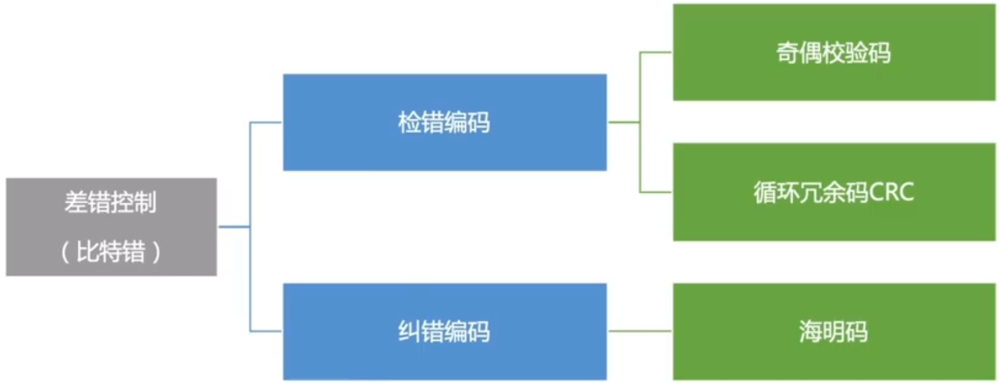
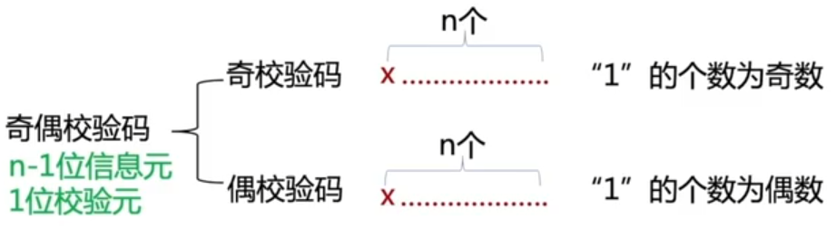
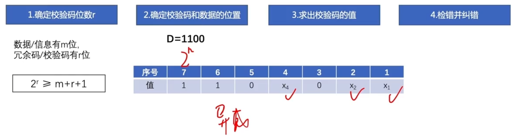

# 差错控制

### 封装成帧

### 差错控制

### 检错编码 奇偶校验码

奇偶校验码特点：只能检查出奇数个比特错误，检错能力为50%。

### 检错编码 循环冗余码CRC

例：要发送的数据时 1101 0110 11，采用CRC校验，生成多项式是10011，那么最终发送的数据应该是？

最终发送的数据：要发送的数据+帧检验序列FCS

计算冗余码：

1. 加0 假设生成多项式G(x)的阶为r，则加r个0 多项式N位，阶为N-1
2. 模2除法 数据加0后除以多项式，余数为冗余码/FCS/CRC检验码的比特序列 异或 同0异1

10011表示成多项式为
$$
X^4+X^1+X^0
$$
阶为4

### 纠错编码 海明码

检验d位错，码距为d+1

纠正d位错，码距为2d+1

