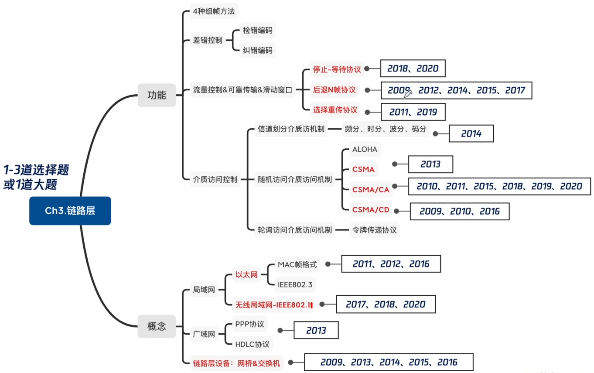
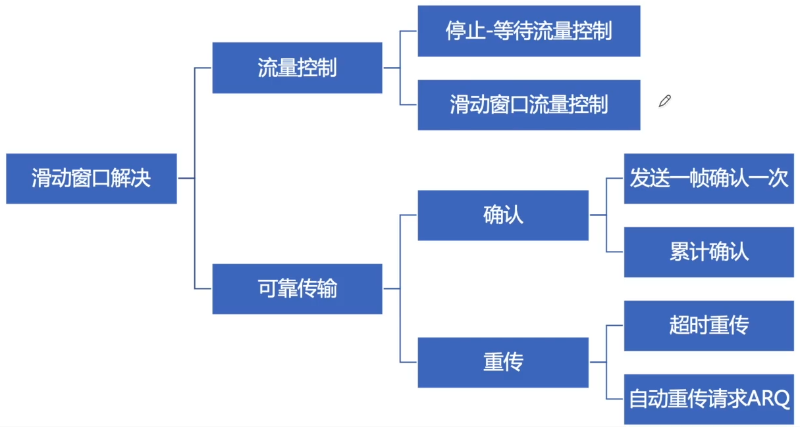
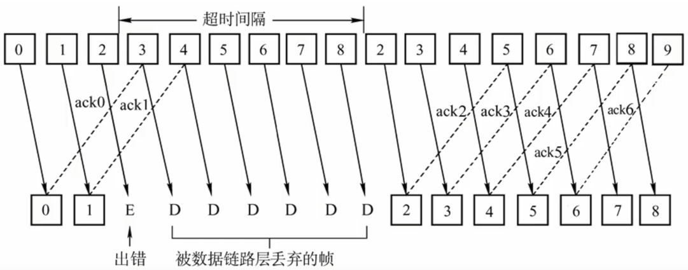
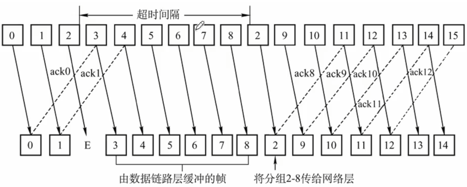

# 流量控制&可靠传输&滑动窗口

### 考点分布

### 可靠传输、流量控制、滑动窗口

可靠传输：发送端发啥，接收端接啥

流量控制：控制发送速率，使接收方有足够的缓冲空间来接收每一个帧

- 链路层流量控制 接收方收不下就不回复确认
- 传输层流量控制 接收端给发送端一个窗口公告

### 停止-等待协议

”停止-等待“就是每发送完一个帧就停止发送，等待对方确认，在收到确认后再发送下一个帧。

发送方在一个发送周期内，有效地发送数据所需要的时间占整个发送周期的比率。

信道利用率 = (L/C)/T

- L T内发送L比特数据
- C 发送方数据传输率
- T 发送周期 从开始发送数据，到收到第一个确认帧为止

例题：一个信道的数据传输率为4kb/s，单向传播时延为30ms，如果使停止-等待协议的信道最大利用率达到80%，要求的数据帧长度至少为 **960bits**
$$
80\%=\frac{L/(4kB/s)}{L/(4kB/s)+2*30ms }
$$
主机甲采用停-等协议向主机乙发送数据，数据传输速率是3kbps，单向传播延时是200ms，忽略确认帧的传输延时。当信道利用率等于40%时，数据帧的长度为 **B**

A 240比特

B 400比特

C 480比特

D 800比特
$$
40\%=\frac{L/(3kb/s)}{200ms+L/(3kb/s)}
$$
**2020** 假设主机甲采用停-等协议向主机乙发送数据帧，数据帧长与确认帧长均为1000B，数据传输速率是10kbps，单向传播延时是200ms。则甲的最大信道利用率为 **D**

A 80%

B 66.7%

C 44.4%

D 40%

### 后退N帧（GBN协议）

GBN协议：发送方连续发出N个帧，接收方流水线接收各个帧，并进行差错检测；一旦某个帧出错，接收方就丢弃该帧和它之后收到的所有帧，对出错的帧不发送确认帧；发送方在出错帧的确认帧超时后，从出错的帧开始重传所有已发送但未被确认的帧。

接收方可以累积确认（捎带确认）：ACKn表示对第n号帧及其前面所有帧。

发送窗口
$$
1<=W_T<=2^n-1
$$
接收窗口 1

**2009** 数据链路层采用了后退N帧（GBN）协议，发送方已经发送了编号为0~7的帧。当计时器超时时，若发送方只收到了0、2、3号帧的确认，则发送方需要重发的帧数是 **C**

A 2

B 3

C 4

D 5

**2012** 两台主机之间的数据链路层采用后退N帧协议（GBN）传输数据，数据传输速率为16kbps，单向传播时延为270ms，数据帧长度范围是128~512字节，接收方总是以与数据帧等长的帧进行确认。为使信道利用率达到最高，帧序号的比特数至少为

A 5

B 4

C 3

D 2

**2014** 主机甲和主机乙之间使用后退N帧协议（GBN）传输数据，甲的发送窗口尺寸为1000，数据帧长为1000字节，信道带宽为100Mbps，乙每收到一个数据帧立即利用一个短帧（忽略其传输延迟）进行确认，若甲、乙之间的单向传播延迟是50ms，则甲可以达到的最大平均数据传输速率约为

A 10Mbps

B 20Mbps

C 80Mbps

D 100Mbps

**2015** 主机甲通过128kbps卫星链路，采用滑动窗口协议向主机乙发送数据，链路单向传播延迟为250ms，帧长为1000字节。不考虑确认帧的开销，为使链路利用率不小于80%，帧序号的比特数至少是

A 3

B 4

C 7

D 8

**2017**

### 选择重传（SR）协议

SR协议：发送方可连续发送多个帧，接收方对数据帧逐一确认，发送方收到ACK时继续发送后面的帧，若超时未收到应答，则重传出错帧；接收方可以不按照序号接收数据帧，收到帧不正确则丢弃，正确则放入缓存，再按顺序一起交付。

**2011** 数据链路层采用选择重传协议(SR)传输数据，发送方已发送了0~3号数据帧，现已收到1号帧的确认，而0、2号帧依次超时，则此时需要重传的帧数是

A 1

B 2

C 3

D 4

**2019** 对于滑动窗口协议，如果分组序号采用3比特编号，发送窗口大小为5，则接收窗口最大是

A 2

B 3

C 4

D 5

### 三种协议总结

|          | 窗口大小                   | 确认方式             |
| -------- | -------------------------- | -------------------- |
| 停等协议 | 发1，收1                   | 逐个确认，逐个接收   |
| GBN协议  | 发x(2^n-1)，收1            | 累积确认，按序接收   |
| SR协议   | 发x(2^(n-1))，手x(2^(n-1)) | 逐个确认，可乱序接收 |

