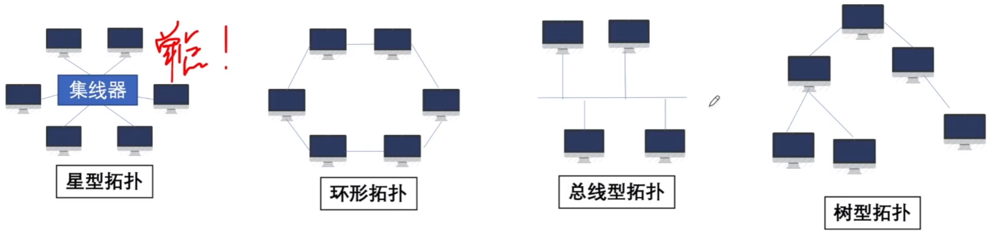
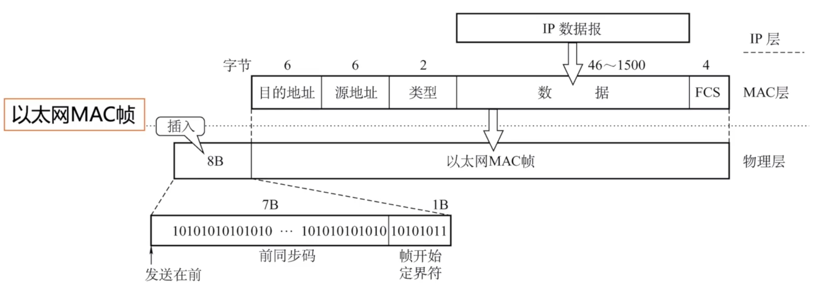
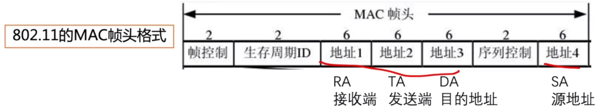
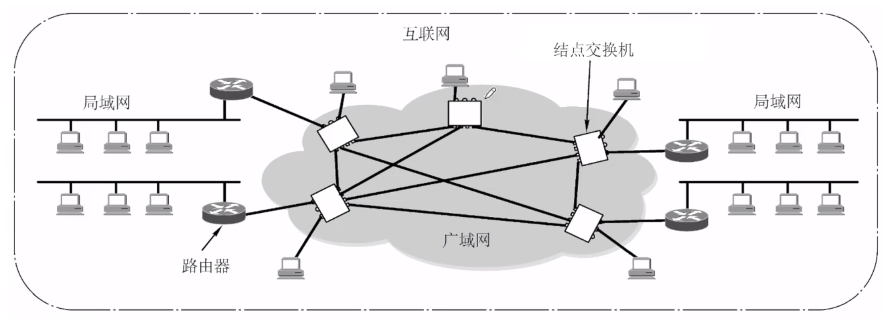
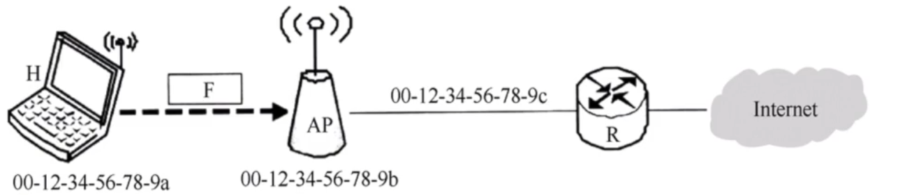

# 局域网&广域网

### 局域网

局域网（Local Area Network）：简称LAN，是指在某一区域内由多台计算机互联成的计算机组，使用广播信道。

1. 覆盖的地理范围较小，只在一个相对独立的局部范围内联，如一座或集中的建筑群内。
2. 使用专门铺设的传输介质（双绞线、同轴电缆）进行联网，数据传输率高（10Mb/s~10Gb/s）。
3. 通信延迟时间短，误码率低，可靠性高。
4. 各站为平等关系，共享传输信道。
5. 多采用分布式控制和广播式通信，能进行广播和组播。

### 局域网的分类

1. 以太网

   以太网式应用最为广泛的局域网，包括标准以太网（10Mbps）、快速以太网（100Mbps）、千兆以太网（1000Mbps）和10G以太网，它们都符合IEEE802.3系列标准规范。逻辑拓扑总线型，物理拓扑是星型或拓展星型。使用CSMA/CD。

   - 无连接：发送方和接收方之间无“握手过程”
   - 不可靠：不对发送方的数据帧编号，接收方不向发送方进行确认，差错帧直接丢弃，差错纠正由高层负责。

   

2. 令牌环网

   物理上采用了星形拓扑结构，逻辑上是环形拓扑结构，已是“明日黄花”。

3. FDDI网（Fiber Distributed Data Interface）

   物理上采用了双环拓扑结构，逻辑上是环形拓扑结构。

4. ATM网（Asynchronous Transfer Mode）

   较新型的单元交换技术，使用53字节固定长度的单元进行交换。

5. 无线局域网（Wireless Local Area Network; WLAN）

   采用IEEE802.11标准。它是由IEEE所定义的无线网络通信的标准。

   

### 广域网

广域网（WAN，Wide Area Network），通常跨接很大的物理范围，所覆盖的范围从几十公里到几千公里，它能连接多个城市或国家，或横跨几个洲并能提供远距离通信，形成国际性的远程网络。

广域网的通信子网主要使用分组交换技术。广域网的通信子网可以利用公用分组交换网、卫星通信网和无线分组交换网，它将分布在不同地区的局域网或计算机系统互连起来，达到资源共享的目的。如因特网（Internet）是世界范围内最大的广域网。

 **2012** 以太网的MAC协议提供的是

A 无连接不可靠服务

B 无连接可靠服务

C 有连接不可靠服务

D 有连接可靠服务

**2013** HDLC协议对01111100 01111110组帧后对应的比特串为

A 01111100 00111110 10

B 01111100 01111101 01111110

C 01111100 01111101 0

D 01111100 01111110 01111101

**2017** 在下图所示的网络中，若主机H发送一个封装访问Internet的IP分组IEEE802.11数据帧F，则帧F的地址1、地址2和地址3分别是

A 00-12-34-56-78-9a, 00-12-34-56-78-9b, 00-12-34-56-78-9c

B 00-12-34-56-78-9b, 00-12-34-56-78-91, 00-12-34-56-78-9c

C 00-12-34-56-78-9b, 00-12-34-56-78-9c, 00-12-34-56-78-9a

D 00-12-34-56-78-9a, 00-12-34-56-78-9c, 00-12-34-56-78-9b