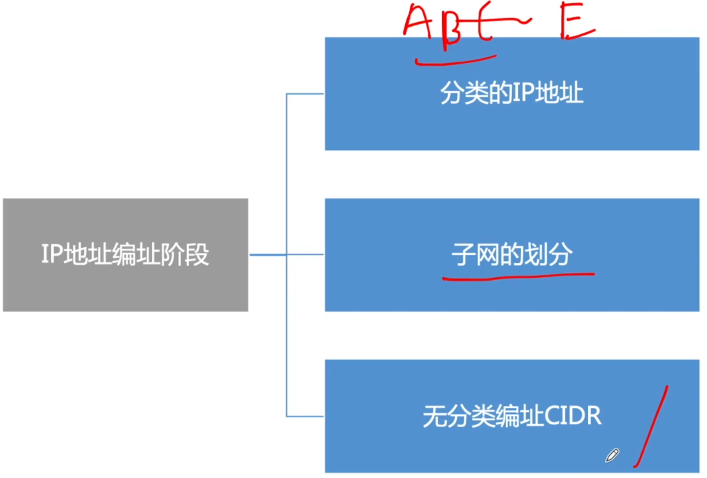
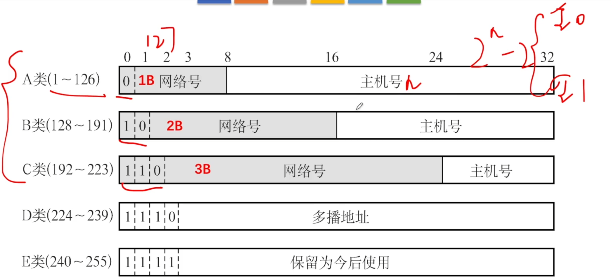
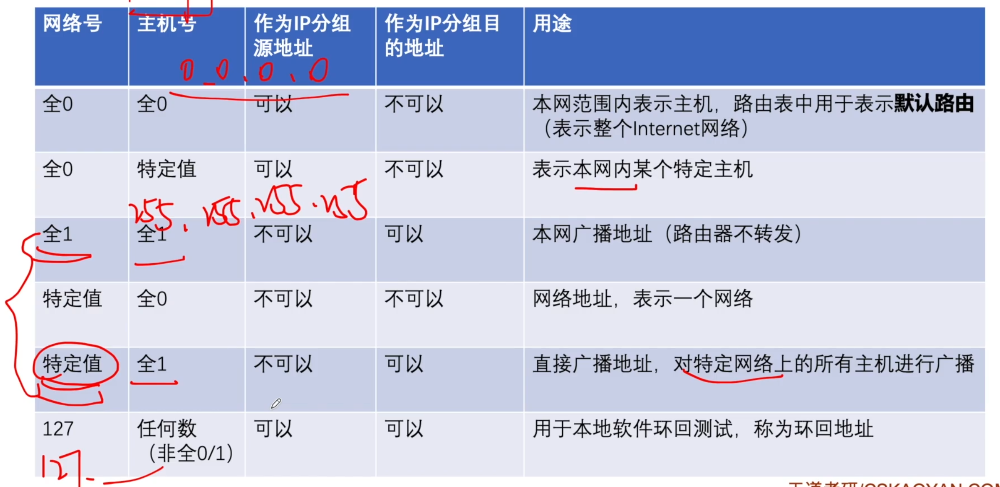
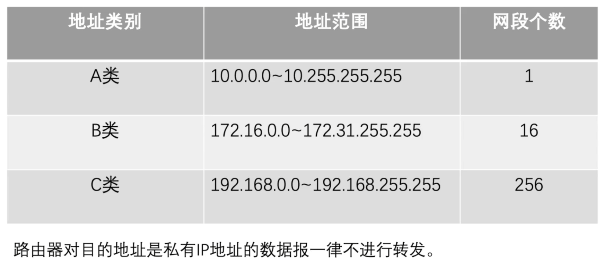
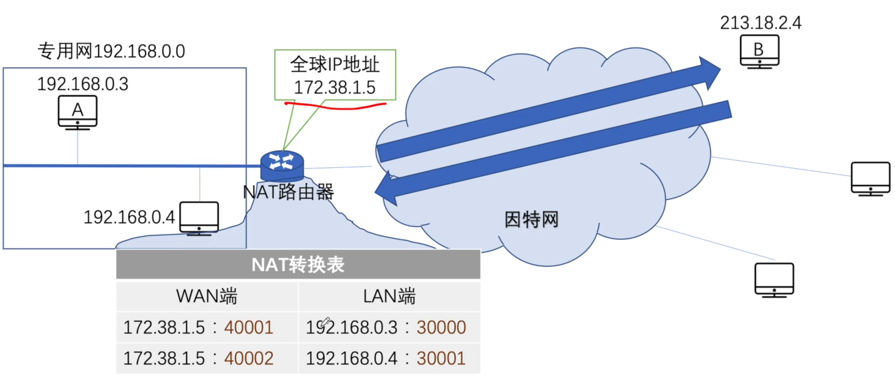
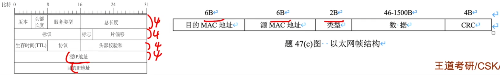
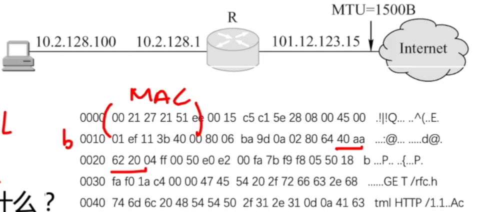
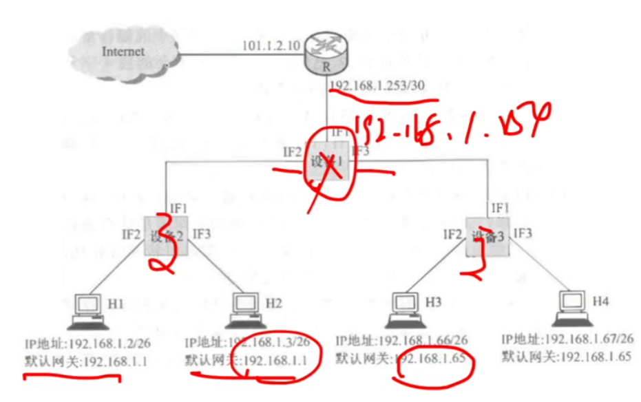
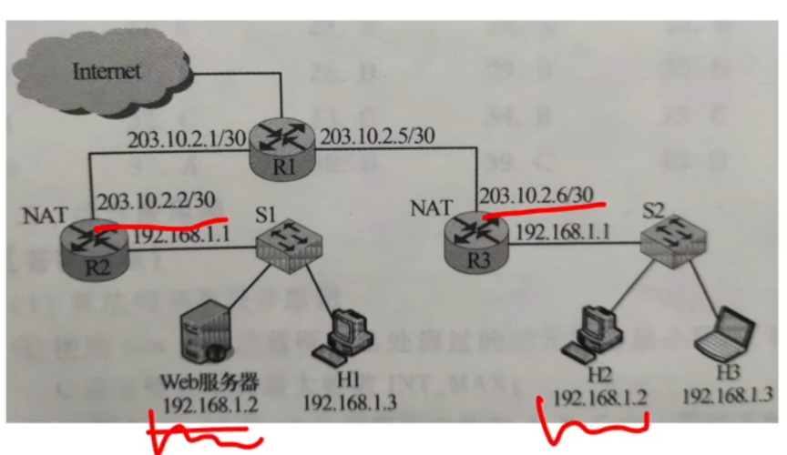

# IPv4地址与NAT

### IP地址的演变

### 分类的IP地址

### 特殊IP地址

### 特殊IP地址 私有IP地址

### 网络地址转换NAT

网络地址转换NAT(Network Address Translation)：在专用网连接到因特网的路由器上安装NAT软件，安装了NAT软件的路由器叫NAT路由器，它至少有一个有效的外部全球IP地址。

**2017** 下列IP地址中，只能作为IP分组的源IP地址但不能作为目的IP地址的是

A 0.0.0.0

B 127.0.0.1

C 200.10.10.3

D 255.255.255.255

**2011** 某主机的MAC地址为00-15-C5-C1-5E-28，IP地址为10.2.128.100（私有地址）。上图是网络拓扑，下图是该主机进行Web请求的1个以太网数据帧前80B的十六进制及ASCII码内容。

1. Web服务器的IP地址是什么？该主机的默认网关的MAC地址是什么？
2. 该主机在构造下图的数据帧时，使用什么协议确定目的MAC地址？封装该协议请求报文的以太网帧的目的MAC地址是什么？
3. 假设HTTP/1.1协议以持续的非流水线方式工作，一次请求响应时间为RTT，rfc.html页面引用了5个JPEG小图像，则从发出下图中的Web请求开始到浏览器收到全部内容为止，需要多少个RTT？
4. 该帧所封装的IP分组经过路由器R转发时，需修改IP分组头中的哪些字段？

**2019** 某网络拓扑如图所示，其中R为路由器，主机H1~H4的IP地址配置以及R的各接口IP地址配置如图所示。现有若干台以太网交换机（无VLAN功能）和路由器两类网络互连设备可供选择。请回答下列问题：

1. 设备1、设备2和设备3分别应选择什么类型网络设备？
2. 设备1、设备2和设备3中，哪几个设备的接口需要配置IP地址？并为对应的接口配置正确地IP地址。
3. 为确保主机H1~H4能够访问Internet，R需要提供什么服务
4. 若主机H3发送一个目的地址192.168.1.127的IP数据报，网络中哪几个主机会接受该数据报？

**2020** 某校园网有两个局域网，通过路由器R1、R2和R3互联后接入Internet，S1和S2为以太网交换机。局域网采用静态IP地址配置，路由器部分接口以及各主机的IP地址如下图所示。

假设NAT转换表结构为：

请回答下列问题：

1. 为使H2和H3能够访问Web服务器（使用默认端口号），需要进行什么配置？
2. 若H2主动访问Web服务器时，将HTTP请求报文封装到IP数据报P中发送，则H2发送P的源IP地址和目的IP地址分别是什么？经过R3转发后，P的源IP地址和目的IP地址分别是什么？经过R2转发后，P的源IP地址和目的IP地址分别是什么？

