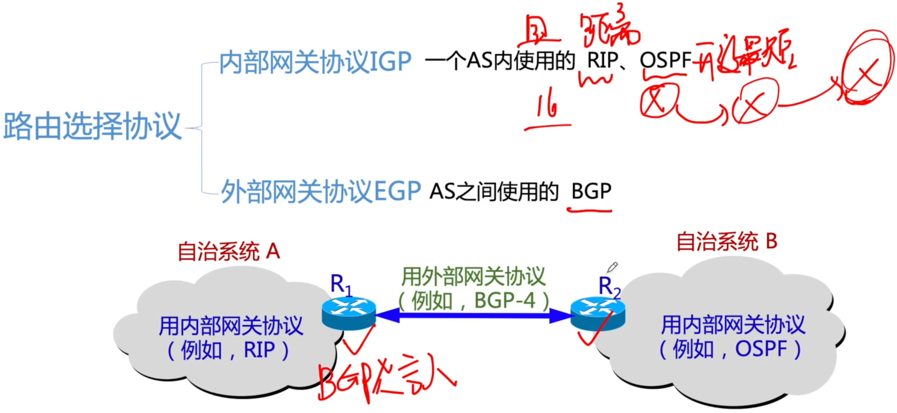

# 路由协议

### 路由选择协议分类回顾

### 路由选择协议汇总

| 协议         | RIP                    | OSPF                               | BGP                                 |
| ------------ | ---------------------- | ---------------------------------- | ----------------------------------- |
| 网关协议     | AS内                   | AS内                               | AS间                                |
| 路由算法     | 距离-向量              | 链路状态                           | 路径-向量                           |
| 路由表内容   | 目的网络，下一跳，距离 | 目的网络，下一跳，距离             | 目的网络，完整路径                  |
| 传递方式     | UDP                    | IP                                 | TCP                                 |
| 最优通路要求 | 跳数最少               | 费用/代价最低                      | 多种关联策略                        |
| 交换结点     | 相邻路由器             | 所有路由器                         | 相邻路由器                          |
| 交换内容     | 自己的路由表           | 与本路由相邻的所有路由器的链路状态 | 首次-整个路由表；非首次，变化的部分 |
| 补充         | 跳数16位不可达         | /                                  | /                                   |

某自治系统内采用RIP协议，若该自治系统内的路由器R1收到其邻居路由器R2的距离矢量，距离矢量中包含信息<net1,16>，则能得出的结论是

A R2可以经过R1到达net1，跳数为17

B R2可以到达net1，跳数为16

C R1可以经过R2到达net1，跳数为17

D R1不能经过R2到达net1