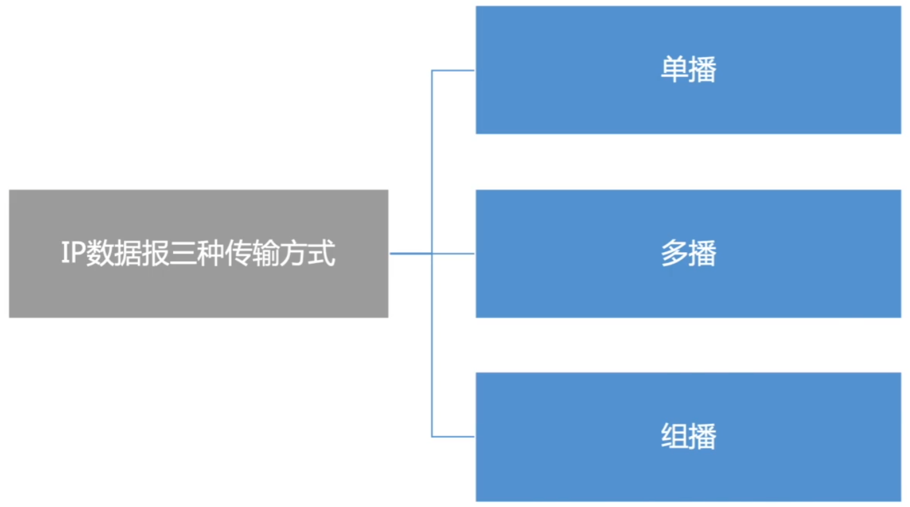

# IP组播

### IP数据报3中传输方式

### IP组播地址

IP组播地址让源设备能够将分组发送给一组设备。属于多播组的设备将被分配一个组播组IP地址。使用网际组管理协议IGMP。

组播地址范围224.0.0.0~239.255.255.255（D类地址），一个D类地址表示一个组播组。只能用作分组的目标地址，源地址总是为单播地址。

组播数据报应用于UDP，是”尽最大努力交付“，不提供可靠交付。

