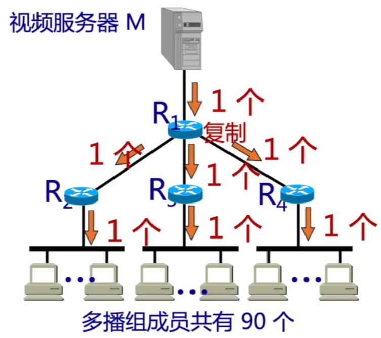

# IP组播

### IP数据报3中传输方式

### IP组播地址

IP组播地址让源设备能够将分组发送给一组设备。属于多播组的设备将被分配一个组播组IP地址。使用网际组管理协议IGMP。

组播地址范围224.0.0.0~239.255.255.255（D类地址），一个D类地址表示一个组播组。只能用作分组的目标地址，源地址总是为单播地址。

组播数据报应用于UDP，是”尽最大努力交付“，不提供可靠交付。

### 移动IP相关概念

移动IP技术是移动结点（计算机/服务器等）以固定的网络IP地址，实现跨越不同网段的漫游功能，并保证了基于网络IP的网络权限在漫游过程中不发生任何改变。

1. 移动结点

   具有永久IP地址的移动设备。

2. 归属代理（本地代理）

   一个移动结点的永久”居所“称为归属网络，在归属网络中代表移动结点执行移动管理功能的实体叫做归属代理。

3. 永久地址（归属地址/主地址）移动站点在归属网络中的原始地址。

4. 外部代理（外地代理）在外部网络中帮助移动结点完成移动管理功能的实体称为外部代理。

5. 转交地址（辅地址）可以是外部代理的地址或动态配置的一个地址。

### 移动IP通信过程

A刚进入外部网路：

1. 获得外部代理的转交地址（外部代理广播报文）。
2. 移动结点通过外部代理发送注册报文给归属代理（包含永久地址&转交地址）。
3. 归属代理接受请求，并将移动结点的永久地址和转交地址绑定（以后到达该归属代理的数据报且要发往移动结点的数据报将被封装并以隧道方式发给转交地址），并返回一注册响应报文。
4. 外部代理接受注册响应，并转发给移动结点。

A移动到了下一个网络：

1. 在新外部代理登记注册一个转交地址。
2. 新外部代理给本地代理发送新的转交地址（覆盖旧的）。
3. 通信

A回到了归属网络：

1. A向本地代理注销转交地址。
2. 按原始方式通信。

