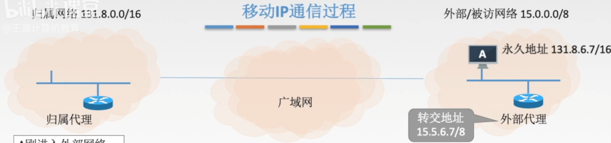

# 网络层设备

### 路由器

路由器是一种具有多个输入端口和多个输出端口的专用计算机，其任务是转发分组。

路由选择：根据所选定的路由选择协议构造出路由表，同时经常或定期地和相邻路由器交换路由信息而不断地更新和维护路由表。

交换结构：根据转发表（路由表得来）对分组进行转发。

**2010** 下列网络设备中，能够抑制广播风暴的是

1. 中继器
2. 集线器
3. 网桥
4. 路由器

A 13

B 3

C 34

D 4

**2012** 下列关于IP路由器功能地描述中，正确的是

1. 运行路由协议，设置路由表
2. 检测到拥塞时，合理丢弃IP分组
3. 对收到的IP分组头进行差错校验，确保传输的IP分组不丢失
4. 根据收到的IP分组的目的IP地址，将其转发到合适的输出线路上

A 34

B 123

C 124

D 1234

**2015** 某路由器的路由表如下表所示：

| 目的网络       | 下一跳    | 接口 |
| -------------- | --------- | ---- |
| 169.96.40.0/23 | 176.1.1.1 | S1   |
| 169.96.40.0/25 | 176.2.2.2 | S2   |
| 169.96.40.0/27 | 176.3.3.3 | E3   |
| 0.0.0.0/0      | 176.4.4.4 | E4   |

若路由器收到一个目的地址为169.96.40.5的IP分组，则转发该IP分组的接口是

A S1

B S2

C S3

D S4