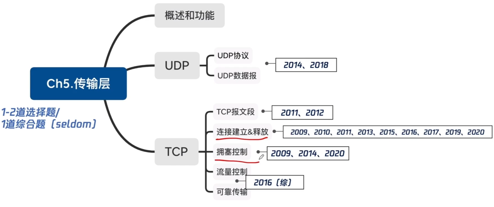

# UDP

### 考点分布

### 传输层功能概述

1. 传输层提供进程和进程之间的逻辑通信 端到端

   网络层提供主机之间的逻辑通信

2. 复用和分用（用端口号区分进程）

3. 传输层对收到的报文进行差错检测（首部+数据部分） 网络只校验首部

4. 传输层的两种协议提供无连接/面向连接的服务。

### 用户数据报协议UDP概述

UDP只在IP数据报服务至上增加了很少功能，即复用分用和差错检测功能。

UDP的主要特点：

1. UDP是无连接的，减少开销和发送数据之前的时延。
2. UDP使用最大努力交付，即不保证可靠交付。
3. UDP是面向报文的，适合一次性传输少量数据的网络应用
4. UDP无拥塞控制，适合很多实时应用。
5. UDP首部开销小，8B，TCP20B。

### UDP首部格式

### UDP校验

伪首部只有在计算检验和时才出现，不向下传送也不向上提交。

17：封装UDP报文的IP数据报首部协议字段是17。

**2014** 下列关于UDP协议的叙述中，正确的是

1. 提供无连接服务
2. 提供复用/分用服务
3. 通过差错校验，保证可靠数据传输

A 1

B 12

C 23

D 123

**2018** UDP协议实现分用(demultiplexing)时所依据的头部字段是

A 源端口号

B 目的端口号

C 长度

D 校验和