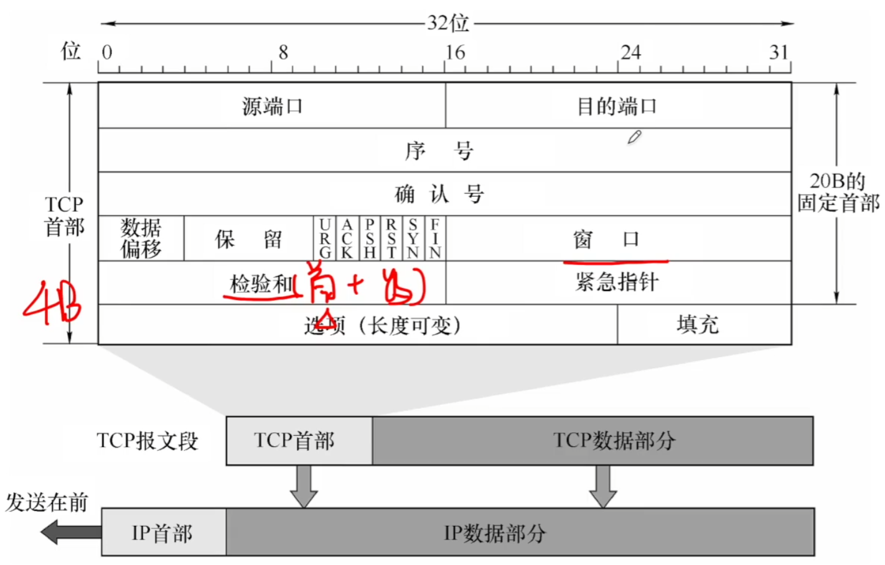

# TCP报文段

### TCP协议的特点

1. 点对点
2. 面向连接
3. 全双工
4. 可靠传输

### TCP报文段首部格式

序号：本报文段所发送数据的第一个字节的序号。

确认号：期望收到对方下一个报文段的第一个数据字节的序号。

数据偏移（首部长度）：TCP报文段的数据起始处距离TCP报文段的起始处有多远，以4B位单位（最大值为15）。

重要控制位

紧急位URG：URG=1时，标明此报文段中有紧急数据，是高优先级的数据，应尽快传送，不用在缓存里排队，配合紧急指针字段使用。

确认位ACK：ACK=1时确认号有效，在连接建立后所有传输的报文段都必须把ACK置为1。

同步位SYN：SYN=1时，表明是一个连接请求/连接接受报文。

终止位FIN：FIN=1时，表明此报文段发送方数据已发完，要求释放连接。

窗口：指的是发送本报文段的一方的接收窗口，即现在允许对方发送的数据量。

校验和：检验首部+数据，检验时要加上12B伪首部。

**2011** 主机甲和主机乙之间已建立了一个TCP连接，主机甲向主机乙发送了3个连续的TCP段，分别包含300B、400B和500B的有效载荷，第3个段的序号为900。若主机乙仅正确接收到第1和第3个段，则主机乙发送给主机甲的确认序号是

A 300

B 500

C 1200

D 1400