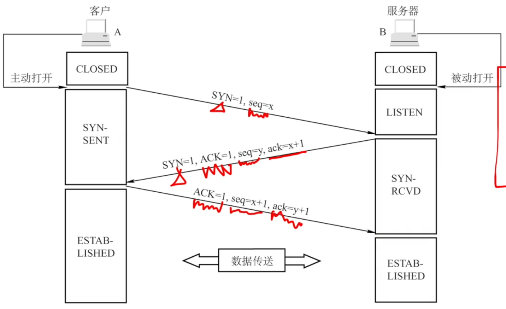

# TCP连接管理

### TCP连接管理

TCP连接传输三个阶段：

- TCP连接的建立采用客户/服务器方式，主动发起连接建立的应用进程叫做客户，而被动等待连接建立的应用进程叫服务器。
- TCP连接采用全双工通信
- TCP连接的端点是套接字socket=(IP地址：端口号)

### TCP连接建立：三次握手

1. 客户端发送连接请求报文段，无应用层数据。

   SYN=1，seq=x（随机）

2. 服务器端为该TCP连接分配缓存和变量，并向客户端返回确认报文段，允许连接，无应用层数据。

   SYN=1，ACK=1，seq=y（随机），ack=x+1

3. 客户端为该TCP连接分配缓存和变量，并向服务器端返回确认的确认，可以携带数据。

   ACK=1，seq=x+1，ack=y+1

### TCP连接释放：四次挥手

参与一条TCP连接的两个进程中的任何一个都能终止该连接。

1. 客户端发送连接释放报文段，停止发送数据，主动关闭TCP连接

   FIN=1，seq=u

2. 服务器端回送一个确认报文段，客户到服务器这个方向的连接就释放了-半关闭状态。

   ACK=1，seq=v，ack=u+1

3. 服务器端发完数据，就发出连接释放报文段，主动关闭TCP连接。

   FIN=1，ACK=1，seq=w，ack=u+1

4. 客户端会送一个确认报文段，再等待时间等待计时器设置的2MSL（最长报文段寿命）后，连接彻底关闭。

   ACK=1，seq=u+1，ack=w+1

**2020** 若主机甲和主机乙建立TCP连接时，发送的SYN段中的序号为1000，在断开连接时，甲发送给乙的FIN段中的序号为5001，则在无任何重传的情况下，甲向乙已经发送的应用层数据的字节数为

A 4002

B 4001

C 4000

D 3999

**2013** 主机甲和主机乙之间已建立一个TCP连接，双方持续有数据传输，且数据无差错与丢失。若甲收到1个来自乙的TCP段，该段的序号为1913、确认序号为2046、有效载荷为100字节，则甲立即发送给乙的TCP段的序号和确认序号分别是

A 2046、2012

B 2046、2013

C 2047、2012

D 2047、2013