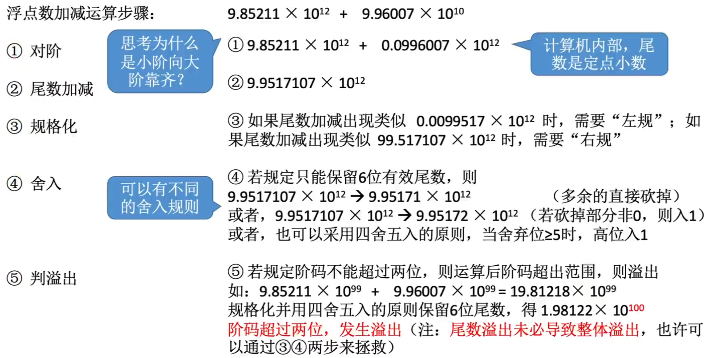
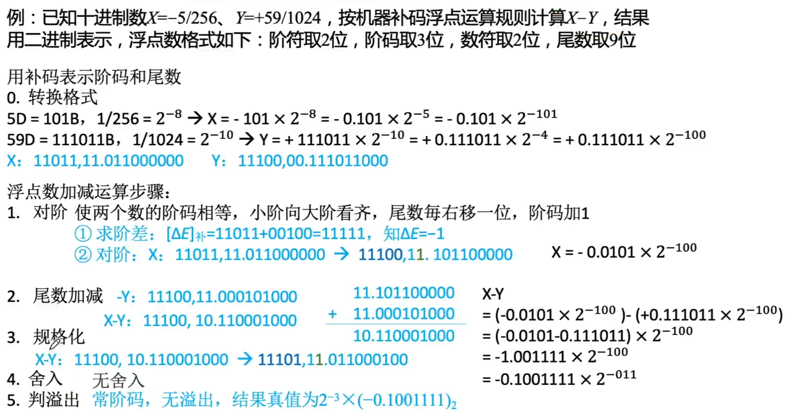
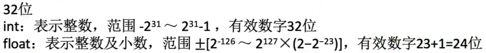
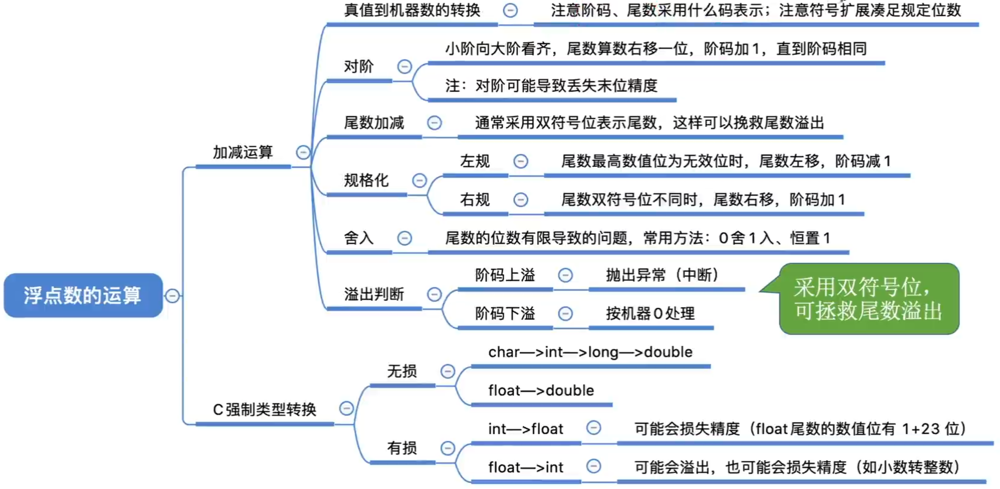

# 浮点数的运算

## 浮点数的加减运算步骤

## 舍入

### “0”舍“1”入法

类似于十进制数运算中的“四舍五入”法，即在尾数右移时，被移去的最高数值位为0，则舍去；被移去的最高数值位为1，则在尾数的末位加1。这样做可能会使尾数又溢出，此时需再做一次右规。

### 恒置“1”法

尾数右移时，不论丢掉的最高数值位是“1”还是“0”，都使右移后的尾数末位恒置“1”。这种方法同样有使尾数变大和变小的两种可能。

## 强制类型转换

| 类型      | 16位机器 | 32位机器 | 64位机器 |
| --------- | -------- | -------- | -------- |
| char      | 8        | 8        | 8        |
| short     | 16       | 16       | 16       |
| int       | 16       | 32       | 32       |
| long      | 32       | 32       | 64       |
| long long | 64       | 64       | 64       |
| float     | 16       | 32       | 32       |
| double    | 64       | 64       | 64       |

char->int->long->double

float->double

范围、精度从小到大，转换过程没有损失

int->float 可能损失精度

float->int 可能溢出及损失精度

