# 浮点数的运算

## 浮点数的加减运算步骤

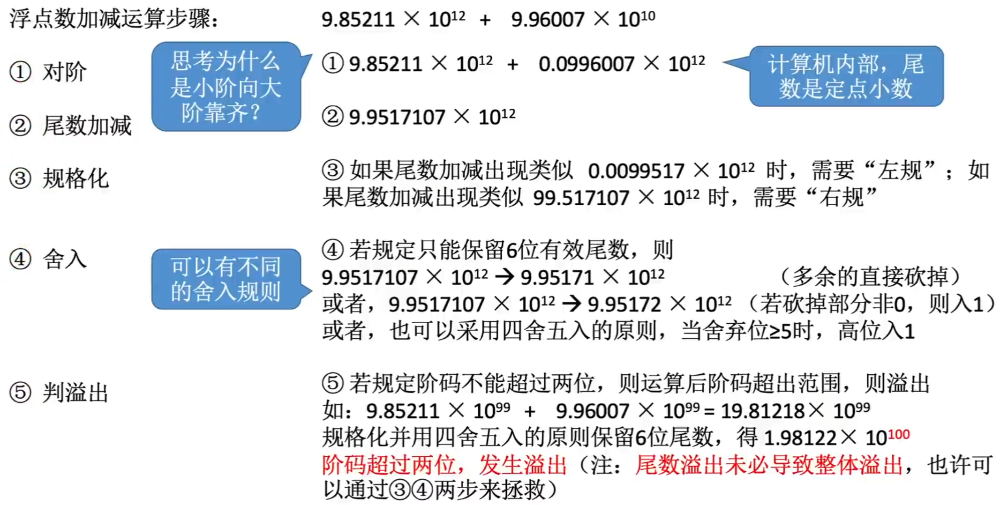

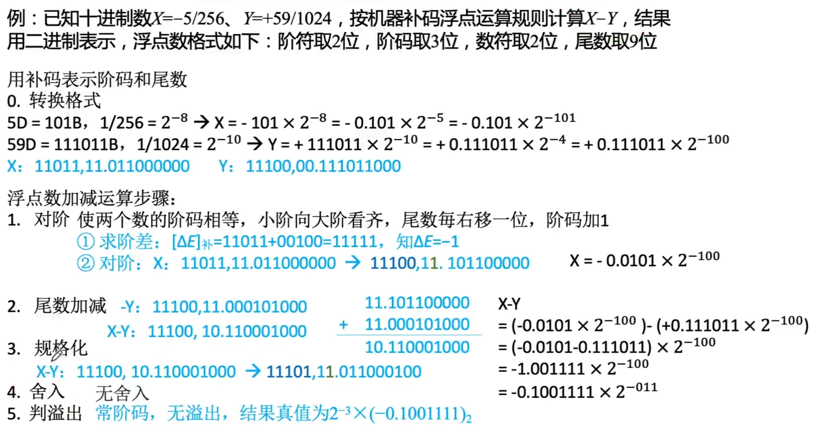

## 舍入

### “0”舍“1”入法

类似于十进制数运算中的“四舍五入”法，即在尾数右移时，被移去的最高数值位为0，则舍去；被移去的最高数值位为1，则在尾数的末位加1。这样做可能会使尾数又溢出，此时需再做一次右规。

### 恒置“1”法

尾数右移时，不论丢掉的最高数值位是“1”还是“0”，都使右移后的尾数末位恒置“1”。这种方法同样有使尾数变大和变小的两种可能。

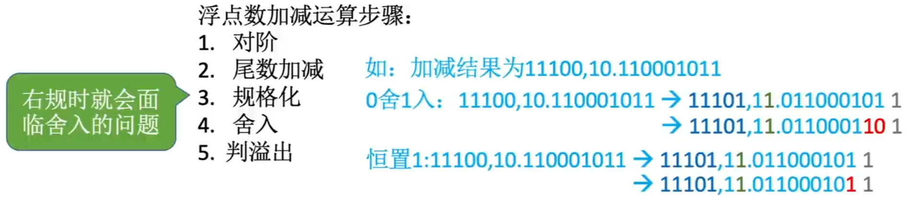

## 强制类型转换

| 类型      | 16位机器 | 32位机器 | 64位机器 |
| --------- | -------- | -------- | -------- |
| char      | 8        | 8        | 8        |
| short     | 16       | 16       | 16       |
| int       | 16       | 32       | 32       |
| long      | 32       | 32       | 64       |
| long long | 64       | 64       | 64       |
| float     | 16       | 32       | 32       |
| double    | 64       | 64       | 64       |

char->int->long->double

float->double

范围、精度从小到大，转换过程没有损失

int->float 可能损失精度

float->int 可能溢出及损失精度

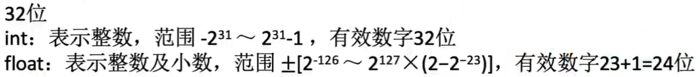

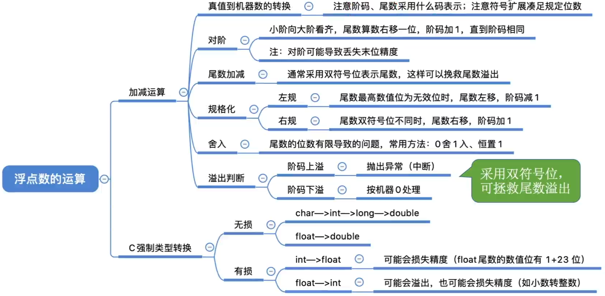

# 存储系统基本概念

## 现代计算机的结构

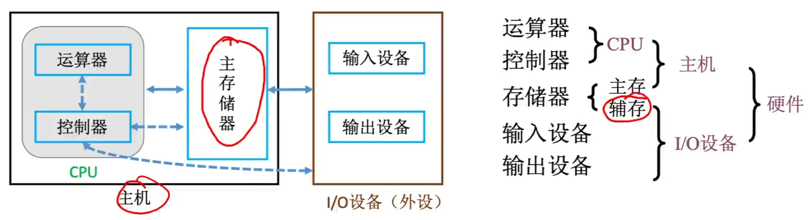

## 知识总览

## 存储器的层次化结构

注：有的教材会把安装在电脑内部的磁盘称为“辅存”，把U盘、光盘等称为外存。也有的教材把磁盘、U盘、光盘等统称为“辅存”或“外存”。

辅存中的数据要调入主存后才能被CPU访问

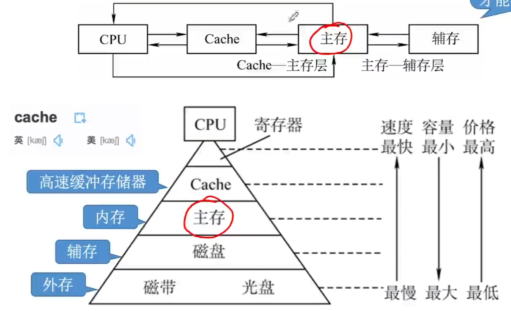

### 主存-辅存

实现虚拟存储系统，解决了主存容量不够的问题

### Cache-主存

解决了主存与CPU速度不匹配的问题

## 存储器的分类

### 层次

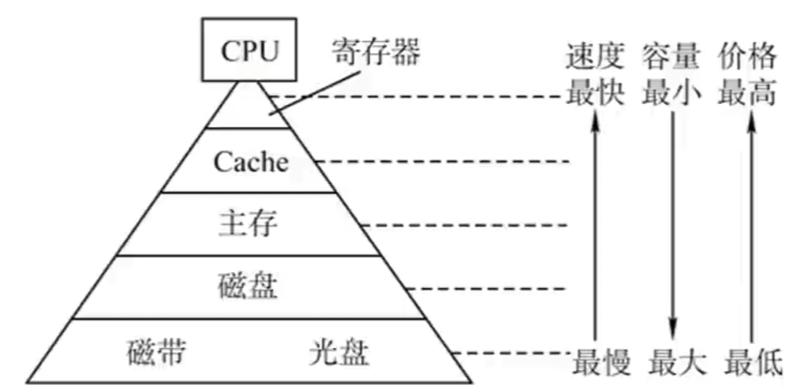

### 存储介质

存储器的功能：存放二进制信息

按存储介质分类

#### 半导体存储器（主存、Cache）

以半导体器件存储信息

#### 磁表面存储器（磁盘、磁带）

以磁性材料存储信息

#### 光存储器

以光介质存储信息

### 存取方式

#### 随机存储器（Random Access Memory, RAM）

读写任何一个存储单元所需时间都相同，与存储单元所在的物理位置无关。

#### 顺序存储存储器（Sequential Access Memory, SAM）

读写一个存储单元所需时间取决于存储单元所在的物理位置

#### 直接存取存储器（Direct Access Memory, DAM）

既有随机存取特性，也有顺序存取特性。先直接选取信息所在区域，然后按顺序方式存取。

串行访问存储器

读写某个存储单元所需时间与存储单元的物理位置有关

相联存储器（Associative Memory）

即可以按内容访问的存储器（Content Addressed Memory, CAM）可以按照内容检索到存储位置进行读写，“快表”就是一种相联存储器

### 信息的可更改性

#### 读写存储器（Read/Write Memory）

即可读、也可写（如：磁盘、内存、Cache）

#### 只读存储器（Read Only Memory）

只能读，不能写（如：实体音乐专辑通常采用CD-ROM，实体电影采用蓝光光碟，BIOS通常写在ROM中）

事实上很多ROM也可多次读写，只是比较麻烦。

### 信息的可保存性

断电后，存储信息消失的存储器——易失性存储器（主存，Cache）

断电后，存储信息依然保持的存储器——非易失性存储器（磁盘、光盘）

信息读出后，原存储信息被破坏——破坏性读出（如DRAM芯片，读出数据后要进行重写）

信息读出后，原存储信息不被破坏——非破坏性读出（如SRAM芯片、磁盘、光盘）

## 存储器的性能指标

1. 存储容量：存储字数*字长（如1M\*8位）。

   MDR位数反映存储字长

2. 单位成本：每位价格=总成本/总容量。

3. 存储速度：数据传输率=数据的宽度/存储周期。

   数据的宽度即存储字长

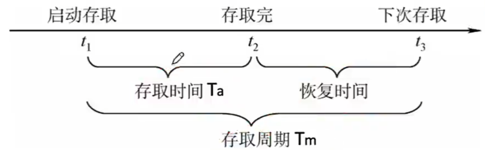

存取时间（Ta）：存取时间是指从启动一次存储器操作到完成该操作所经历的时间，分为读出时间和写入时间。

存取周期（Tm）：存取周期又称为读写周期或访问周期。它是指存储器进行一次完整的读写操作所需的全部时间，即连续两次独立地访问存储器操作（读或写操作）之间所需地最小时间间隔。

主存带宽（Bm）：主存带宽又称数据传输率，表示每秒从主存进出信息的最大数量，单位为字/秒、字节/秒（B/s）或位/秒（b/s）。

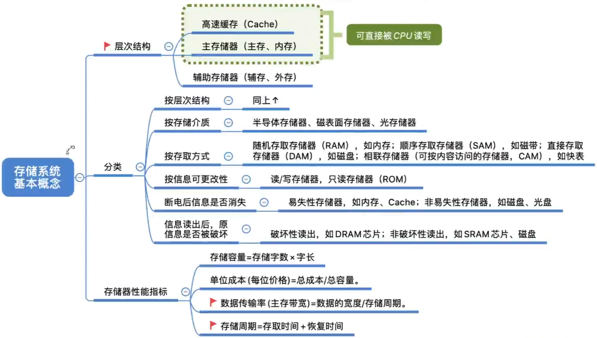

# 主存储器的基本组成

## 基本的半导体元件及原理

注：MOS管可理解为一种电控开关，输入电压达到某个阈值时，MOS管就可以接通

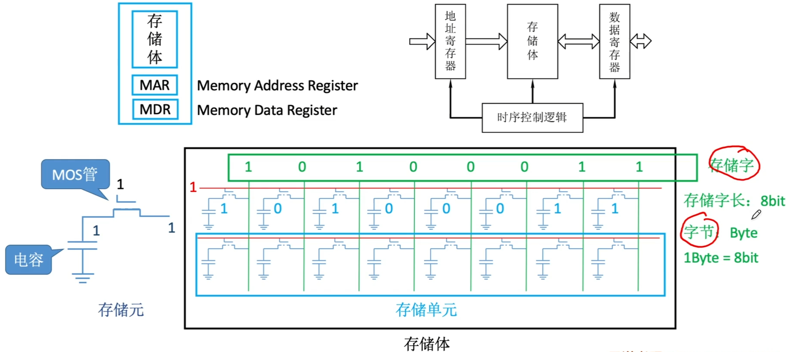

## 存储器芯片的基本原理

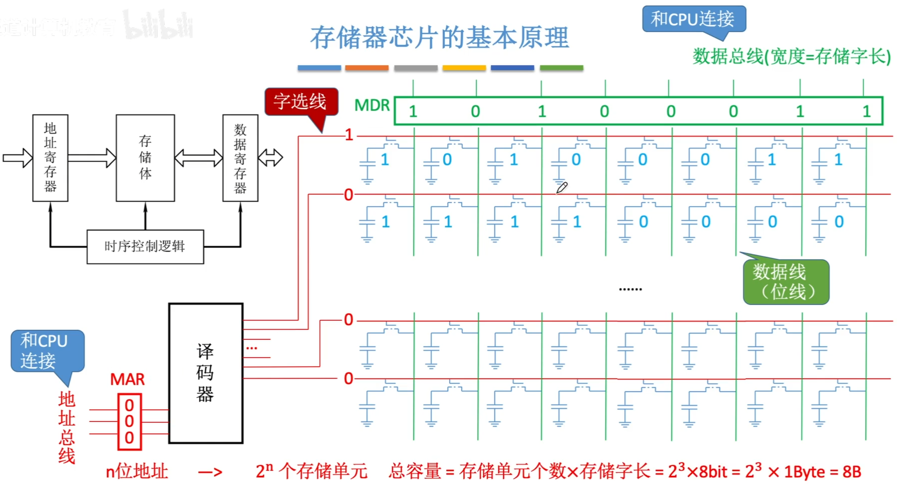

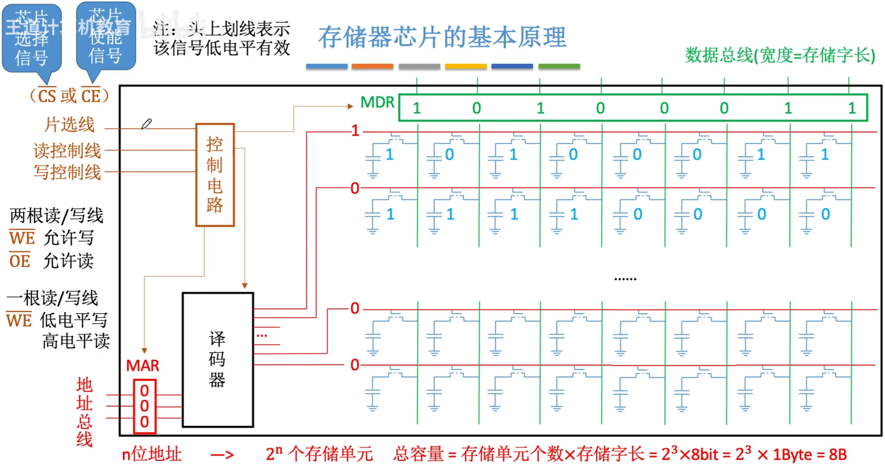

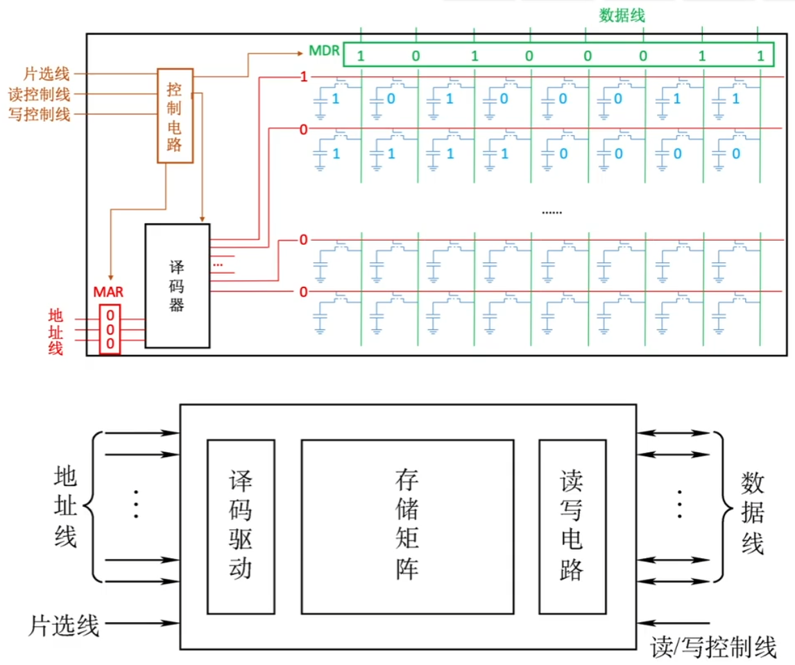

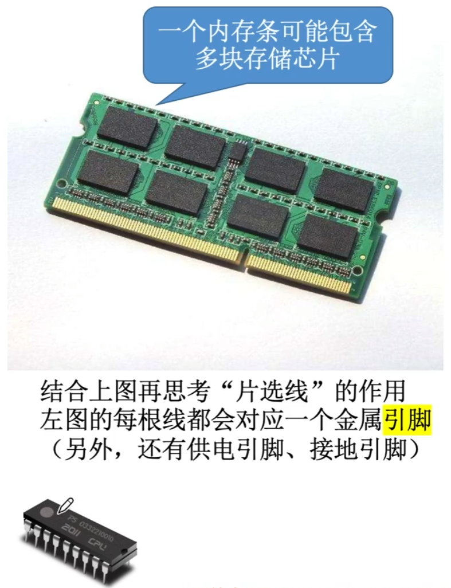

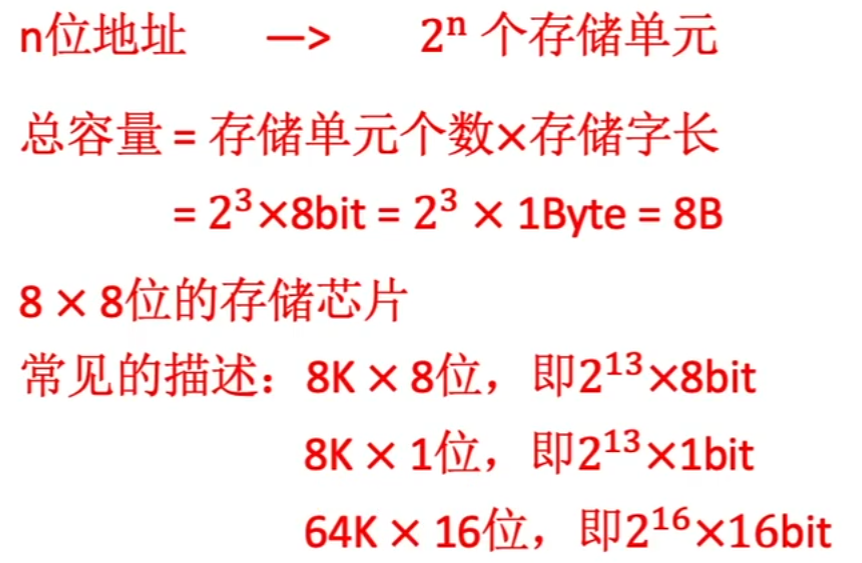

## 寻址

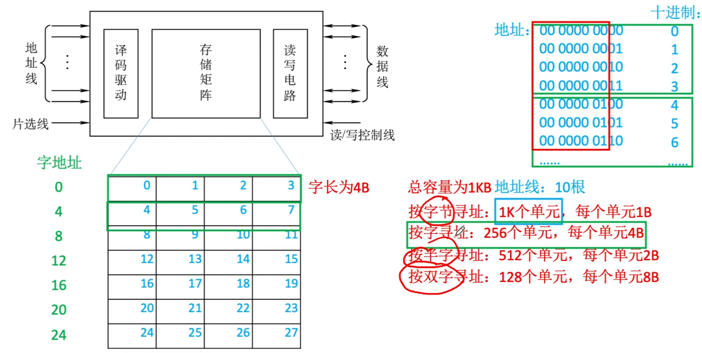

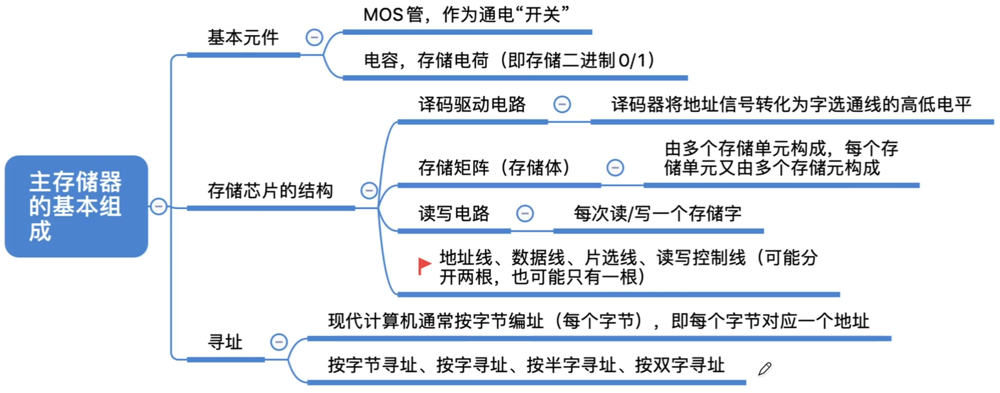