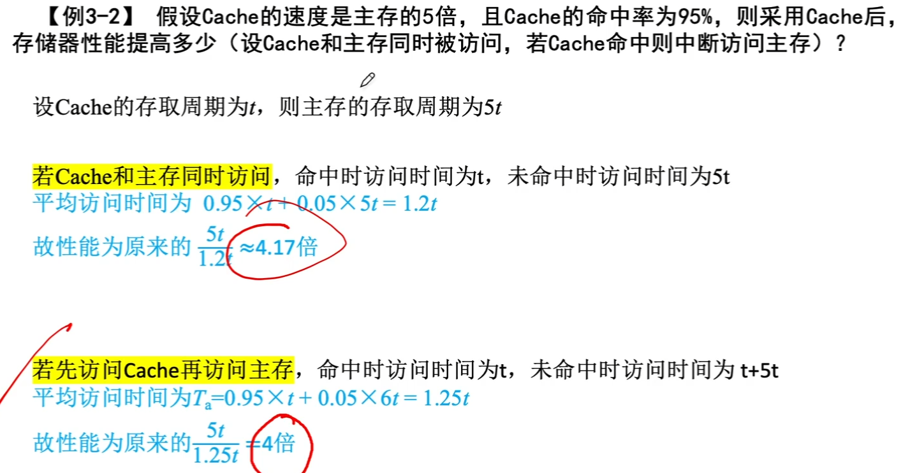
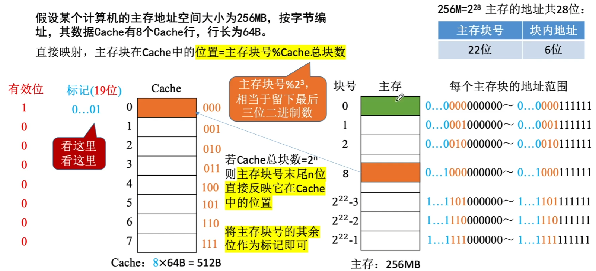
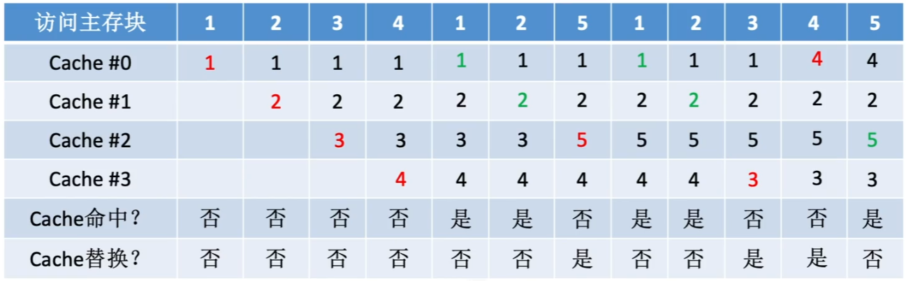

# Cache

## Cache的基本概念和原理

### 局部性原理

#### 空间局部性

数组元素、顺序执行的指令代码

在最近的未来要用到的信息（指令和数据），很可能与现在正在使用的信息在存储空间上是邻近的

#### 时间局部性

循环结构的指令代码

在最近的未来要用到的信息，很可能是现在正在使用的信息

```c++
int sumarrayrows(int a[M][N])
{
    int i, j, sum = 0;
    for(i=0;i<M;i++)
        for(j=0;j<N;j++)
            sum+=a[i][j];
    return sum;
}
```

程序B按“列优先”访问二维数组，空间局部性更差

```c++
int sumarrayrows(int a[M][N])
{
    int i, j, sum = 0;
    for(j=0;j<N;j++)
    	for(i=0;i<M;i++)
            sum+=a[i][j];
    return sum;
}
```

基于局部性原理，不难想到，可以把CPU目前访问的地址“周围”的部分数据放到Cache中


### 性能分析

设tc位访问一次Cache所需时间，tm为访问一次主存所需时间

命中率H：CPU欲访问的信息已在Cache中的比率

缺失（未命中）率M=1-H

Cache-主存系统的平均访问时间t为

先访问Cache，若Cache未命中再访问主存
$$
t=Ht_c+(1-H)(t_c+t_m)
$$
同时访问Cache和主存，若Cache命中则立即停止访问主存
$$
t=Ht_c+(1-H)t_m
$$




### 有待解决的问题

基于局部性原理，不难想到，可以把CPU目前访问的地址“周围”的部分数据放到Cache中。如何界定“周围“？

将主存的存储空间”分块“，如：每1kB为一块。主存与Cache之间以“块”为单位进行数据交换


注：操作系统中，通常将主存中的“一个块”也成为“一个页/页面/页框”

Cache中的“块“也称为”行“

注意：每次被访问的主存块，一定会被立即调入Cache

如何区分Cache与主存的数据块对应关系？Cache和主存的映射方式

Cache很小，主存很大。如果Cache满了怎么办？替换算法

CPU修改了Cache中的数据副本，如果确保主存中数据母本的一致性？Cache写策略


## Cache和主存的映射方式

如何区分Cache中存放的是哪个主存块？

给每个Cache块增加一个”标记“，记录对应的主存块号？

有”标记“就够了？

还要增加”有效位“


### 全相联映射（随意放）

主存块可以放在Cache的任意位置


### 直接映射

每个主存块只能放到一个特定的位置：
$$
Cache块号=主存块号\%Cache总块数
$$



### 组相联映射

Cache块分为若干组，每个主存块可放到特定分组中的任意一个位置组号
$$
组号=主存块号\%分组数
$$


结合每种地址映射方式的地址结构思考：给定一个主存地址，如何拆分地址，并查找Cache、访存？

## Cache替换算法

### 替换算法解决的问题


1. 全相联映射

   Cache完全满了才需要替换需要在全局选择替换哪一块

2. 直接映射

   如果对应位置非空，则毫无选择地直接替换

3. 组相联映射

   分组内满了才需要替换

   需要在分组内选择替换哪一块


### 随机算法（RAND）

随机算法（RAND，Random）若Cache已满，则随机选择一块替换。

设总共有4个Cache块，初始整个Cache为空。采用全相联映射，依次访问主存块

{1，2，3，4，1，2，5，1，2，3，4，5}



随机算法 实现简单，但完全没考虑局部性原理，命中率低，实际效果很不稳定

### 先进先出算法（FIFO）

先进先出算法（FIFO，First In First Out）若Cache已满，则替换最先被调入Cache的块

设总共有4个Cache块，初始整个Cache为空。采用全相联映射，依次访问主存块{1，2，3，4，1，2，5，1，2，3，4，5}


先进先出算法 实现简单，最开始按#0#1#2#3放入Cache，之后轮流替换#0#1#2#3FIFO依然没考虑局部性原理，最先被调入Cache的块也有可能是被频繁访问的

抖动现象：频繁的换入换出现象（刚被替换的块很快又被调入）

### 近期最少使用算法（LRU）

近期最少使用算法（LRU，Least Recently Used）为每一个Cache块设置一个”计数器“，用于记录每个Cache块已经有多久没被访问了。当Cache满后替换”计数器“最大的

设总共有4个Cache块，初始整个Cache为空。采用全相联映射，依次访问主存块{1，2，3，4，1，2，5，1，2，3，4，5}


1. 命中时，所命中的行的计数器清零，比其低的计数器加1，其余不变；
2. 未命中且还有空闲行时，新装入的行的计数器置0，其余非空闲行全加1；
3. 未命中且无空闲行时，计数值最大的行的信息块被淘汰，新装行的块的计数器置0，其余全加1。

LRU算法 基于"局部性原理"，近期被访问过的主存块，在不久的将来也很有可能被再次访问，因此淘汰最久没被访问过的块是合理的。LRU算法的实际运行效果优秀，Cache命中率高。

若被频繁访问的主存块数量>Cache行的数量，则有可能发生“抖动”，如：{1，2，3，4，5，1，2，3，4，5，1，2...}

### 最不经常使用算法（LFU）

最不经常使用算法（LFU，Least Frequently Used）为每一个Cache块设置一个“计数器”，用于记录每个Cache块被访问过几次。当Cache满后替换”计数器“最小的

设总共有4个Cache块，初始整个Cache为空。采用全相联映射，依次访问主存块{1，2，3，4，1，2，5，1，2，3，4，5}


新调入的块计数器=0，之后每被访问一次计数器+1。需要替换时，选择计数器最小的一行

注：若采用FIFO策略，则会淘汰4号主存块

LFU算法 曾经被访问的主存块在未来不一定会用到（如：微信视频聊天相关的块），并没有很好地遵循局部性原理，因此实际运行效果不如LRU


## Cache写策略


为何不讨论读命中、读不命中的情况？

读操作不会导致Cache和主存的数据不一致

### 写命中

#### 写回法


写回法（write-back）当CPU对Cache命中时，只修改Cache的内容，而不立即写入主存，只有当此块被换出时才写回主存

减少了访存次数，但存在数据不一致的隐患。

#### 全写法


全写法（写直通法，write-through）当CPU对Cache写命中时，必须把数据同时写入Cache和主存，一般使用写缓冲（write buffer）

访存次数增加，速度变慢，但更能保证数据一致性


使用写缓冲，CPU写的速度很快，若写操作不频繁，则效果很好。若写操作很频繁，可能会因为写缓冲饱和而发生阻塞

### 写不命中

#### 写分配法

写分配法（write-allocate）当CPU对Cache写不命中时，把主存中的块调入Cache，在Cache中修改。通常搭配写回法使用。

写回法（write-back）当CPU对Cache写命中时，只修改Cache的内容，而不立即写入主存，只有当此块被换出时才写回主存


#### 非写分配法


非写分配法（not-write-allocate）当CPU对Cache写不命中时只写入主存，不调入Cache。

搭配全写法使用。

全写法（写直通法，write-through）当CPU对Cache写命中时，必须把数据同时写入Cache和主存，一般使用写缓冲（write buffer）

### 多级Cache


# 页式存储器

# 虚拟存储器