# 内存的基础知识

## 什么是内存？有何作用？

内存可存放数据。程序执行前需要先放到内存中才能被CPU处理——缓和CPU与硬盘之间的速度矛盾

 思考：在多道程序环境下，系统中有多个程序并发执行，也就是说会有多个程序的数据需要同时放到内存中。那么如何区分各个程序的数据是放在什么地方的呢？

方案：给内存的存储单元编地址

内存地址从0开始，每个地址对应一个存储单元

内存中也有一个一个的“小房间”，每个小房间就是一个“存储单元”

如果计算机“按字节编址”则每个存储单元大小为1字节，即1B，即8个二进制位

如果字长为16位的计算机“按字编址”，则每个存储单元大小为1个字；每个字的大小为16个二进制位

## 几个常用的数量单位

 注：有的题目会告诉我们内存的大小，让我们确定地址长度应该是多少（即要多少个二进制位才能表示相应数目的存储单元）

## 指令的工作原理

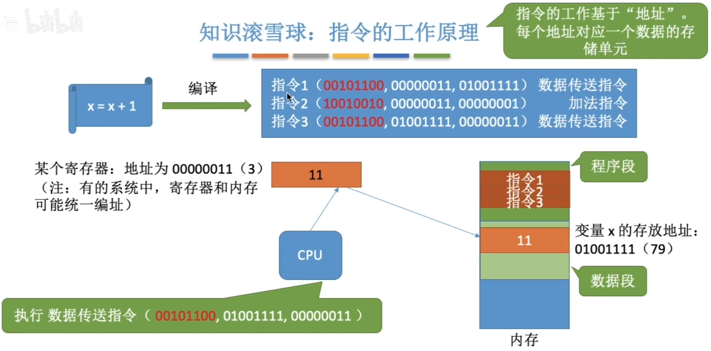

可见，我们写的代码要翻译成CPU能识别的指令。这些指令会告诉CPU应该去内存的哪个位置读/写数据，这个数据应该做什么样的处理。在这个例子中，我们默认让这个进程的相关内容从地址#0开始连续存放，指令中的地址参数直接给出了变量x的实际存放地址（物理地址）。

思考：如果这个进程不是从地址#0开始存放的，会影响指令的正常执行吗？ 

为了简化理解，本节中我们默认操作系统给进程分配的是一片连续的内存空间

程序经过编译、链接后生成的指令中指明的是逻辑地址（相对地址），即：相对于进程的起始地址而言的地址

C语言程序经过编译、链接处理后，生成装入模块，即可执行文件：

int x = 10;

x = x+1;

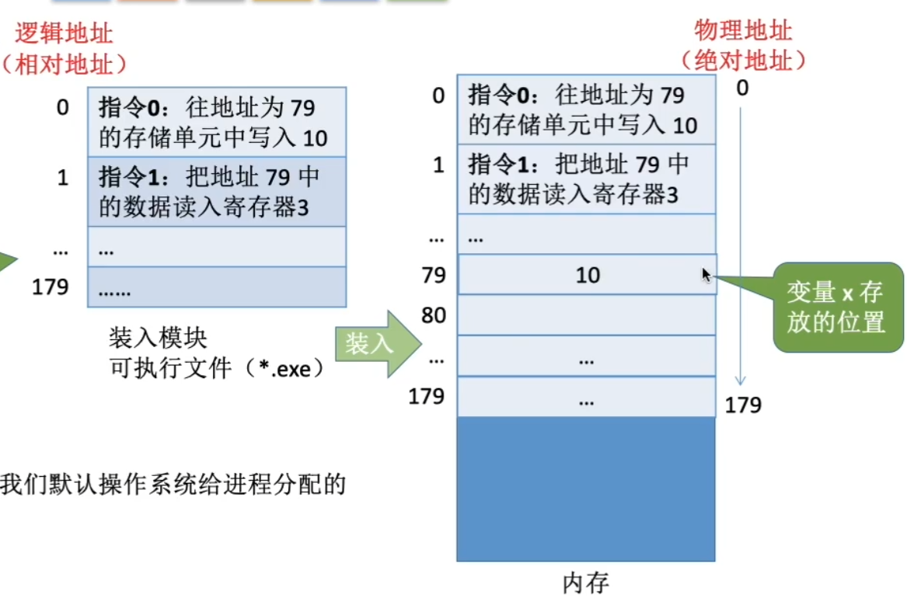

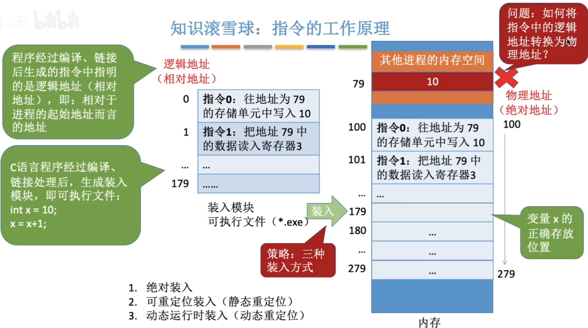

策略：三种装入方式

1. 绝对装入

   在编译时，如果直到程序将放到内存中的哪个位置，编译程序将产生绝对地址的目标代码。装入程序按照装入模块中的地址，将程序和数据装入内存。

   如果知道装入模块要从地址为100的地方开始存放

   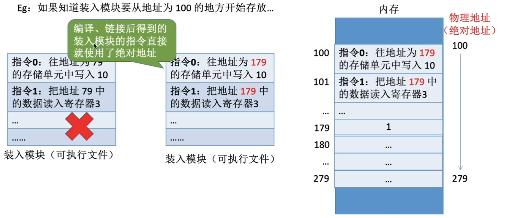

   绝对装入只适用于单道程序环境。

   程序中使用的绝对地址，可在编译或汇编时给出，也可由程序员直接赋予。通常情况下都是编译或汇编时再转换为直接地址。

2. 可重定位装入（静态重定位）

   又称可重定位装入。编译、链接后的装入模块的地址都是从0开始的，指令中使用的地址、数据存放的地址都是相对于起始地址而言的逻辑地址。可根据内存的当前情况，将装入模块装入到内存的适当位置。装入时对地址进行”重定位“，将逻辑地址变换为物理地址（地址变换是在装入时一次完成的）。

   静态重定位的特点是在一个作业装入内存时，必须分配其要求的全部内存空间，如果没有足够的内存，就不能装入该作业。

   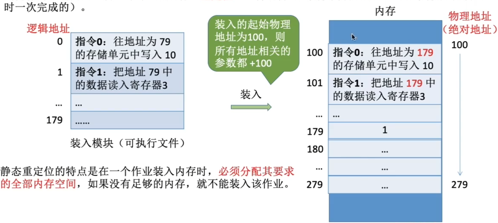

3. 动态运行时装入（动态重定位）

   又称动态运行时装入。编译、链接后的装入模块的地址都是从0开始的。装入程序把装入模块装入内存后，并不会立即把逻辑地址转换为物理地址，而是把地址转换推迟到程序真正要执行时才进行。因此装入内存后所有的地址依然是逻辑地址。这种方式需要一个重定位寄存器的支持。 

   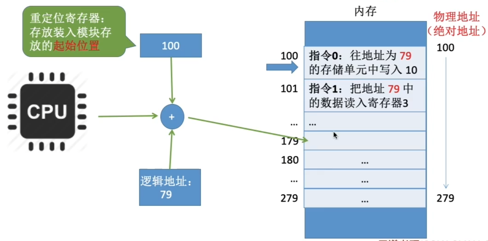

采用动态重定位时允许程序在内存中发生移动。

并且可将程序分配到不连续的存储区中；在程序运行前只需装入它的部分代码即可投入运行，然后在程序运行期间，根据需要动态申请分配内存；便于程序段的共享，可以向用户提供一个比存储空间大得多的地址空间。

## 从写程序到程序运行

编译：由编译程序将用户源代码编译成若干个目标模块（编译就是把高级语言翻译为机器语言）

链接：由链接程序将编译后形成的一组目标模块，以及所需库函数链接在一起，形成一个完整的装入模块

装入（装载）：由装入程序将装入模块装入内存运行

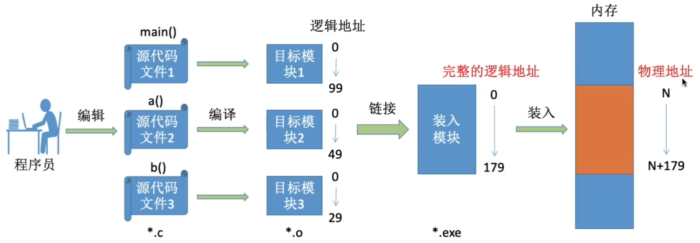

## 链接的三种方式

### 静态链接

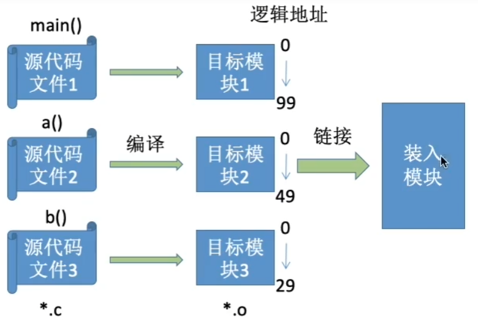

在程序运行之前，先将各目标模块及它们所需的库函数连接成一个完整的可执行文件（装入模块），之后不再拆开。

### 装入时动态链接

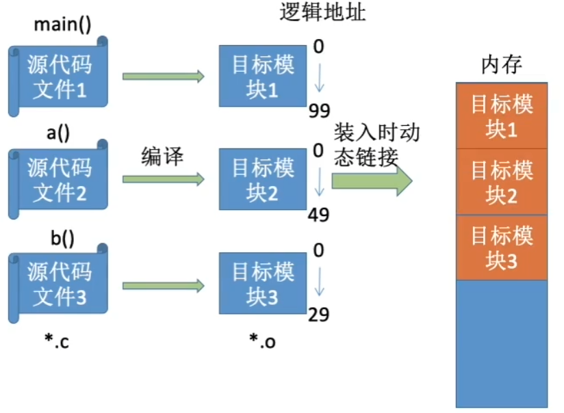

将各目标模块装入内存时，边装入边链接的链接方式。

### 运行时动态链接

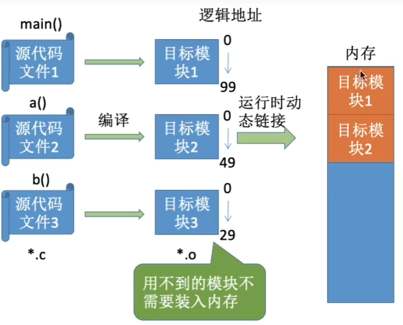

在程序执行中需要该目标模块时，才对它进行链接。其优点是便于修改和更新，便于实现对目标模块的共享。

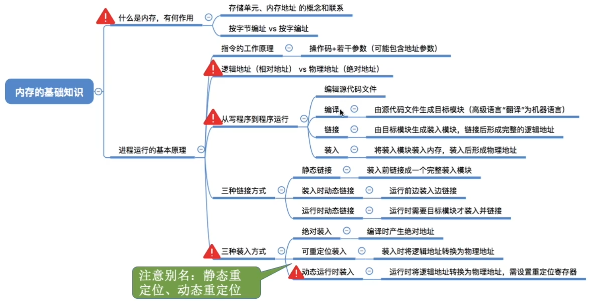

# 内存管理的概念

## 内存空间的分配与回收

操作系统作为系统资源的管理者，当然也要对内存进行管理，要管些什么呢？

1. 操作系统负责内存空间的分配与回收

2. 操作系统需要提供某种技术从逻辑上对内存空间进行扩充

   虚拟技术（操作系统的虚拟性）

3. 操作系统需要提供地址转换功能，负责程序的逻辑地址与物理地址的转换

   为了使编程更方便，程序员写程序时应该只需要关注指令、数据的逻辑地址。而逻辑地址到物理地址的转换（这个过程称为地址重定位 三种装入方式）应该由操作系统负责，这样就保证了程序员写程序时不需要关注物理内存的实际情况。

   

4. 操作系统需要提供内存保护功能。保证各进程在各自存储空间内运行，互不干扰

## 内存保护

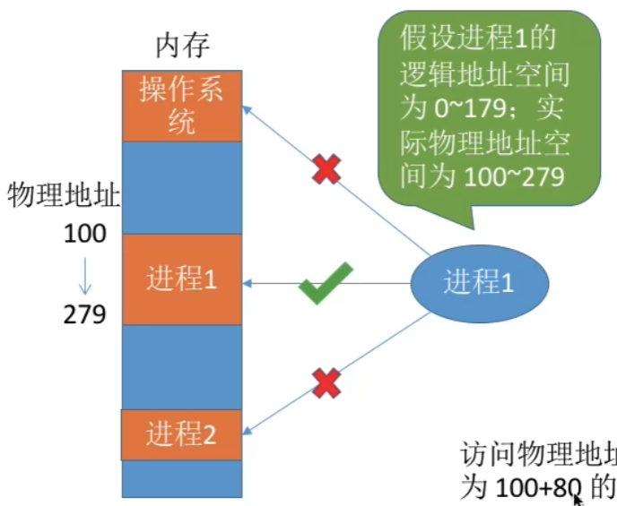

内存保护可采取两种方法：

方法一：在CPU中设置一对上、下限寄存器，存放进程的上、下限地址。进程的指令要访问某个地址时，CPU检查是否越界。

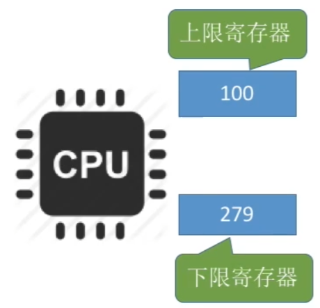

方法二：采用重定位寄存器（又称基址寄存器）和界地址寄存器（又称限长寄存器）进行越界检查。重定位寄存器中存放的是进程的起始物理地址。界地址寄存器中存放的是进程的最大逻辑地址。

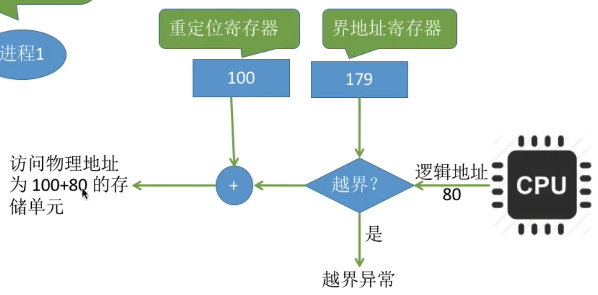

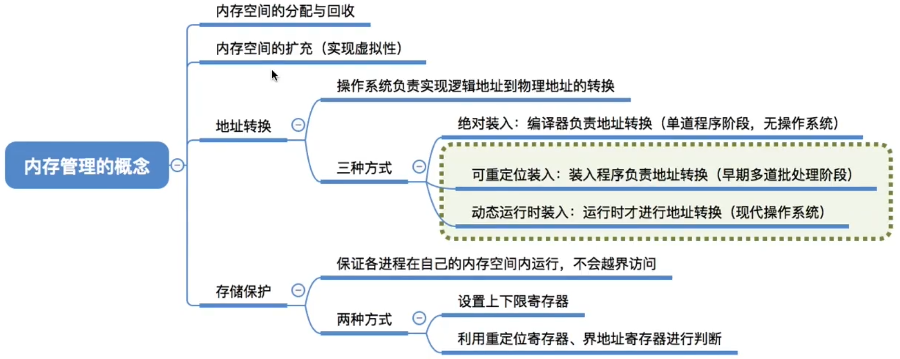

# 覆盖与交换

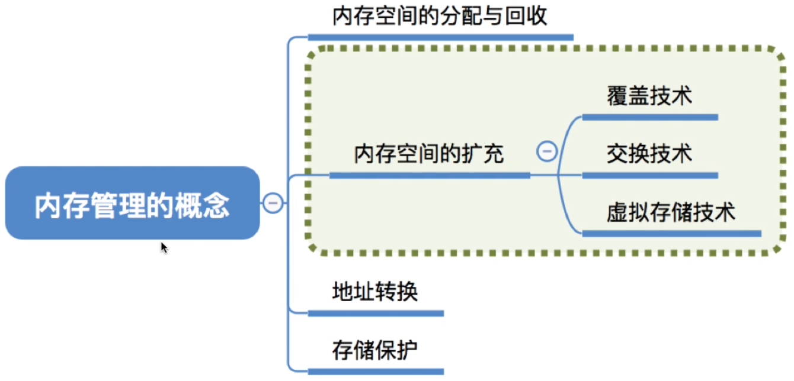

## 覆盖技术

早期的计算机内存很小，比如IBM推出的第一台PC机最大只支持1MB大小的内存。因此经常会出现内存大小不够的情况。

后来人们引入了覆盖技术，用来解决“程序大小超过物理内存总和”的问题

覆盖技术的思想：将程序分为多个段（多个模块）。

常用的段常驻内存，不常用的段在需要时调入内存。

内存中分为一个“固定区“和若干个”覆盖区“

需要常驻内存的段放在”固定区“中，调入后就不再调出（除非运行结束）

不常用的段放在”覆盖区“，需要用到时调入内存，用不到时调出内存

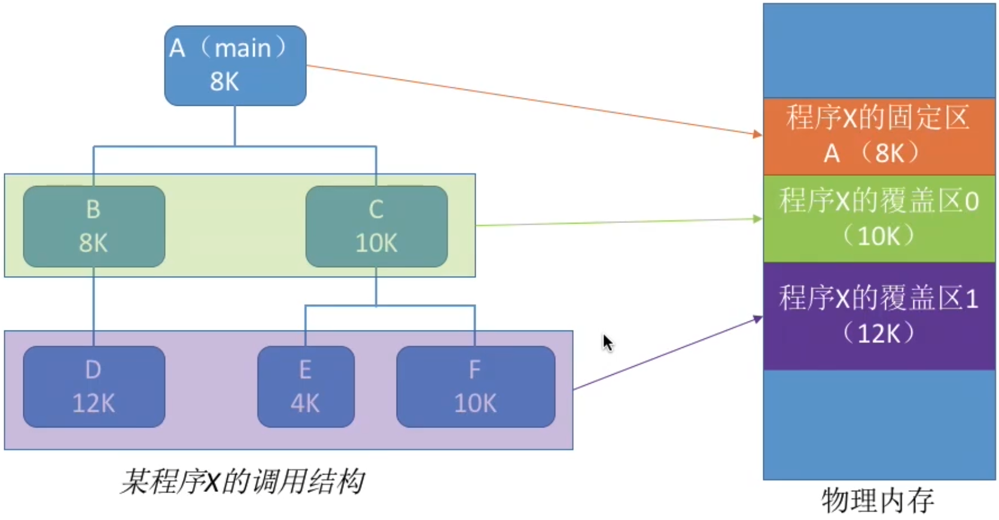

按照自身逻辑结构，让那些不可能同时被访问的程序段共享同一个覆盖区

必须由程序员声明覆盖结构，操作系统完成自动覆盖。缺点：对用户不透明，增加了用户编程负担。

覆盖技术只用于早期的操作系统中，现在已成为历史。

## 交换技术

交换（对换）技术的设计思想：内存空间紧张时，系统将内存中某些进程暂时换出外存，把外存中某些已具备运行条件的进程换入内存（进程在内存与磁盘间动态调度）

中级调度（内存调度），就是要决定将哪个处于挂起状态的进程重新调入内存。

暂时换出外存等待的进程状态为挂起状态（挂起态，suspend）

挂起态又可以进一步细分为就绪挂起、阻塞挂起两种状态

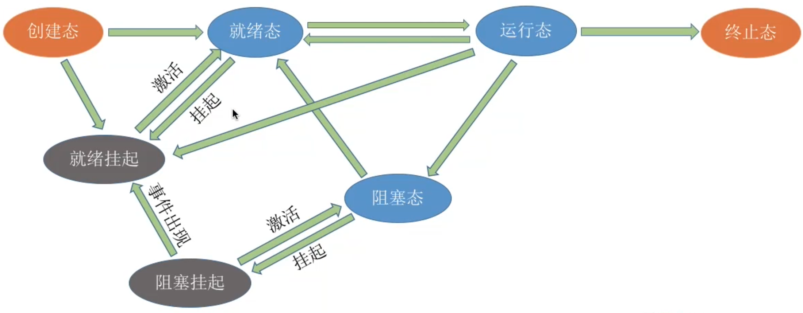

1. 应该在外存（磁盘）的什么位置保存被换出的进程？

   具有对换功能的操作系统中，通常把磁盘空间分为文件区和对换区两部分。文件区主要用于存放文件，主要追求存储空间的利用率，因此对文件区空间的管理采用离散分配方式；对换区空间只占磁盘空间的小部分，被换出的进程数据就存放在对换区。由于对换的速度直接影响到系统的整体速度，因此对换空间的管理主要追求换入换出速度，因此通常对换区采用连续分配方式（学过文件管理章节后即可理解）。总之，对换区的I/O速度比文件区的更快。

2. 什么时候应该交换？

   交换通常在许多进程运行且内存吃紧时进行，而系统负荷降低就暂停。例如：在发现许多进程运行时经常发生缺页，就说明内存紧张，此时可以换出一些进程；如果缺页率明显下降，就可以暂停换出。

   

3. 应该换出哪些进程？

   可优先换出阻塞进程；可换出优先级低的进程；为了防止优先级低的进程在被调入内存后很快又被换出，有的系统还会考虑进程在内存的驻留时间...

注意：PCB会常驻内存，不会被换出外存

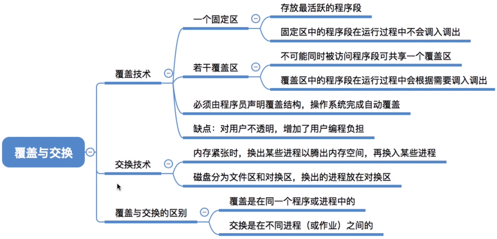