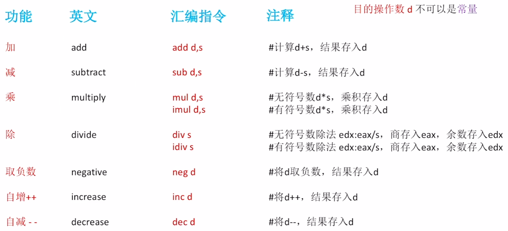

# 高级语言与机器级代码之间的对应


## 高级语言->汇编语言->机器语言

- 只需关注x86汇编语言；若考察其他汇编语言题目会详细注释
- 题目给出简单程序的C语言、汇编语言、机器语言表示。能结合C语言看懂汇编语言的关键语句（看懂常见指令、选择结构、循环结构、函数调用）
- 汇编语言、机器语言一一对应，要结合汇编语言分析机器语言指令的格式、寻址方式


## x86汇编语言指令基础


## 以mov指令为例

mov 目的操作数d, 源操作数s

#mov指令功能：将源操作数s复制到目的操作数d所指的位置


## x86架构CPU，有哪些寄存器？


## 更多例子


# 常用的x86汇编指令


## 常见的算术运算指令

destination：目的地（d目的操作数）

source：来源地（s源操作数）

目的操作数d不可以是常量




## 常见的逻辑运算指令


## 其他指令

用于实现分支结构、循环结构的指令：cmp、test、jmp、jxxx

用于实现函数调用的指令：push、pop、call、ret

用于实现数据转移的指令：mov

# AT&T格式和Intel格式

AT&T Unix、Linux的常用格式

intel Windows的常用格式


# 选择语句的机器级表示

程序中的选择语句（分支结构）

注：Intel x86处理器中

程序计数器PC(Program Counter)

通常被称为IP(Instruction Pointer)

分支结构可能改变程序的执行流


## 无条件转移指令 jmp


## 条件转移指令 jxxx


## 示例：选择语句的机器级表示

```c++
if(a>b){
	c=a;
}else{
  c=b;
}
```

```assembly
mov eax, 7   #假设变量a=7，存入eax
mov ebx, 6   #假设变量b=6，存入ebx
cmp eax, ebx #比较变量a和b
jq NEXT      #若a>b，转移到NEXT:
mov ecx,ebx  #假设用ecx存储变量c，令c=b else部分的逻辑
jmp END      #无条件转移到END:
NEXT:
mov ecx, eax #假设用ecx存储变量c，令c=a if部分的逻辑
END:
```

```assembly
mov eax, 7   #假设变量a=7，存入eax
mov ebx, 6   #假设变量b=6，存入ebx
cmp eax, ebx #比较变量a和b
jle NEXT     #若a<=b，转移到NEXT:
mov ecx,eax  #假设用ecx存储变量c，令c=a if部分的逻辑
jmp END      #无条件转移到END:
NEXT:
mov ecx, ebx #假设用ecx存储变量c，令c=b else部分的逻辑
END:
```

写汇编语言代码时，一般会以函数名作为“标号”，标注该函数指令的起始地址

## 扩展：cmp指令的底层原理


# 循环语句的机器级表示

用条件转移指令实现循环

# call和ret指令（函数调用的机器级表示）

# 如何访问栈帧（函数调用的机器级表示）

# 如何切换栈帧（函数调用的机器级表示）

# 如何传递参数和返回值（函数调用的机器级表示）

# CISC和RISC