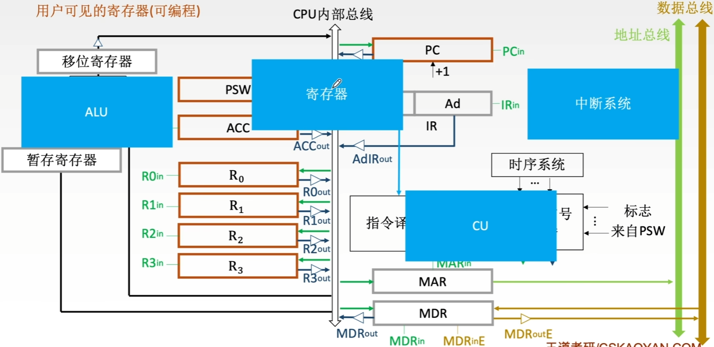
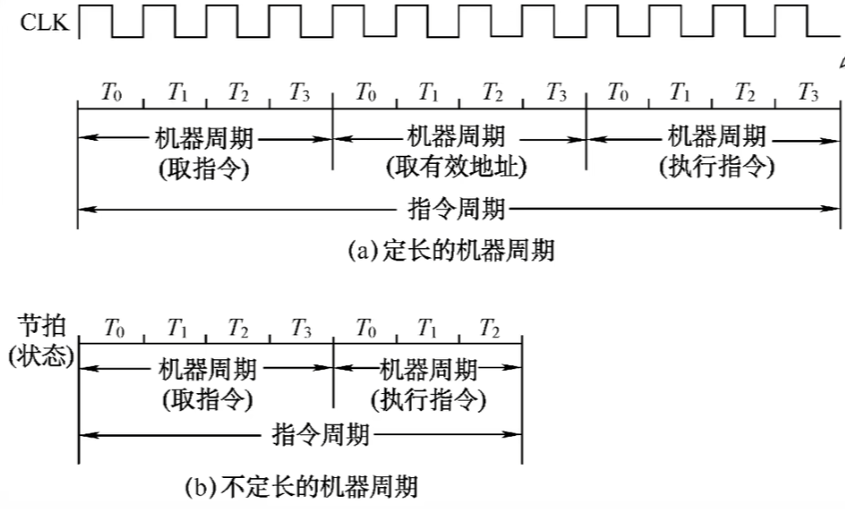
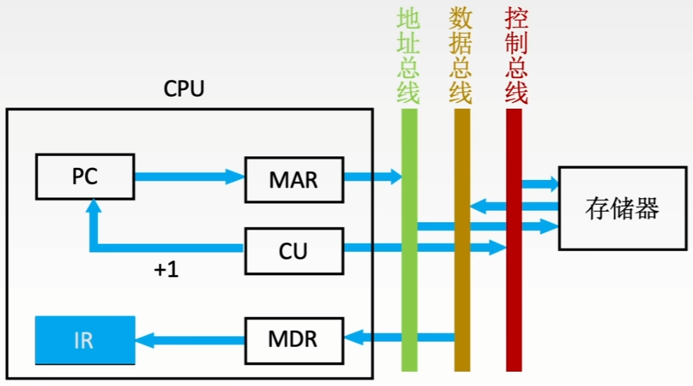

# 中央处理器

# CPU的功能和基本结构

## CPU的功能

1. 指令控制。完成取指令、分析指令和执行指令的操作，即程序的顺序控制。
2. 操作控制。一条指令的功能往往是由若干操作信号的组合来实现的。CPU管理并产生由内存取出的每条指令的操作信号，把各种操作信号送往相应的部件，从而控制这些部件按指令的要求进行动作。
3. 时间控制。对各种操作加以时间上的控制。时间控制要为每条指令按时间顺序提供应有的控制信号。
4. 数据加工。对数据进行算术和逻辑运算。
5. 中断处理。对计算机运行过程中出现的异常情况和特殊请求进行处理。

## 运算器和控制器的功能

运算器：对数据进行加工

控制器：协调并控制计算机各部件执行程序的指令队列，基本功能包括取指令、分析指令、执行指令

取指令：自动形成指令地址；自动发出取指令的命令。

分析指令：操作码译码（分析本条指令要完成什么操作）；产生操作数的有效地址。

执行指令：根据分析指令得到的“操作命令”和“操作数地址”，形成操作信号控制序列，控制运算器、存储器以及I/O设备完成相应的操作。

中断处理：管理总线及输入输出；处理异常情况（如掉电）和特殊请求（如打印机请求打印一行字符）。

## 运算器的基本结构

1. 算术逻辑单元：主要功能是进行算术/逻辑运算。

2. 通用寄存器组：如AX、BX、CX、DX、SP等，用于存放操作数（包括源操作数、目的操作数及中间结果）和各种地址信息等。SP是堆栈指针，用于指示栈顶的地址。

3. 暂存寄存器：用于暂存从主存读来的数据，这个数据不能存放在通用寄存器中，否则会破坏其原有内容。

   如：两个操作数分别来自主存和R0，最后结果存回R0，那么从主存中取来的操作数直接放入暂存器，就不会破坏运算前R0的内容。

4. 累加寄存器：它是一个通用寄存器，用于暂时存放ALU运算的结果信息，用于实现加法运算。

5. 程序状态字寄存器：保留由算术逻辑运算指令或测试指令的结果而建立的各种状态信息，如溢出标志（OP）、符号标志（SF）、零标志（ZF）、进位标志（CF）等。PSW中的这些位参与并决定微操作的形成。

6. 移位器：对运算结果进行移位运算。

7. 计数器：控制乘除运算的操作步数。

性能较高，基本不存在数据冲突现象，但结构复杂，硬件量大，不易实现。

专用数据通路方式：根据指令执行过程中的数据和地址的流动方向安排连接线路。

如果直接用导线连接，相当于多个寄存器同时并且一直向ALU传输数据

解决方法1. 使用多路选择器 根据控制信号选择一路输出

解决方法2. 使用三态门可以控制每一条路是否输出

如：R0out为1时R0中的数据输出到A端，

R0out为0时R0中的数据无法输出到B端

CPU内部单总线方式：将所有寄存器的输入端和输出端都连接到一条公共的通路上。 

结构简单，容易实现，但数据传输存在较多冲突的现象，性能较低。

## 控制器的基本结构

1. 程序计数器：用于指出下一条指令在主存中的存放地址。CPU就是根据PC的内容去主存中取指令的。因程序中指令（通常）是顺序执行的，所以PC有自增功能。
2. 指令寄存器：用于保存当前正在执行的那条指令。
3. 指令译码器：仅对操作码字段进行译码，向控制器提供特定的操作信号。
4. 微操作信号发生器：根据IR的内容（指令）、PSW的内容（状态信息）及时序信号，产生控制整个计算机系统所需的各种控制信号，其结构有组合逻辑型和存储逻辑型两种。
5. 时序系统：用于产生各种时序信号，它们都是由同一时钟（CLOCK）分频得到的。
6. 存储器地址寄存器：用于存放索要访问的主存单元的地址。
7. 存储器数据寄存器：用于存放向主存写入的信息或从主存中读出的信息。

## CPU的基本结构

用户可见的寄存器（可编程）

# 指令周期的数据流

## 指令周期

指令周期：CPU从主存中每取出并执行一条指令所需要的全部时间。

指令周期常常用若干个机器周期来表示，机器周期又叫CPU周期。

一个机器周期又包含若干时钟周期（也称为节拍、T周期或CPU时钟周期，它是CPU操作的最基本单位）。

每个指令周期内机器周期数可以不等，每个机器周期内的节拍数也可以不等。

## 指令周期流程

四个工作周期都有CPU访存操作，只是访存的目的不同。

取指周期是为了取指令，间址周期是为了取有效地址，执行周期是为了取操作数，中断周期是为了保存程序断点。

## 指令周期的数据流-取指周期

1. 当前指令地址送至存储器地址寄存器，记作：(PC)->MAR
2. CU发出控制信号，经控制总线传到主存，这里是读信号，记作：1->R
3. 将MAR所指主存中的内容经数据总线送入MDR，记作：M(MAR)->MDR
4. 将MDR中的内容（此时是指令）送入IR，记作：(MDR)->IR
5. CU发出控制信号，形成下一条指令地址，记作：(PC)+1->PC

## 指令周期的数据流-间址周期

1. 将指令的地址码送入MAR，记作：Ad(IR)->MAR或Ad(MDR)->MAR
2. CU发出控制信号，启动主存做读操作，记作：1->R
3. 将MAR所指主存中的内容经数据总线送入MDR，记作：M(MAR)->MDR
4. 将有效地址送至指令的地址码字段，记作：(MDR)->Ad(IR)

## 指令周期的数据流-执行周期

执行周期的任务是根据IR中的指令字的操作码和操作数通过ALU操作产生执行结果。

不同指令的执行周期操作不同，因此没有统一的数据流向。

## 指令周期的数据流-中断周期

中断：暂停当前任务去完成其他任务。

为了能够恢复当前任务，需要保存断点。

一般使用堆栈来保存断点，这里用SP表示栈顶地址，假设SP指向栈顶元素，进栈操作是先修改指针，后存入数据。

1. CU控制将SP减1，修改后的地址送入MAR

   记作：(SP)-1->SP, (SP)->MAR

   本质上是将断点存入某个存储单元，假设其地址为a，故可记作：a->MAR

2. CU发出控制信号，启动主存做写操作，

   记作：1->W

3. 将断点（PC内容）送入MDR，

   记作：(PC)->MDR

4. CU控制将中断服务程序的入口地址（由向量地址形成部件产生）送入PC，

   记作：向量地址->PC

## 指令执行方案

一个指令周期通常要包括几个时间段（执行步骤），每个步骤完成指令的一部分功能，几个一次执行的步骤完成这条指令的全部功能。

**方案1. 单指令周期**

对所有指令都选用相同的执行时间来完成。

指令之间串行执行；指令周期取决于执行时间最长的指令的执行时间。

对于哪些本来可以在更短时间内完成的指令，要使用这个较长的周期来完成，会降低整个系统的运行速度。

**方案2. 多指令周期**

对不同类型的指令选用不同的执行步骤来完成。指令之间串行执行；可选用不同个数的时钟周期来完成不同指令的执行过程。

需要更复杂的硬件设计。

**方案3. 流水线方案**

在每一个时钟周期启动一条指令，尽量让多条指令同时运行，但各自处在不同的执行步骤中。

指令之间并行执行。

# 数据通路 单总线结构

数据通路：数据在功能部件之间传送的路径。

信息从哪里开始

中间经过哪些部件

最后传到哪里

由控制部件产生的控制信号建立数据通路

数据通路的基本结构：

1. CPU内部单总线方式。
2. CPU内部多总线方式。
3. 专用数据通路方式。

## 数据通路-CPU内部单总线方式

内部总线是指同一部件，如CPU内部连接各寄存器及运算部件之间的总线；

系统总线是指同一台计算机系统的各部件，如CPU、内存、通道和各类I/O接口间互相连接的总线。

1. 寄存器之间数据传送

   比如把PC内容送至MAR，实现传送操作的流程及控制信号为：

   (PC)->Bus PCout有效，PC内容送总线

   Bus->MAR MARin有效，总线内容送MAR

   (PC)->Bus->MAR

   PC->Bus->MAR

   重要的是描述清除数据流向

2. 主存与CPU之间的数据传送

   比如CPU从主存读取指令，实现传送操作的流程及控制信号为：

   (PC)->Bus->MAR PCout和MARin有效，现行指令地址->MAR

   1->R CU发读指令（通过控制总线发出，图中未画出）

   MEM(MAR)->MDR MDRin有效

   MDR->Bus->IR MDRout和IRin有效，现行指令->IR

3. 执行算术或逻辑运算

   比如一条加法指令，微操作序列及控制信号为：

   Ad(IR)->Bus->MAR MDRout和MARin有效

   或ADIRout和MARin有效

   1->R CU发读命令

   MEM(MAR)->数据线->MDR MDRin有效

   MDR->Bus->Y MDRout和Yin有效，操作数->Y

   (ACC)+(Y)->Z ACCout和ALUin有效，CU向ALU发送加命令

## CPU内部单总线方式-例题

设有如图所示的单总线结构，分析指令ADD (R0) R1的指令流程和控制信号

1. 分析指令功能和指令周期

   功能：((R0))+(R1)->(R0)

   取指周期、间址周期、执行周期

2. 写出各阶段的指令流程

   取指周期：公共操作

   | 时序 | 微操作                      | 有效控制信号         |
   | ---- | --------------------------- | -------------------- |
   | 1    | (PC)->MAR                   | PCout, MARin         |
   | 2    | M(MAR)->MDR (PC)+1->PC | MemR, MARout, MDRinE |
   | 3    | (MDR)->IR                   | MDRout, IRin         |
   | 4    | 指令译码                    |                      |

   间址周期：完成取数操作，被加数在主存中，加数已经放在寄存器R1中。

   | 时序 | 微操作      | 有效控制信号         |
   | ---- | ----------- | -------------------- |
   | 1    | (R0)->MAR   | R0out, MARin         |
   | 2    | M(MAR)->MDR | MemR, MARout, MDRinE |
   | 3    | (MDR)->Y    | MDRout, Yin          |

   执行周期：完成取数操作，被加数在主存中，加数已经放在寄存器R1中。

   | 时序 | 微操作        | 有效控制信号                       |
   | ---- | ------------- | ---------------------------------- |
   | 1    | (R1)+(Y)->Z   | R1out, ALUin, CU向ALU发ADD控制信号 |
   | 2    | (Z)->MDR      | Zout, MDRin                        |
   | 3    | (MDR)->M(MAR) | MemW, MDRoutE, MARout              |

   