# 概念及功能

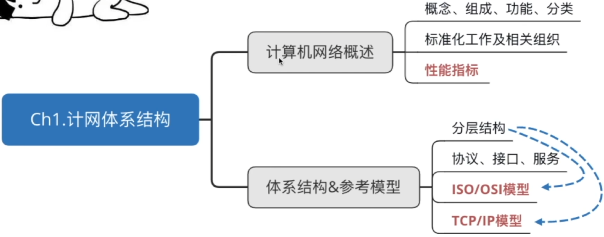

## 计算机网络的概念

网络：网样的东西或网状系统。

计算机网络：是一个将分散的、具有独立功能的计算机系统，通过通信设备与线路连接起来，由功能完善的软件实现资源共享和信息传递的系统。

计算机网路是互连的、自治的计算机集合

互连-通过通信链路互联互通

自治-无主从关系

## 计算机网路的功能

1. 数据通信

2. 资源共享

   同一个计算机网络上的其他计算机可使用某台计算机的计算机资源的行为，可共享硬件、软件、数据。

3. 分布式处理

   多台计算机各自承担同一工作任务的不同部分

4. 提高可靠性

5. 负载均衡

## 计算机网络的发展 第一阶段

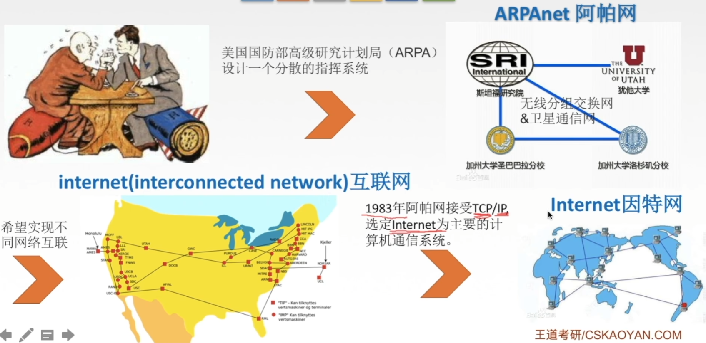

网络把许多计算机连接在一起，而互联网则把许多网络连接在一起，因特网是世界上最大的互联网。

## 第二阶段 三级结构

1985年起，美国国家科学基金会NSF围绕6个大型计算机中心建设计算机网络，即国家科学基金网NSFNET。

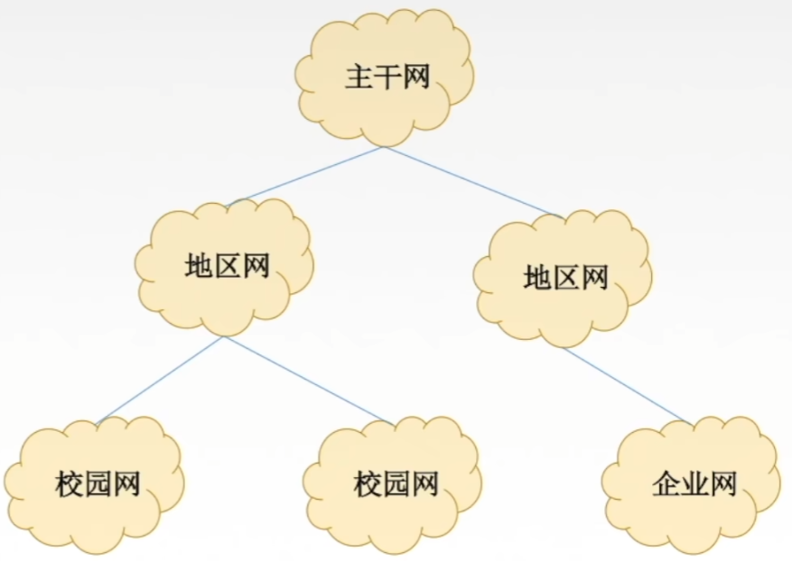

## 第三阶段 多层次ISP结构

ISP：因特网服务提供者/因特网服务提供商，是一个向广大用户综合提供互联网接入业务、信息业务、和增值业务的公司，如中国电信、中国联通、中国移动等。分为主干ISP、地区ISP和本地ISP。

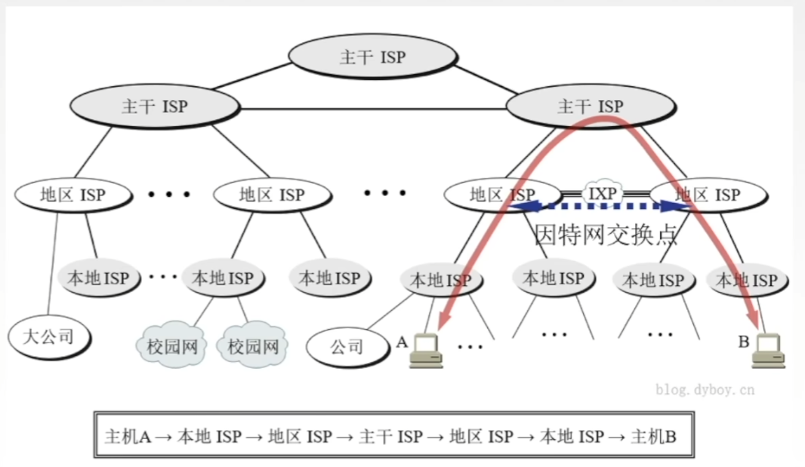

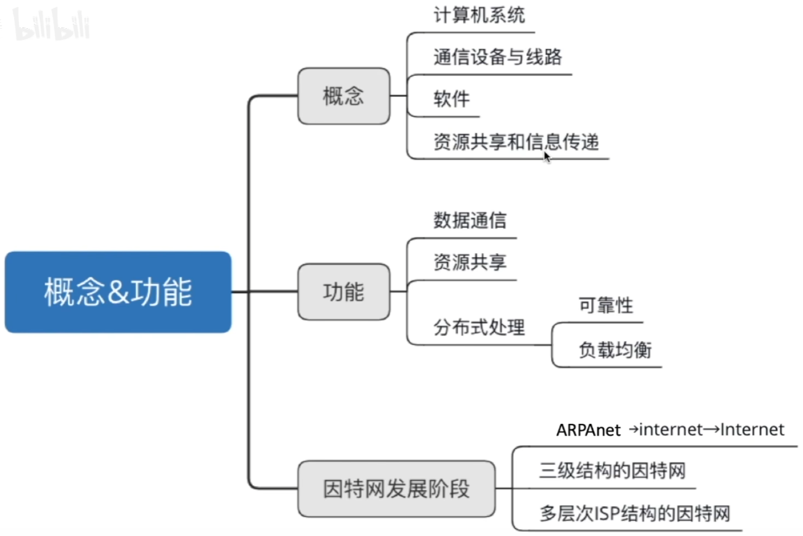

# 组成与分类

## 计算机网络的组成

1. 组成部分

   硬件、软件、协议（一系列规则和约定的集合）

2. 工作方式

   - 边缘部分

   - 核心部分

3. 功能组成

   - 通信子网

     实现数据通信

   - 资源子网

     实现资源共享/数据处理

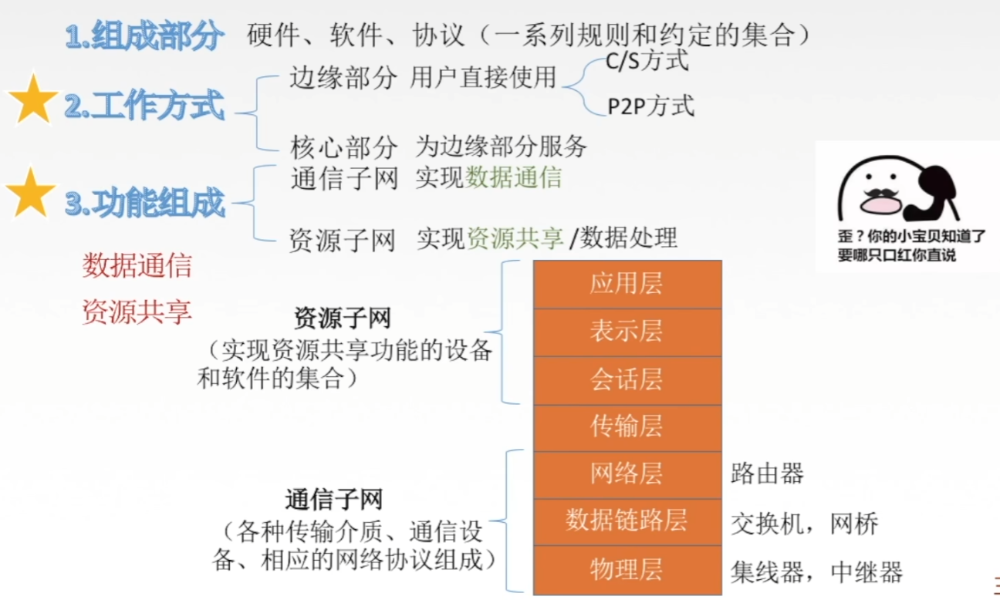

## 计算机网络的分类

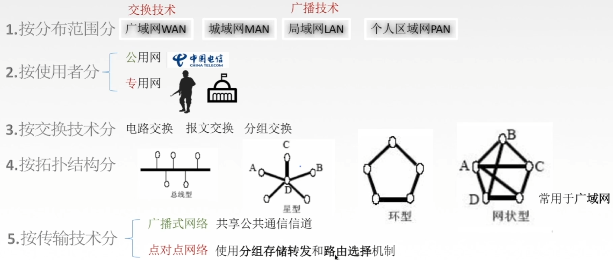

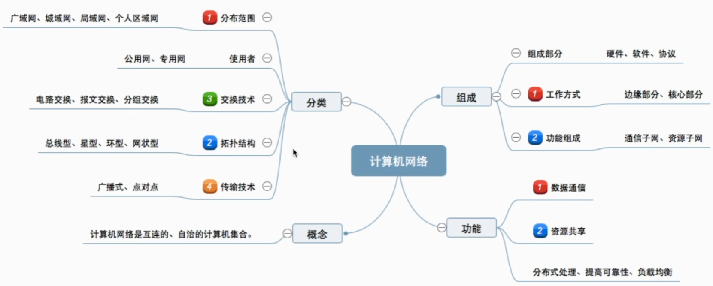

# 性能指标1

## 速率

速率即数据率或称数据传输率或比特率。

比特 1/0位

连接在计算机网络上的主机在数字信道上传输数据位数的速率。

单位是b/s, kb/s, Mb/s, Gb/s, Tb/s

## 带宽

“带宽”原本指某个信号具有的频带宽度，即最高频率与最低频率之差，单位是赫兹（Hz）。

计算机网络中，带宽用来表示网络的通信线路传送数据的能力，通常是指单位时间内从网络中的某一点到另一点所能通过的“最高数据率”。单位是“比特每秒”，b/s，kb/s，Mb/s，Gb/s。

网络设备所支持的最高速度

链路带宽=1Mb/s

主机在1us内可向链路发1bit数据

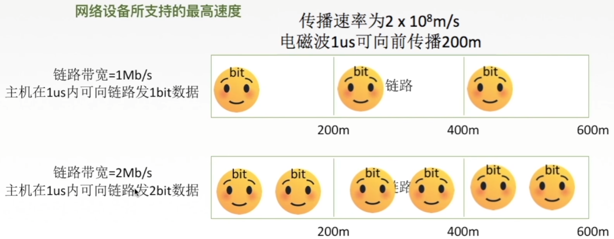

## 吞吐量

表示在单位时间内通过某个网路（或信道、接口）的数据量。单位b/s，kb/s，Mb/s等。

吞吐量受网络的带宽或网络的额定速率的限制。

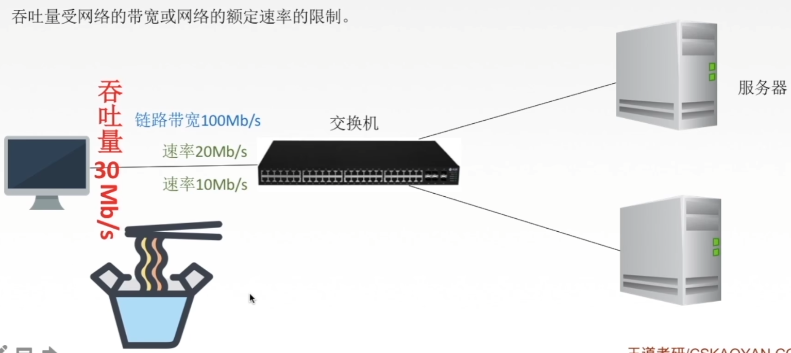

# 性能指标2

## 时延

指数据（报文/分组/比特流）从网络（或链路）的一端传送到另一端所需的时间。也叫延迟或迟延。单位是s。

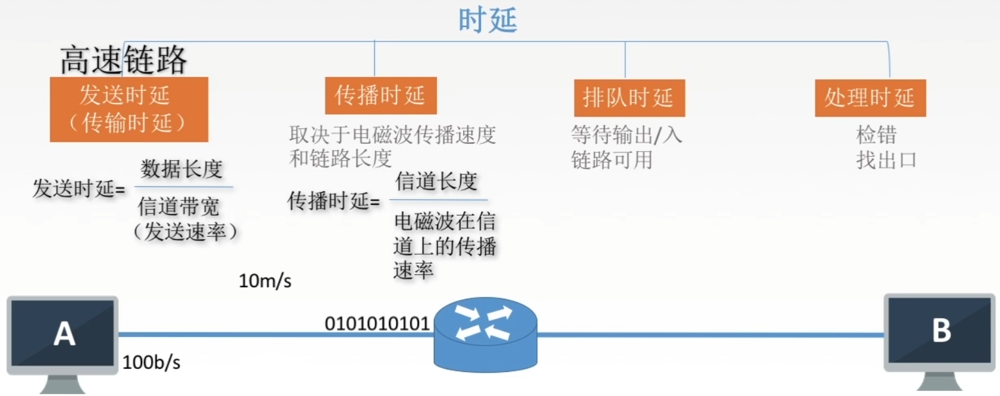

## 时延带宽积

时延带宽积=传播时延X带宽

bit = s x b/s

时延带宽积又称为以比特为单位的链路长度。

即“某段链路现在有多少比特”。

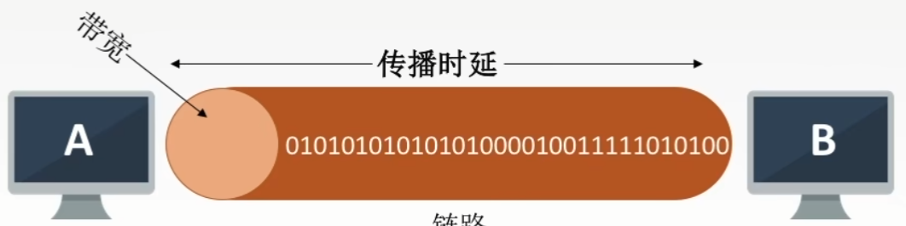

## 往返时间RTT

从发送方发送数据开始，到发送方收到接收方的确认（接收方收到数据后立即发送确认），总共经历的时延。

RTT越大，在收到确认之前，可以发送的数据越多。

## 利用率

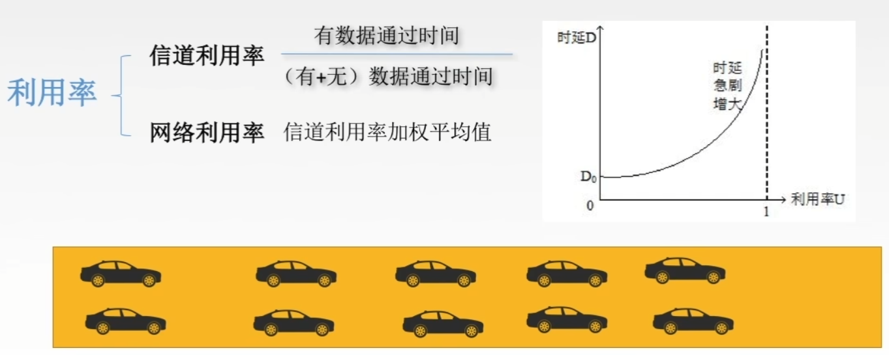

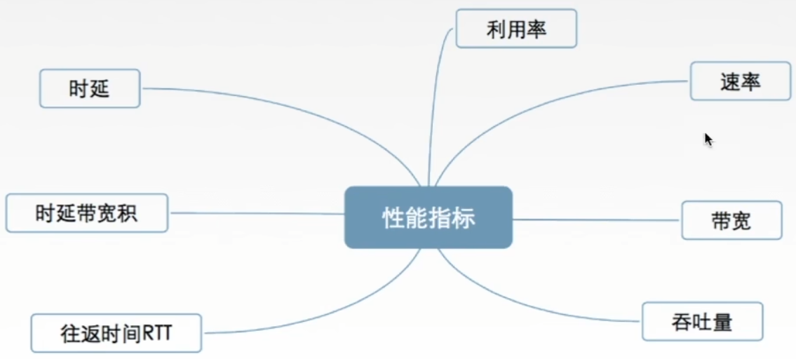

# 分层结构、协议、接口、服务

# OSI参考模型1

# OSI参考模型2

# TCPIP参考模型

# 第一章总结

# 数据通路 专用通路结构

# 硬布线控制器的设计

# 微程序控制器的基本原理

# 微指令的设计

# 微程序控制单元的设计

# 指令流水线的基本概念

# 指令流水线的影响因素和分类

# 五段式指令流水线

# 多处理器系统的基本概念

# 硬件多线程的基本概念