# 概念及功能

## 计算机网络的概念

网络：网样的东西或网状系统。

计算机网络：是一个将分散的、具有独立功能的计算机系统，通过通信设备与线路连接起来，由功能完善的软件实现资源共享和信息传递的系统。

计算机网路是互连的、自治的计算机集合

互连-通过通信链路互联互通

自治-无主从关系

## 计算机网路的功能

1. 数据通信

2. 资源共享

   同一个计算机网络上的其他计算机可使用某台计算机的计算机资源的行为，可共享硬件、软件、数据。

3. 分布式处理

   多台计算机各自承担同一工作任务的不同部分

4. 提高可靠性

5. 负载均衡

## 计算机网络的发展 第一阶段

网络把许多计算机连接在一起，而互联网则把许多网络连接在一起，因特网是世界上最大的互联网。

## 第二阶段 三级结构

1985年起，美国国家科学基金会NSF围绕6个大型计算机中心建设计算机网络，即国家科学基金网NSFNET。

## 第三阶段 多层次ISP结构

ISP：因特网服务提供者/因特网服务提供商，是一个向广大用户综合提供互联网接入业务、信息业务、和增值业务的公司，如中国电信、中国联通、中国移动等。分为主干ISP、地区ISP和本地ISP。

# 组成与分类

## 计算机网络的组成

1. 组成部分

   硬件、软件、协议（一系列规则和约定的集合）

2. 工作方式

   - 边缘部分

   - 核心部分

3. 功能组成

   - 通信子网

     实现数据通信

   - 资源子网

     实现资源共享/数据处理

## 计算机网络的分类

# 性能指标1

## 速率

速率即数据率或称数据传输率或比特率。

比特 1/0位

连接在计算机网络上的主机在数字信道上传输数据位数的速率。

单位是b/s, kb/s, Mb/s, Gb/s, Tb/s

## 带宽

“带宽”原本指某个信号具有的频带宽度，即最高频率与最低频率之差，单位是赫兹（Hz）。

计算机网络中，带宽用来表示网络的通信线路传送数据的能力，通常是指单位时间内从网络中的某一点到另一点所能通过的“最高数据率”。单位是“比特每秒”，b/s，kb/s，Mb/s，Gb/s。

网络设备所支持的最高速度

链路带宽=1Mb/s

主机在1us内可向链路发1bit数据

## 吞吐量

表示在单位时间内通过某个网路（或信道、接口）的数据量。单位b/s，kb/s，Mb/s等。

吞吐量受网络的带宽或网络的额定速率的限制。

# 性能指标2

## 时延

指数据（报文/分组/比特流）从网络（或链路）的一端传送到另一端所需的时间。也叫延迟或迟延。单位是s。

## 时延带宽积

时延带宽积=传播时延X带宽

bit = s x b/s

时延带宽积又称为以比特为单位的链路长度。

即“某段链路现在有多少比特”。

## 往返时间RTT

从发送方发送数据开始，到发送方收到接收方的确认（接收方收到数据后立即发送确认），总共经历的时延。

RTT越大，在收到确认之前，可以发送的数据越多。

## 利用率

# 分层结构、协议、接口、服务

## 为什么要分层？

发送文件前要完成的工作：

1. 发起通信的计算机必须将数据通信的通路进行激活。
2. 要告诉网络如何识别目的主机。
3. 发起通信的计算机要查明的主机是否开机，并且与网络连接正常。
4. 发起通信的计算机要弄清楚，对方计算机中文件管理程序是否已经做好准备工作。
5. 确保差错和意外可以解决。

## 怎么分层？

分层的基本原则

1. 各层之间相互独立，每层只实现一种相对独立的功能。
2. 每层之间界面自然清晰，易于理解，相互交流尽可能少。
3. 结构上可分割开。每层都采用最合适的技术来实现。
4. 保持下层对上层的独立性，上层单向使用下层提供的服务。
5. 整个分层结构应该能促进标准化工作。

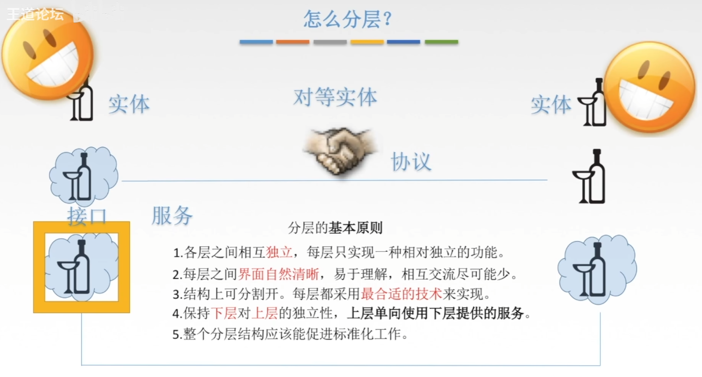

## 正式认识分层结构

1. 实体：第n层中的活动元素称为n层实体。同一层的实体叫对等实体。
2. 协议：为进行网络中的对等实体数据交换而建立的规则、标准或约定称为网络协议。【水平】
   - 语法：规定传输数据的格式
   - 语义：规定所要完成的功能
   - 同步：规定各种操作的顺序
3. 接口（访问服务点SAP）：上层使用下层服务的入口。
4. 服务：下层为相邻上层提供的功能调用。【垂直】

SDU服务数据单元：为完成用户所要求的功能而应传送的数据。

PCI协议控制信息：控制协议操作的信息。

PDU协议数据单元：对等层次之间传送的数据单位。

## 概念总结

网络体系结构是从功能上描述计算机网络结构。

计算机网络体系结构简称网络体系结构是分层结构。

每层遵循某个/些网络协议以完成本层功能。

计算机网络体系结构是计算机网络的各层及其协议的集合。

第n层向n+1层提供服务时，此服务不仅包含第n层本身的功能，还包含由下层服务提供的功能。

仅仅在相邻层间有接口，且所提供服务的具体实现细节对上一层完全屏蔽。

体系结构是抽象的，而实现是指能运行的一些软件和硬件。

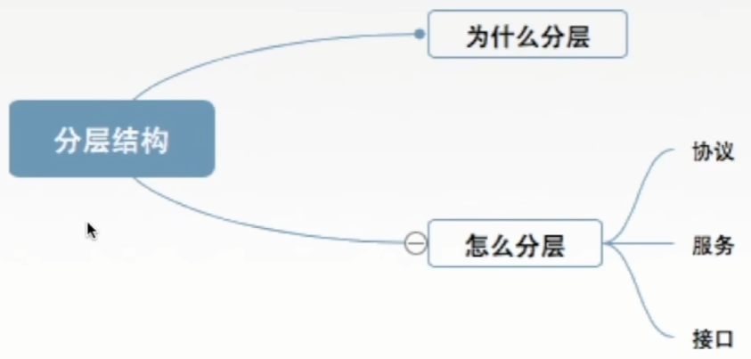

# OSI参考模型1

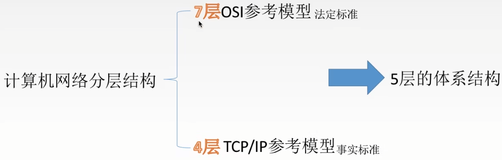

为了解决计算机网络复杂的大问题->分层结构（按功能）

提出第一个网络体系结构！

目的：支持异构网络系统的互联互通

国际标准化组织（ISO）于1984年提出开放系统互连（OSI）参考模型

但是！理论成功，时长失败。

## ISO/OSI参考模型

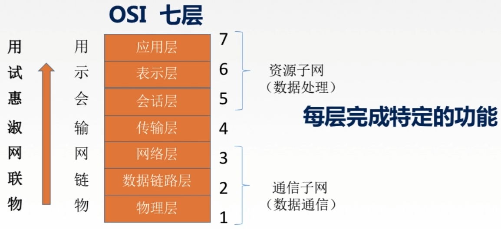

## ISO/OSI参考模型解释通信过程

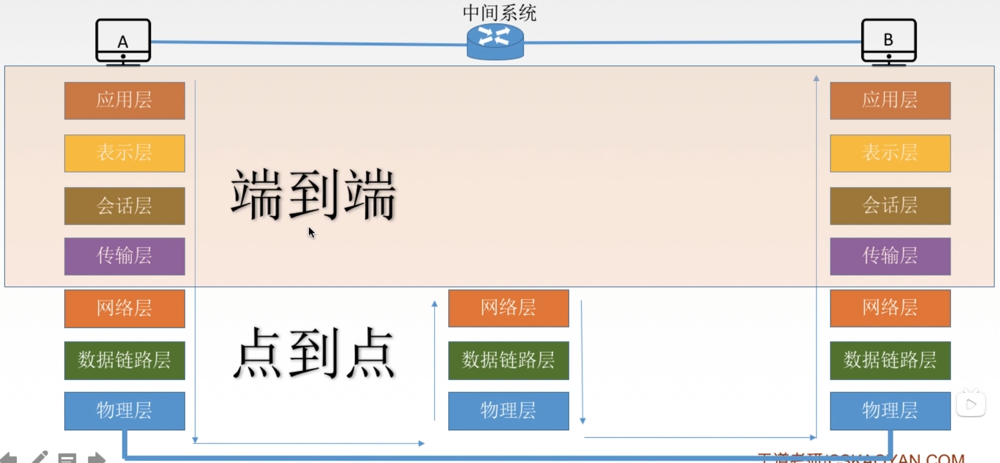

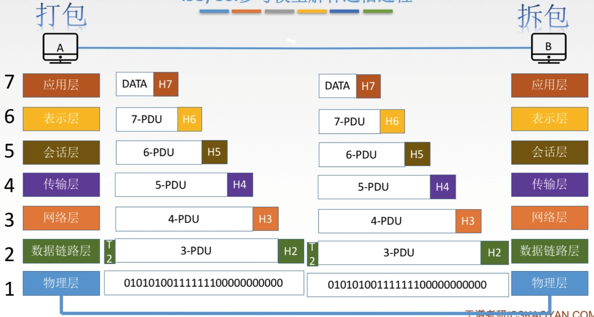

# OSI参考模型2

## 应用层

所有能和用户交互产生网络流量的程序

典型应用层服务：

- 文件传输（FTP）
- 电子邮件（SMTP）
- 万维网（HTTP）

## 表示层

用于处理在两个通信系统中交换信息的表示方式（语法和语义）

功能一：数据格式变换 翻译官

功能二：数据加密解密

功能三：数据压缩和恢复

主要协议：JPEG、ASCII

## 会话层

向表示层实体/用户进程提供建立连接并在连接上有序地传输数据。

这是会话，也是建立同步（SYN）

功能一：建立、管理、终止会话

功能二：使用校验点可使会话在通信失效时从校验点/同步点继续恢复通信，实现数据同步。

适用于传输大文件。

主要协议：ADSP、ASP

## 传输层

负责主机中两个进程的通信，即端到端的通信。传输单位是报文段或用户数据报。

功能一：可靠传输、不可靠传输

功能二：差错控制

功能三：流量控制

功能四：复用分用

可差的也能留用？

复用：多个应用层进程可同时使用下面运输层的服务

分用：运输层把收到的信息分别交付给上面应用层中相应的进程。

主要协议：TCP、UDP

## 网络层

主要任务是把分组从源端传到目的端，为分组交换网上的不同主机提供通信服务。网络层传输单位是数据报。

功能一：路由选择 最佳路径

功能二：流量控制

功能三：差错控制

功能四：拥塞控制

若所有结点都来不及接收分组，而要丢弃大量分组的话，网络就处于拥塞状态。因此要采取一定措施，缓解这种拥塞。

## 数据链路层

主要任务是把网络层传下来的数据报组装成帧。

数据链路层的传输单位是帧。

功能一：成帧（定义帧的开始和结束）

功能二：差错控制 帧错+位错

功能三：流量控制

功能四：访问（接入）控制 控制对信道的访问

主要协议：SDLC、HDLC、PPP、STP

## 物理层

主要任务是在物理媒体上实现比特流的透明传输。

物理层传输单位是比特。

透明传输：指不管所传数据是什么样的比特组合，都应当能够在链路上传送。

功能一：定义接口特性

功能二：定义传输模式 单工、半双工、双工

功能三：定义传输速率

功能四：比特同步

功能五：比特编码

主要协议：Rj45、802.3

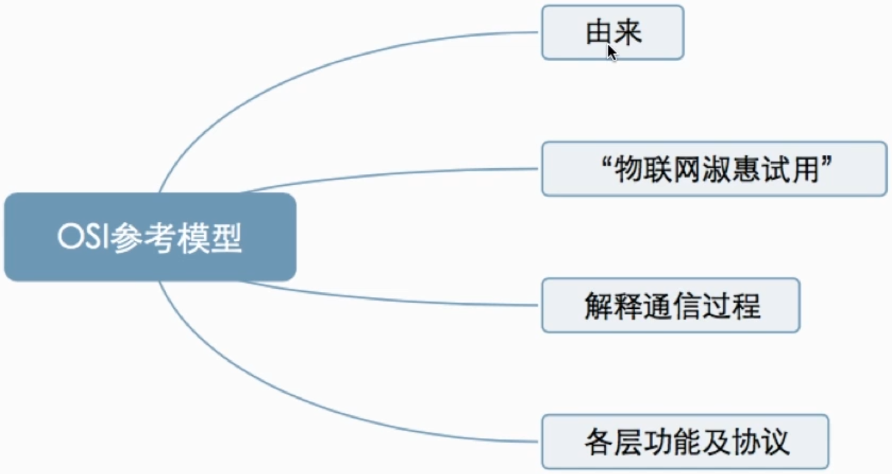

# TCPIP参考模型

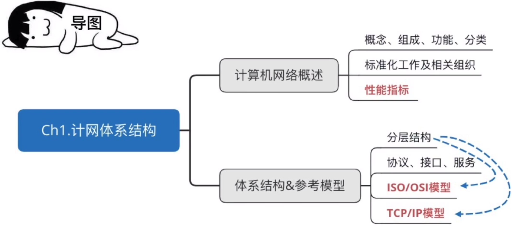

## OSI参考模型与TCP/IP参考模型

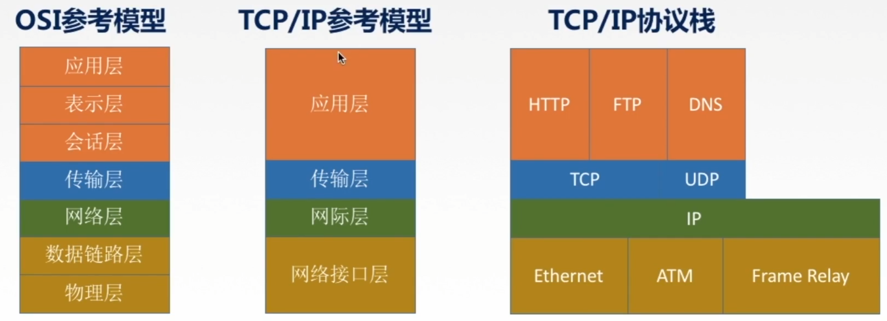

## OSI参考模型与TCP/IP参考模型相同点

1. 都分层
2. 基于独立的协议栈的概念
3. 可以实现异构网络互联

## OSI参考模型与TCP/IP参考模型不同点

1. OSI定义三点：服务、协议、接口
2. OSI先出现，参考模型先于协议发明，不偏向特定协议
3. TCP/IP设计之初就考虑到异构网互联问题，将IP作为重要层次
4. 

|        | ISO/OSI参考模型 | TCP/IP模型      |
| ------ | --------------- | --------------- |
| 网络层 | 无连接+面向连接 | 无连接          |
| 传输层 | 面向连接        | 无连接+面向连接 |

面向连接分为三个阶段，第一是建立连接，在此阶段，发出一个建立连接的请求。只有在连接成功建立之后，才能开始数据传输，这是第二阶段。接着，当数据传输完毕，必须释放连接。而面向无连接没有这么多阶段，它直接进行数据传输。

## 5层参考模型

综合了OSI和TCP/IP的优点

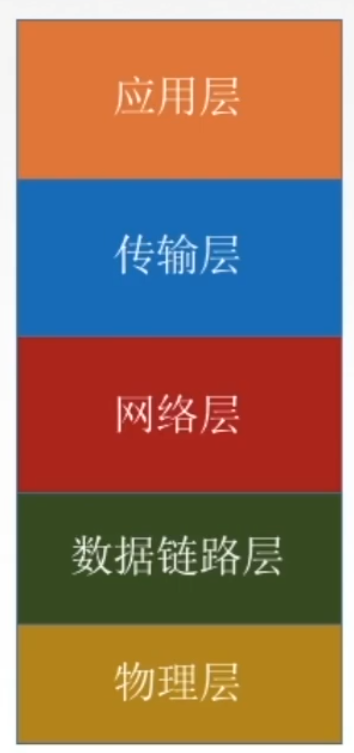

应用层：支持各种网络应用 FTP、SMTP、HTTP

传输层：进程-进程的数据传输 TCP、UDP

网络层：源主机到目的主机的数据分组路由与转发　IP、ICMP、OSPF等

数据链路层：把网络层传下来的数据报组装成帧　Ethernet、PPP

物理层：比特传输

## 5层参考模型的数据封装与解封装

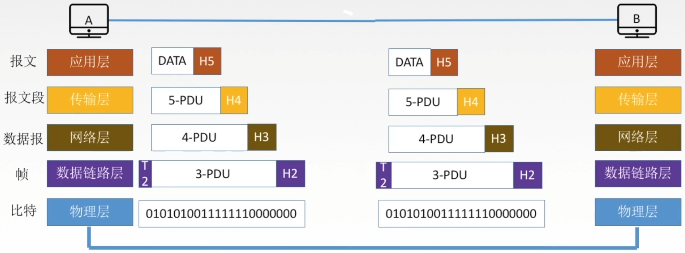

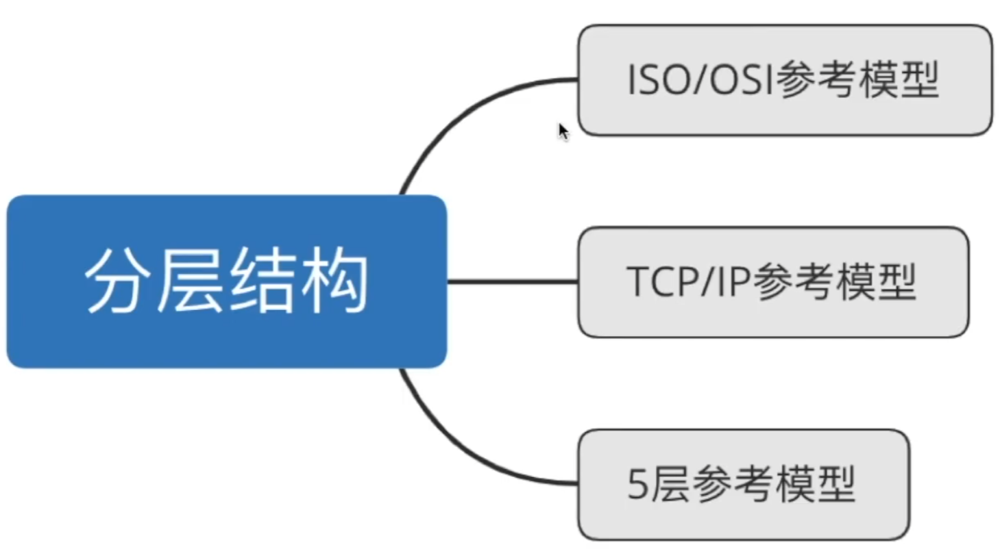

# 第一章总结

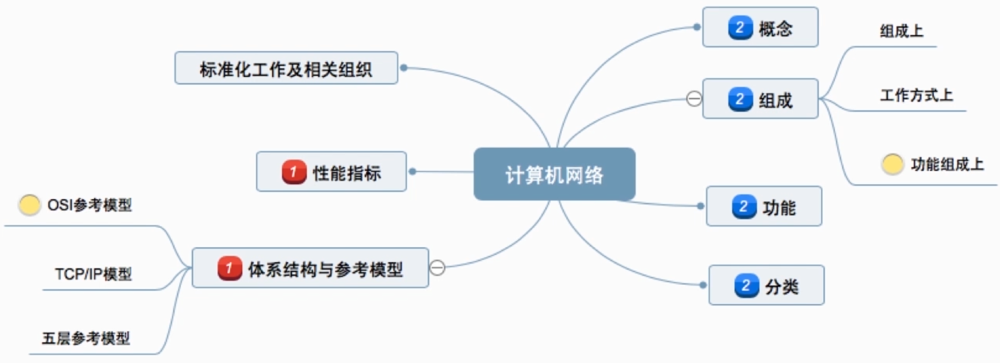

