# 数据通路 专用通路结构

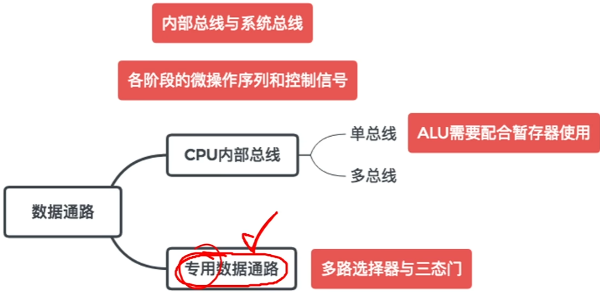

## 专用数据通路方式-取指周期

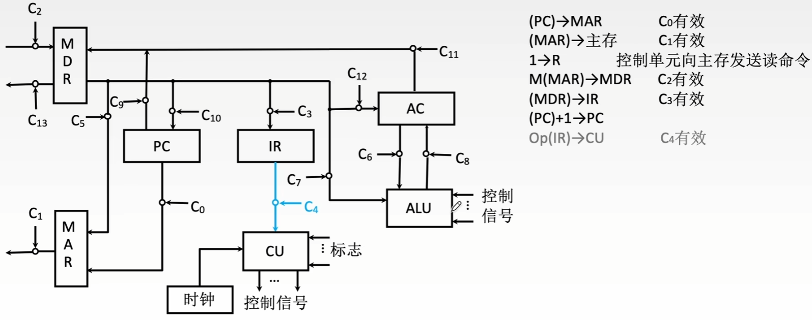

# 硬布线控制器的设计

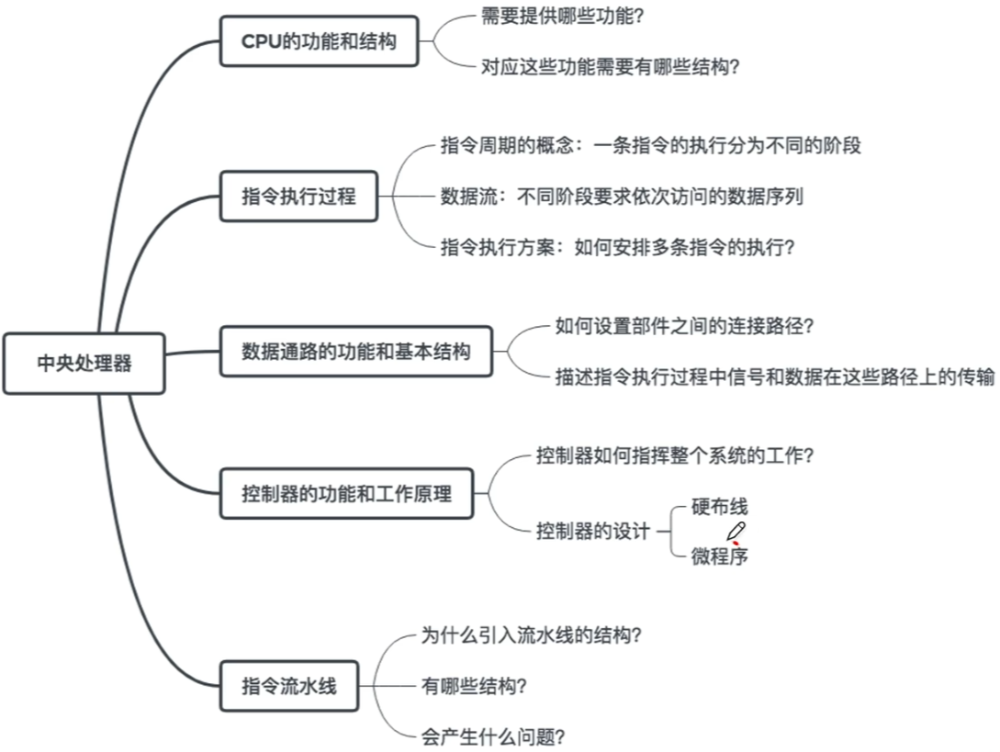

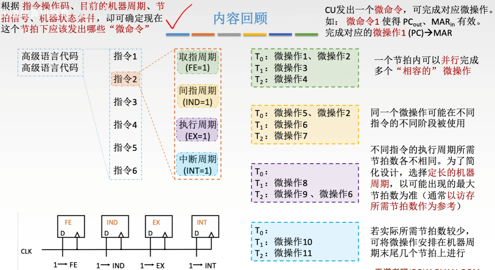

## 硬布线控制器

根据指令操作码、目前的机器周期、节拍信号、机器状态条件，即可确定现在这个节拍下应该发出哪些“微命令”

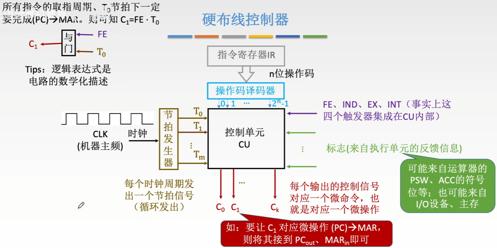

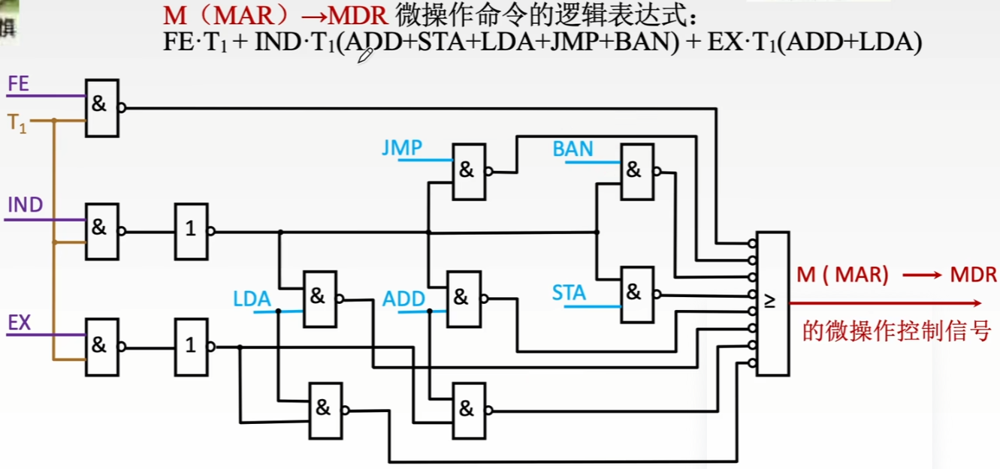

## 硬布线控制器的设计

设计步骤：

1. 分析每个阶段的微操作序列（取值、间址、执行、中断四个阶段）

   确定哪些指令在什么阶段、在什么条件下会使用到的微操作

2. 选择CPU的控制方式

   采用定长机器周期还是不定长机器周期？每个机器周期安排几个节拍？假设采用同步控制方式（定长机器周期），一个机器周期内安排3个节拍。

3. 安排微操作时序

   如何用3个节拍完成整个机器周期内的所有微操作？

4. 电路设计

   确定每个微操作命令的逻辑表达式，并用电路实现

## 分析每个阶段的微操作序列

注：中断周期内的微操作序列就不分析了，原理类似

罗列出所有指令在各个阶段的微操作序列，就可以知道在什么情况下需要使用这个微操作

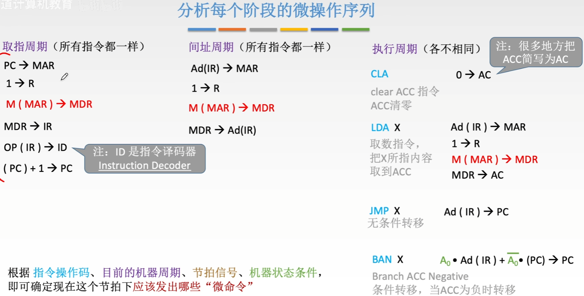

## 安排微操作时序的原则

原则一 微操作的先后顺序不得随意更改

原则二 被控对象不同的微操作 尽量安排在一个节拍内完成

原则三 占用时间较短的微操作 尽量安排在一个节拍内完成 并允许有先后顺序

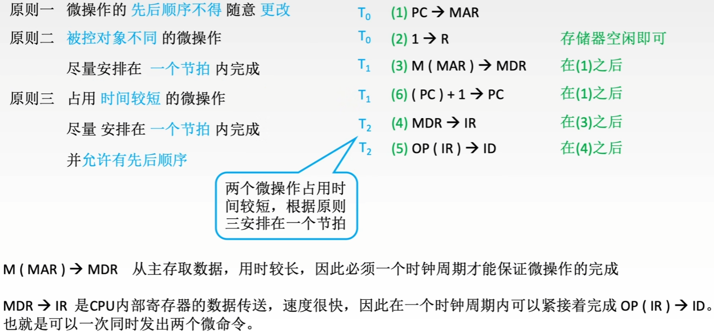

## 安排微操作时序-间址周期

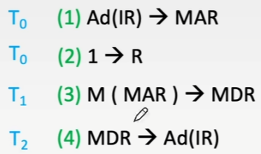

## 安排微操作时序-执行周期

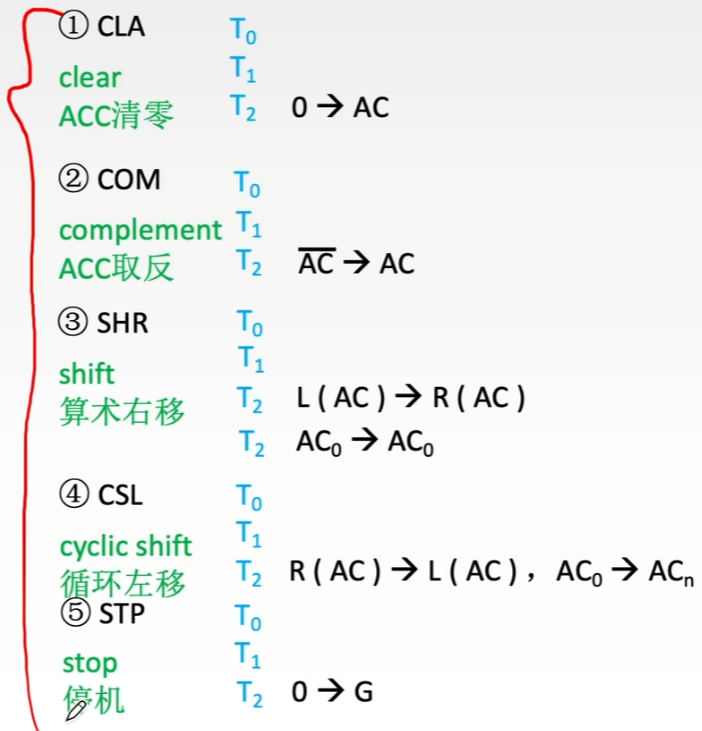

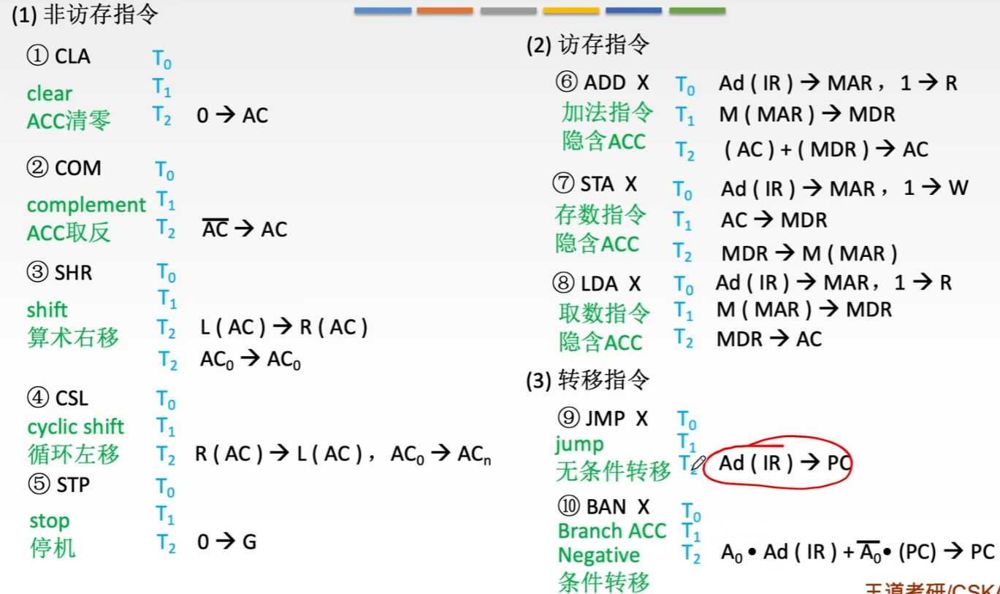

## 组合逻辑设计

设计步骤：

1. 列出操作时间表

   列出在取指、间址、执行、中断周期，T0、T1、T2节拍内有可能用到的所有微操作

2. 写出微操作命令的最简表达式

3. 画出逻辑图

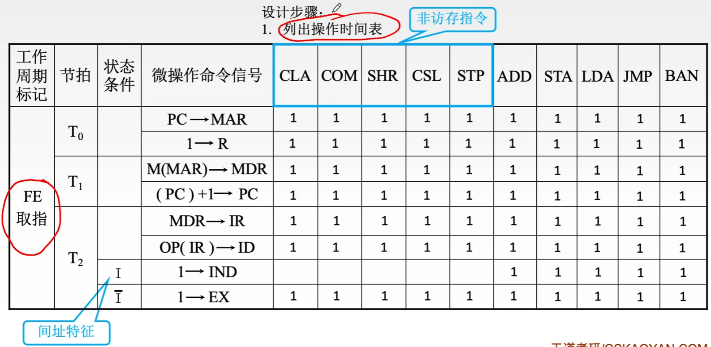

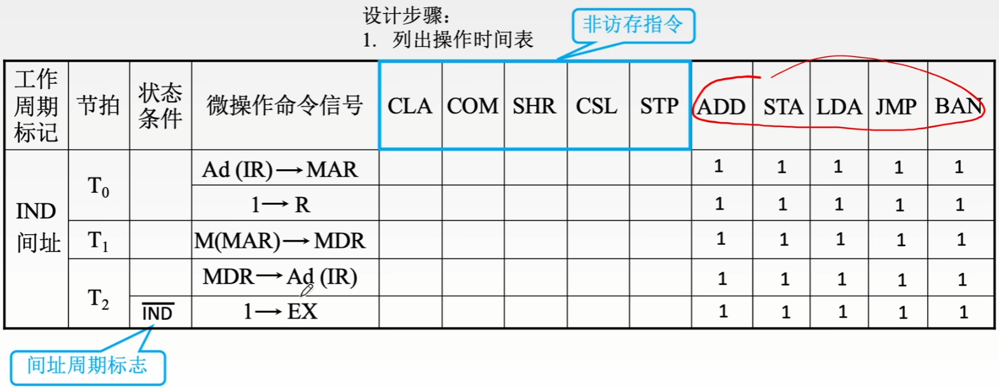

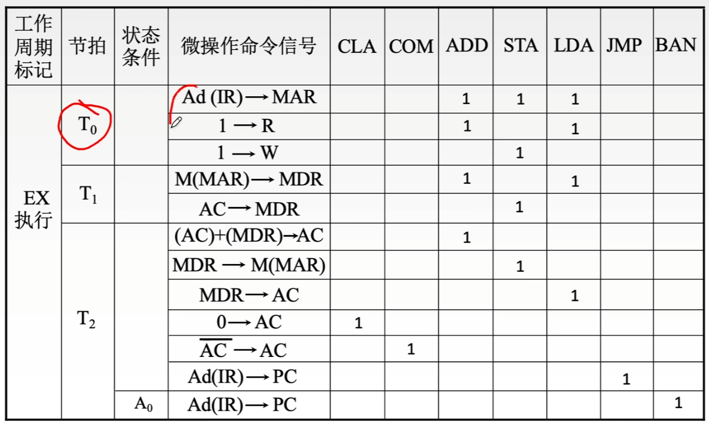

# 微程序控制器的基本原理

# 微指令的设计

# 微程序控制单元的设计

# 指令流水线的基本概念

# 指令流水线的影响因素和分类

# 五段式指令流水线

# 多处理器系统的基本概念

# 硬件多线程的基本概念