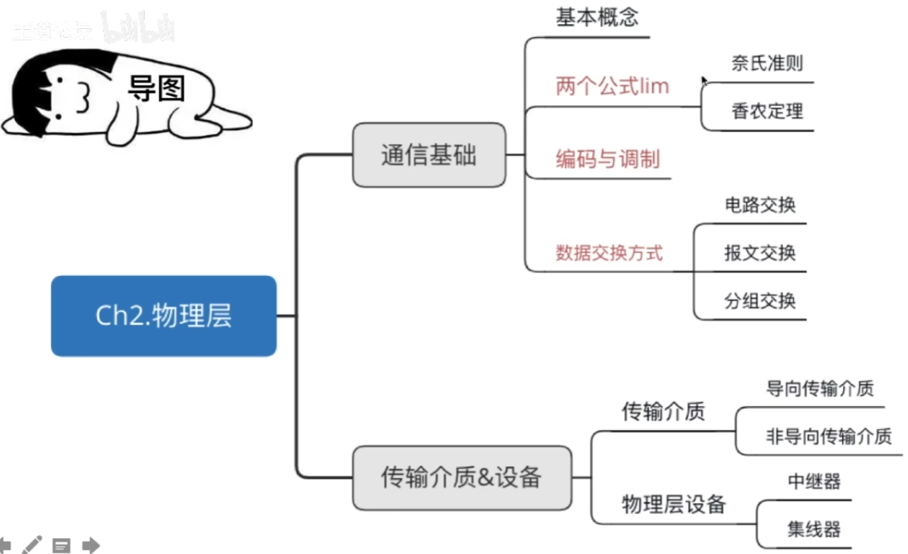
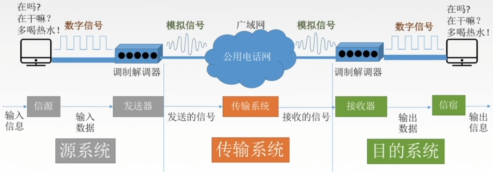
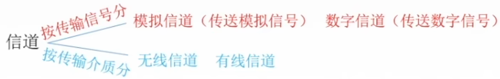
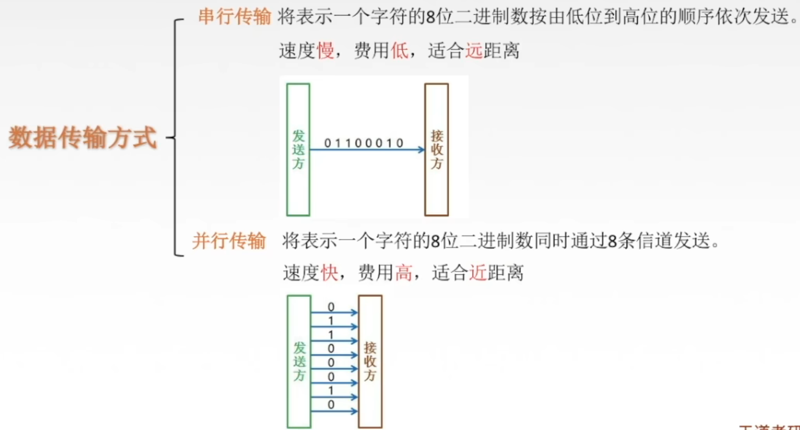
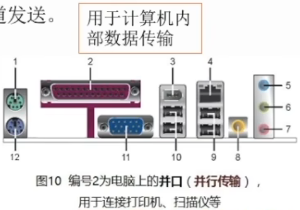
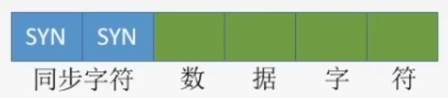
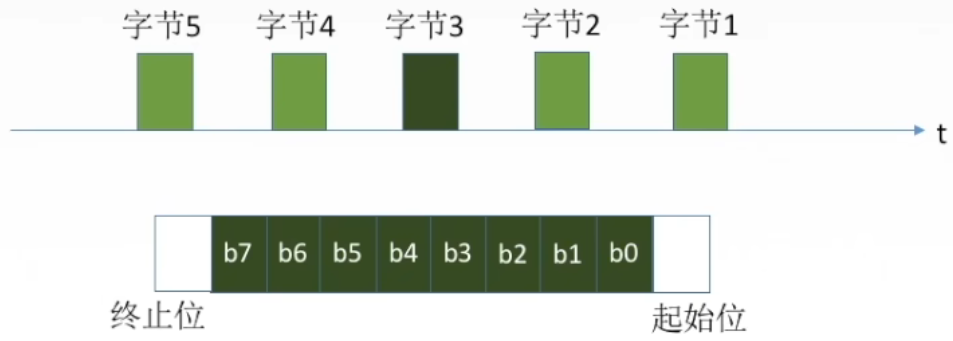
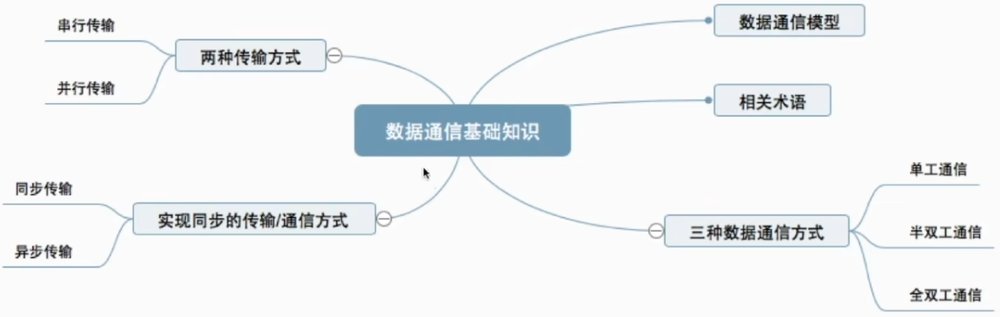

# 物理层基本概念

## 物理层接口特性

物理层解决如何在连接各种计算机的传输媒体上传输数据比特流，而不是指具体的传输媒体。

物理层主要任务：确定与传输媒体接口有关的一些特性 -> 定义标准

1. 机械特性

   定义物理连接的特性，规定物理连接时所采用的规格、接口形状、引线数目、引脚数量和排列情况。

2. 电气特性

   规定传输二进制位，线路上信号的电压范围、阻抗匹配、传输速率和距离限制等。

   某网络在物理层规定，信号的电平用+10V~+15V表示二进制0，用-10V~-15V表示二进制1，电线长度限于15m以内

3. 功能特性

   指明某条线上出现的某一电平表示何种意义，接口部件的信号线的用途。

   描述一个物理层接口引脚处于高电平时的含义时

4. 规程特性（过程特性）

   定义各物理线路的工作规程和时序关系。

# 数据通信基础知识1

## 典型的数据通信模型

## 数据通信相关术语

通信的目的是传送消息（消息：语音、文字、图像、视频等）。

数据data：传送信息的实体，通常是有意义的符号序列。

数据通信指在不同计算机之间传输表示信息的二进制0、1序列的过程。

信号：数据的电气/电磁的表现，是数据在传输过程中的存在形式。

数字信号/离散信号：代表消息的参数的取值是离散的。

模拟信号/连续信号：代表消息的参数的取值是连续的。

信源：产生和发送数据的源头。

信宿：接收数据的终点。

信道：信号的传输媒介。一般用来表示向某一个方向传输信息的介质，因此一条通信线路往往包含一条发送信道和一条接收信道。

## 设计数据通信系统要考虑的3个问题

1. 采用单工通信/半双工/全双工通信方式？
2. 采用串行通信/并行通信方式？
3. 采用同步通信/异步通信方式？

## 三种通信方式

从通信双方信息的交互方式看，可以有三种基本方式：

1. 单工通信

   只有一个方向的通信而没有反方向的交互，仅需要一条信道。

2. 半双工通信/双向交替通信

   通信的双方都可以发送或接收信息，但任何一方都不能同时发送和接收，需要两条信道。

3. 全双工通信/双向同时通信

   通信双方可以同时发送和接受信息，也需要两条信道。

## 串行传输&并行传输

串行传输 将表示一个字符的8位二进制数按由低位到高位的顺序依次发送。

速度慢，费用低，适合远距离

并行传输 将表示一个字符的8位二进制数同时通过8条信道发送。

速度快，费用高，适合近距离

## 同步传输&异步传输

同步传输：在同步传输的模式下，数据的传送是以一个数据区块为单位，因此同步传输又称为区块传输。在传送数据时，需先送出1个或多个同步字符，再送出整批的数据。

异步传输：异步传输将比特分成小组进行传送，小组可以是8位的1个字符或更长。发送方可以在任何时刻发送这些比特组，而接收方不知道它们会在什么时候到达。传送数据时，加一个字符起始位和一个字符终止位。

# 数据通信基础知识2

## 码元

码元是指用一个固定时长的信号波形（数字脉冲），代表不同离散数值的基本波形，是数字通信中数字信号的计量单位，这个时长内的信号称为k进制码元，而该时长称为码元宽度。当码元的离散状态有M个时（M大于2），此时码元为M进制码元。

1码元可以携带多个比特的信息量。例如，在使用二进制编码时，只有两种不同的码元，一种代表0状态，另一种代表1状态。

## 速率

## 波特

## 带宽

# 奈氏准则和香农定理

# 编码与调制1

# 编码与调制2

# 数据交换方式

# 物理层传输介质

# 物理层设备