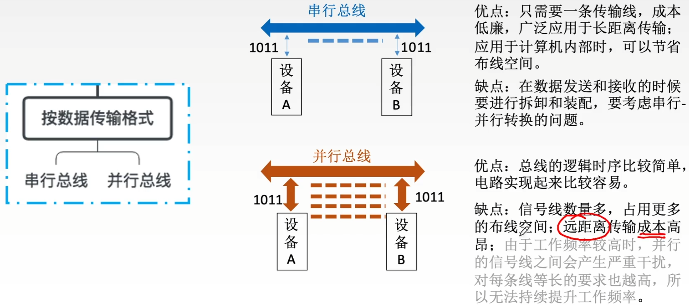

# 总线

## 总线简图

每个总线可能由很多根信号线组成

如上图，4根信号线组成“一根”总线，所有硬件部件都可以通过这根总线传递数据

可并行发送4bit数据。同一时刻只能有一个部件发送数据，但是可有多个部件接受数据

## 总线的定义

总线是一组能为多个部件分时共享的公共信息传送线路。

为什么要用总线？

早期计算机外部设备少时大多采用分散连接方式，不易实现随时增减外部设备。

为了更好地解决I/O设备和主机之间连接的灵活性问题，计算机的结构从分散连接发展为总线连接。

共享是指总线上可以挂接多个部件，各个部件之间互相交换的信息都可以通过这组线路分时共享。

分时是指同一时刻只允许有一个部件向总线发送信息，如果系统中有多个部件，则它们只能分时地向总线发送信息。

## 总线的特性

1. 机械特性：尺寸、形状、管脚数、排列顺序
2. 电气特性：传输方向和有效的电平范围
3. 功能特性：每根传输线的功能（地址、数据、控制）
4. 时间特性：信号的时序关系

## 总线的分类

## 串行总线与并行总线

优点：只需要一条传输线，成本低廉广泛应用于长距离传输；应用于计算机内部时，可以节省布线空间。

缺点：在数据发送和接收的时候要进行拆卸和装配，要考虑串行-并行转换的问题。

优点：总线的逻辑时序比较简单，电路实现起来比较容易。

缺点：信号线数量多，占用更多的布线空间；远距离传输成本高昂；由于工作频率较高时，并行的信号线之间会产生严重干扰，对每条线等长的要求也越高，所以无法持续提升工作频率。

### 速度

总线带宽=总线工作频率X总线宽度（bit/s）

1. 工作频率相同时，串行总线传输速度比并行总线慢。
2. 并行总线的工作频率无法持续提高，而串行总线可以通过不断提高工作频率来提高传输速度，最终超过并行总线。

##  总线的分类（按总线功能）

1. 片内总线

   片内总线是芯片内部的总线。

   它是CPU芯片内部寄存器与寄存器之间、寄存器与ALU之间的公共连接线。

2. 系统总线

   系统总线是计算机系统内各功能部件（CPU、主存、I/O接口）之间相互连接的总线。

   按系统总线传输信息内容的不同，又可分为3类：数据总线、地址总线和控制总线。

   数据总线：传输各功能部件之间的数据信息，包括指令和操作数；位数（根数）与机器字长、存储字长有关；双向。

   地址总线：传输地址信息，包括主存单元或I/O端口的地址；位数（根数）与主存地址空间大小及设备数量有关；单向。

   控制总线：传输控制信息，一根控制线传输一个信号；有出：CPU送出的控制命令；有入：主存（或外设）返回CPU的反馈信号。

   

   数据通路表示的是数据流经的路径

   数据总线是承载的媒介

3. 通信总线

   通信总线是用于计算机系统之间或计算机系统与其他系统（如远程通信设备、测试设备）之间信息传送的总线，通信总线也称为外部总线。

## 系统总线的结构

### 单总线结构

注：单总线并不是指只有一根信号线，系统总线按传送信息的不同可以细分为地址总线、数据总线和控制总线。

- 结构：CPU、主存、I/O设备（通过I/O接口）都连接在一组总线上，允许I/O设备之间、I/O设备和CPU之间或I/O设备与主存之间直接交换信息。
- 优点：结构简单，成本低，易于接入新的设备。
- 缺点：带宽低、负载重，多个部件只能争用唯一的总线，且不支持并发传送操作。

### 双总线结构

主存总线支持突发（猝发）传送：送出一个地址，收到多个地址连续的数据。

通道是具有特殊功能的处理器，能对I/O设备进行统一管理。通道程序放在主存中。

- 结构：双总线结构有两条总线，一条是主存总线，用于CPU、主存和通道之间进行数据传送；另一条是I/O总线，用于多个外部设备与通道之间进行数据传送。
- 优点：将较低速的I/O设备从单总线上分离出来，实现存储器总线和I/O总线分离。
- 缺点：需要增加通道等硬件设备。

### 三总线结构

DMA Direct Memory Access，直接内存访问。

- 结构：三总线结构是在计算机系统各部件之间采用3条各自独立的总线来构成信息通路，这3条总线分别为主存总线、I/O总线和直接内存访问DMA总线。
- 优点：提高了I/O设备的性能，使其更快地响应命令，提高系统吞吐量。
- 缺点：系统工作效率较低。

### 四总线结构

1. 桥接器：用于连接不同的总线，具有数据缓冲、转换和控制功能。
2. 靠近CPU的总线速度较快。
3. 每级总线的设计遵循总线标准。

# 总线的性能指标

### 总线的传输周期（总线周期）

一次总线操作所需的时间（包括申请阶段、寻址阶段、传输阶段和结束阶段），通常由若干个总线时钟周期构成。

### 总线时钟周期

即机器的时钟周期。计算机有一个统一的时钟，以控制整个计算机的各个部件，总线也要受此时钟的控制。

总线周期与总线时钟周期的关系比较魔幻，大多数情况下，一个总线周期包含多个总线时钟周期

有的时候，一个总线周期就是一个总线时钟周期

有的时候，一个总线时钟周期可包含多个总线周期

现在的计算机中，总线时钟周期也有可能由桥接器提供

### 总线的工作频率

总线上各种操作的频率，为总线周期的倒数。

若总线周期=N个时钟周期，则总线的工作频率=时钟频率/N。

实际上指一秒内传送几次数据。

### 总线的时钟频率

即机器的时钟频率，为时钟周期的倒数。

若时钟周期为T，则时钟频率为1/T。

实际上指一秒内有多少个时钟周期。

### 总线宽度

又称为总线位宽，它是总线上同时能够传输的数据位数，通常是指数据总线的根数，如32根称为32（bit）总线。

### 总线带宽

可理解为总线的数据传输率，即单位时间内总线上可传输数据的位数，通常用每秒钟传送信息的字节数来衡量，单位可用字节/秒（B/s）表示。

总线带宽=总线工作频率X总线宽度（bit/s）=总线工作频率X（总线宽度/8）(B/s)

= 总线宽度/总线周期 （bit/s）=总线宽度/8 /总线周期（B/s）

注：总线带宽是指总线本身所能达到的最高传输速率。

在计算实际的有效数据传输率时，要用实际传输的数据量除以耗时。

### 总线复用

总线复用是指一种信号线在不同的时间传输不同的信息。

可以使用较少的线传输更多的信息，从而节省了空间和成本。

### 信号线数

地址总线、数据总线和控制总线3种总线数的总和称为信号线数。

# 总线操作和定时

## 总线传输的四个阶段

总线周期的四个阶段

1. 申请分配阶段：由需要使用总线的主模块（或主设备）提出申请，经总线仲裁机构决定将下一传输周期的总线使用权授予某一申请者。也可将此阶段细分为传输请求和总线仲裁两个阶段。
2. 寻址阶段：获得使用权的主模块通过总线发出本次要访问的从模块的地址及有关命令，启动参与本次传输的从模块。
3. 传输阶段：主模块和从模块进行数据交换，可单向或双向进行数据传送。
4. 结束阶段：主模块的有关信息均从系统总线上撤除，让出总线使用权。

总线定时是指总线在双方交换数据的过程中需要时间上配合关系的控制，这种控制称为总线定时，它的实质是一种协议或规则

- 同步通信（同步定时方式）由统一时钟控制数据传送
- 异步通信（异步定时方式）采用应答方式，没有公共时钟标准
- 半同步通信 同步、异步结合
- 分离式通信 充分挖掘系统总线每瞬间的潜力

## 同步定时方式

同步定时方式是指系统采用一个统一的时钟信号来协调发送和接收双方的传送定时关系。

若干个时钟产生相等的时间间隔，每个间隔构成一个总线周期。

在一个总线周期中，发送方和接收方可进行一次数据传送。

因为采用统一的时钟，每个部件或设备发送或接收信息都在固定的总线传送周期中，一个总线的传送周期结束，下一个总线传送周期开始。

优点：传送速度快，具有较高的传输速率；总线控制逻辑简单。

缺点：主从设备属于强制性同步；不能及时进行数据通信的有效性检验，可靠性较差。

同步通信适用于总线长度较短及总线所接部件的存取时间比较接近的系统。

## 异步定时方式

在异步定时方式中，没有统一的时钟，也没有固定的时间间隔，完全依靠传送双方相互制约的”握手“信号来实现定时控制。

主设备提出交换信息的”请求“信号，经接口传送到从设备；从设备接到主设备的请求后，通过接口向主设备发出”回答“信号。

根据”请求“和“回答”信号的撤销是否互锁，分为以下3中类型。

1. 不互锁方式 速度最快 可靠性最差

   主设备发出“请求”信号后，不必等到接到从设备的“回答”信号，而是经过一段时间，便撤销“请求”信号。

   而从设备在接到“请求”信号后，发出“回答”信号，并经过一段时间，自动撤销“回答”信号。双方不存在互锁关系。

2. 半互锁方式

   主设备发出“请求”信号后，必须待接到从设备的“回答”信号后，才撤销“请求”信号，有互锁的关系。

   而从设备在接到“请求”信号后，发出“回答”信号，但不必等待获知主设备的“请求”信号已经撤销，而是隔一段时间后自动撤销“回答”信号，不存在互锁关系。

3. 全互锁方式 最可靠 速度最慢

   主设备发出”请求“信号后，必须待从设备”回答“后，才撤销”请求“信号；

   从设备发出”回答“信号，必须待获知主设备”请求“信号已撤销后，再撤销其”回答“信号。双方存在互锁关系。

优点：总线周期长度可变，能保证两个工作速度相差很大的部件或设备之间可靠地进行信息交换，自动适应时间的配合。

缺点：比同步控制方式稍复杂一些，速度比同步定时方式慢。

## 半同步通信

同步 发送方用系统时钟前沿发信号

​         接收方用系统时钟后沿判断、识别

异步 允许不同速度的模块和谐工作

半同步通信：统一时钟的基础上，增加一个”等待“响应信号

## 分离式通信

上述三种通信的共同点

一个总线传输周期（以输入数据为例）

- 主模块发地址、命令    使用总线
- 从模块准备数据             不使用总线 总线空闲
- 从模块向主模块发数据 使用总线

分离式通信的一个总线传输周期

子周期1 主模块申请占用总线，使用完后放弃总线的使用权

子周期2 从模块申请占用总线，将各种信息送至总线上

特点：

1. 各模块均有权申请占用总线
2. 采用同步方式通信，不等对方回答
3. 各模块准备数据时，不占用总线
4. 总线利用率提高

## 同步定时方式-读命令

总线控制器采用一个统一的时钟信号来协调发送和接收双方的传送定时关系。

假设：CPU作为主设备，某个输入设备作为从设备

1. CPU在T1时刻的上升沿给出地址信息

2. 在T2的上升沿给出读命令（低电平有效），与地址信息相符合的输入设备按命令进行一系列的内部操作，且必须在T3的上升沿来之前将CPU所需的数据送到数据总线上。

3. CPU在T3时钟周期内，将数据线上的信息传送到其内部寄存器中。

4. CPU在T4的上升沿撤销读命令，输入设备不再向数据总线上传送数据，撤销它对数据总线的驱动。

   如果从设备跟不上节奏，在T3给不出数据。

 