# 程序查询方式

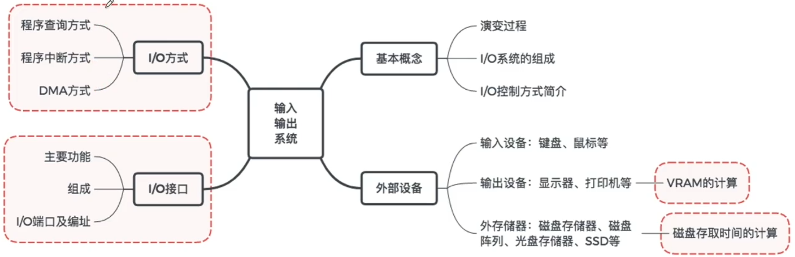

## I/O方式简介

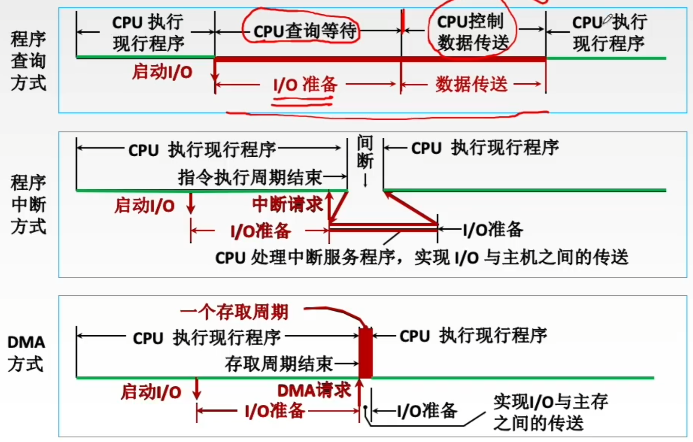

## 程序查询方式

x86中的IO指令实例

IN Rd, Rs 把IO端口Rs的数据输入到CPU寄存器Rd

OUT Rd, Rs 把CPU寄存器Rs的数据输出到IO端口Rd

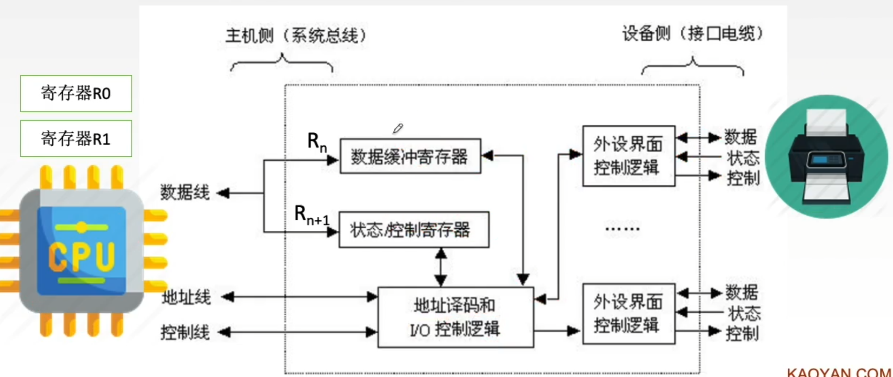

## 程序查询方式流程图

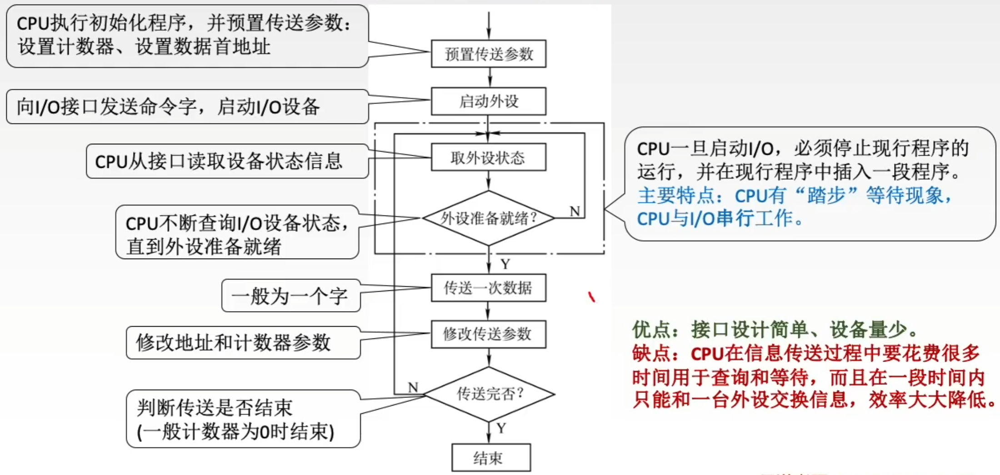

 CPU执行初始化程序，并预置传送参数：设置计数器、设置数据首地址

向I/O接口发送命令字，启动I/O设备

CPU从接口读取设备状态信息

CPU不断查询I/O设备状态，直到外设准备就绪

一般为一个字

修改地址和计数器参数

判断传送是否结束

（一般计数器为０时结束）

CPU一旦启动I/O，必须停止现行程序的运行，并在现行程序中插入一段程序。

主要特点：CPU有“踏步”等待现象，CPU与I/O串行工作。

优点：接口设计简单、设备量少。

缺点：CPU在信息传送过程中要花费很多时间用于查询和等待，而且在一段时间内只能和一台外设交换信息，效率大大降低。

## 程序查询方式 例题

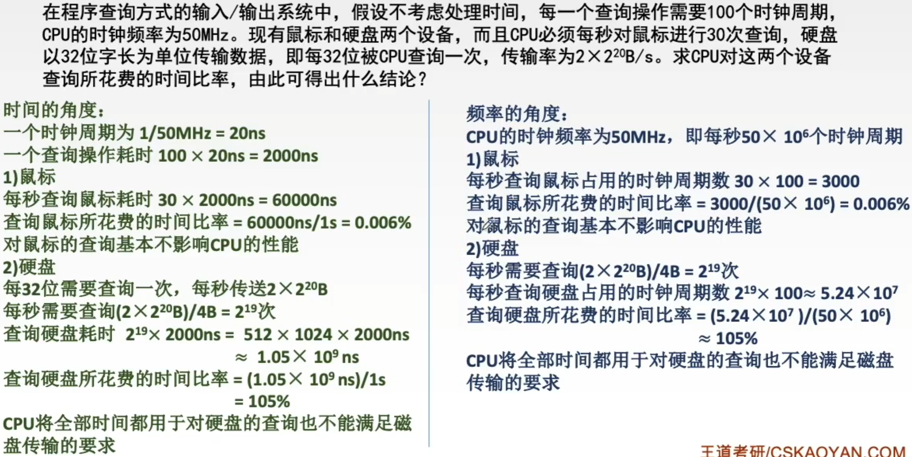

独占查询：CPU 100%的时间都在查询I/O状态，完全串行

定时查询：在保证数据不丢失的情况下，每隔一段时间CPU就查询一次I/O状态。查询的间隔内CPU可以执行其他程序

# 中断的作用和原理

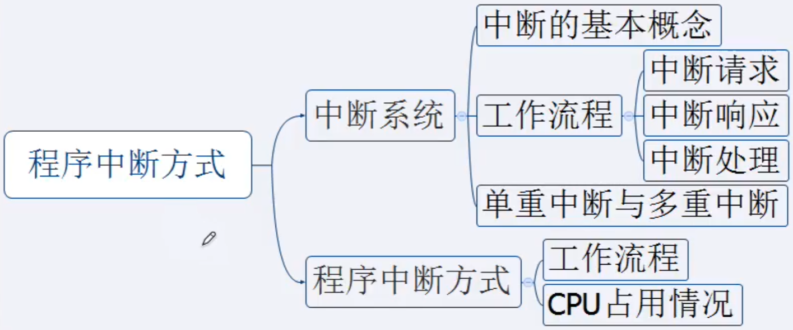

## 中断的基本概念

程序中断是指在计算机执行现行程序的过程中，出现某些急需处理的异常情况或特殊请求，CPU暂时中止现行程序，而转去对这些异常情况或特殊请求进行处理，在处理完毕后CPU又自动返回到现行程序的断点处，继续执行原程序。

工作流程：

1. 中断请求

   中断源向CPU发送中断请求信号

2. 中断响应

   响应中断的条件。

   中断判优：多个中断源同时提出请求时通过中断判优逻辑响应一个中断源。

3. 中断处理

   中断隐指令。

   中断服务程序。

## 中断请求的分类

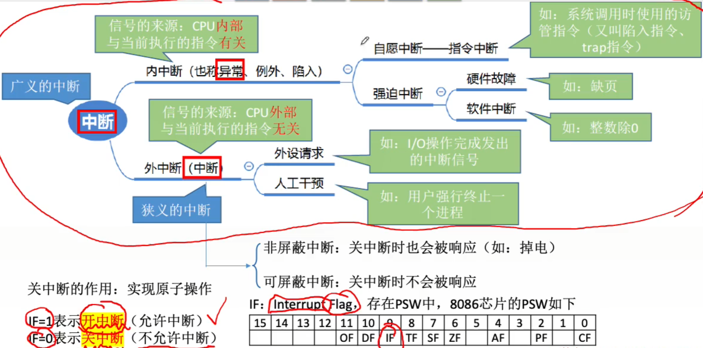

关中断的作用：实现原子操作

IF=1表示开中断（允许中断）

IF=0表示关中断（不允许中断）

## 中断请求标记 如何判断是哪个设备发来的中断信号？

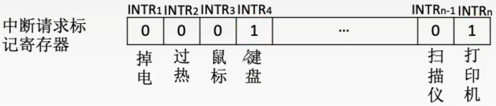

每个中断源向CPU发出中断请求的时间是随机的。

为了记录中断事件并区分不同的中断源，中断系统需对每个中断源设置中断请求标记触发器INTR，

当其状态为“1”时，表示中断源有请求。

这些触发器可组成中断请求标记寄存器，该寄存器可集中在CPU中，也可分散在各个中断源中。

对于外中断，CPU是在统一的时刻即每条指令执行阶段结束前向接口发出中断查询信号，以获取I/O的中断请求，也就是说，CPU响应中断的时间是在每条指令执行阶段的结束时刻。

CPU响应中断必须满足以下3个条件：

1. 中断源有中断请求。
2. CPU允许中断即开中断。
3. 一条指令执行完毕，且没有更紧迫的任务。

## 中断判优 实现 有多个中断信号同时到来，先处理哪个？

中断判优既可以用硬件实现，也可用软件实现：

硬件实现是通过硬件排队器实现的，它既可以设置在CPU中，也可以分散在各个中断源中；

软件实现是通过查询程序实现的。

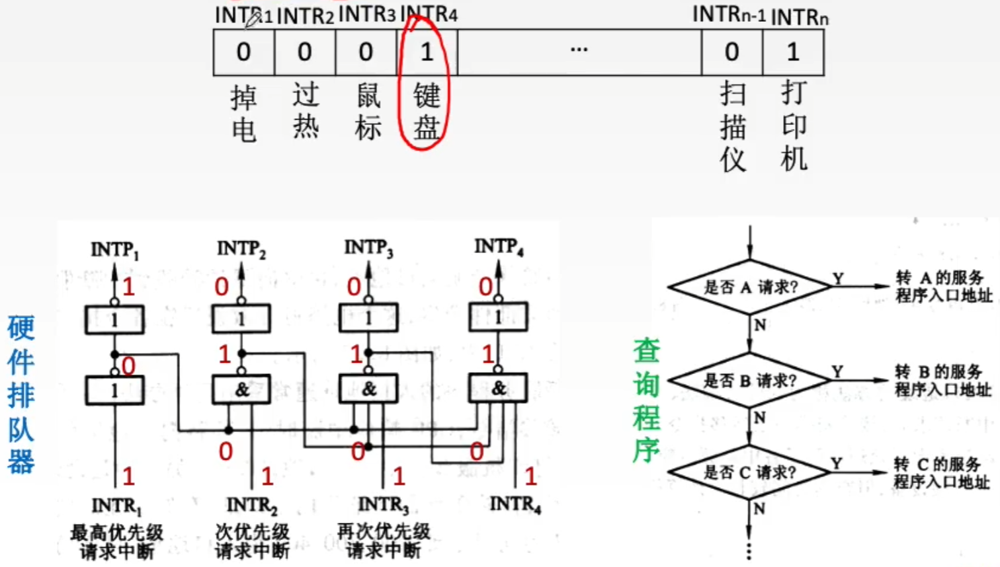

## 中断判优 优先级设置

1. 硬件故障中断属于最高级，其次是软件中断；
2. 非屏蔽中断优于可屏蔽中断；
3. DMA请求优于I/O设备传送的中断请求
4. 高速设备优于低速设备；
5. 输入设备优于输出设备；
6. 实时设备优于普通设备。

## 中断处理过程

当前指令执行结束后，PC内容为K+1

进入中断服务的方法是把该程序第一条指令的地址放入PC

回到主程序的方法是把K+1放入PC

中断隐指令：保存原程序的PC值，并让PC指向中断服务程序的第一条指令

## 中断处理过程 中断隐指令

中断隐指令的主要任务：

1. 关中断。在中断服务程序中，为了保存中断现场（即CPU主要寄存器中的内容）期间不被新的中断所打断，必须关中断，从而保证被中断的程序在中断服务程序执行完毕之后能接着正确地执行下去。
2. 保存断电。为了保证在中断服务程序执行完毕后能正确地返回到原来的程序，必须将原来程序的断点（即程序计数器（PC）的内容）保存起来。可以存入堆栈，也可以存入指定单元。
3. 引出中断服务程序。引出中断服务程序的实质就是取出中断服务程序的入口地址并传送给程序计数器（PC）。
   - 软件查询法
   - 硬件向量法

## 中断处理过程 硬件向量法

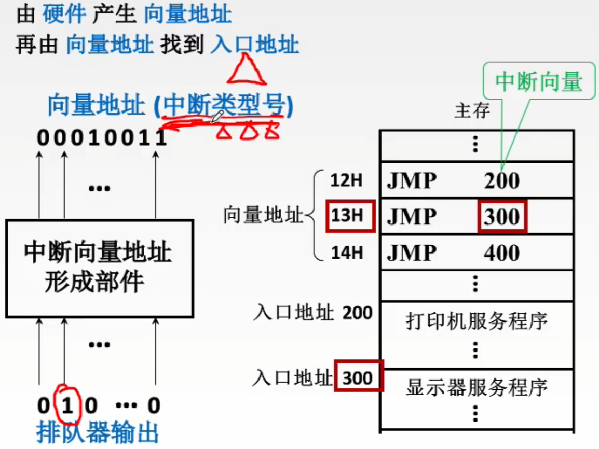

## 中断处理过程 中断服务程序

中断服务程序的主要任务：

1. 保护现场

   保存通用寄存器和状态寄存器的内容（eg 保存ACC寄存器的值），以便返回原程序后可以恢复CPU环境。可使用堆栈，也可以使用特定存储单元。

2. 中断服务（设备服务）

   主体部分，如通过程序控制需打印的字符代码送入打印机的缓冲存储器中（eg 中断服务的过程中有可能修改ACC寄存器的值）

3. 恢复现场

   通过出栈指令或取数指令把之前保存的信息送回寄存器中（eg 把原程序算到一般的ACC值恢复原样）

4. 中断返回

   通过中断返回指令回到原程序断点处。

 单重中断：执行中断服务程序时不响应新的中断请求。

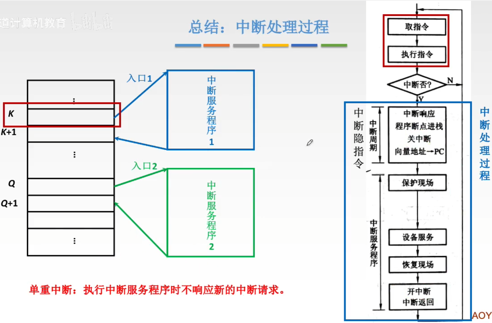

# 多重中断

## 单重中断与多重中断

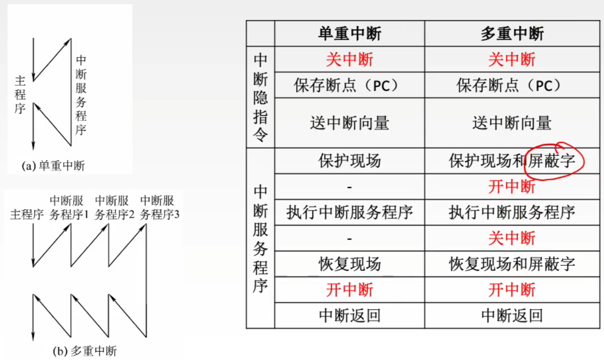

## 中断屏蔽技术

中断屏蔽技术主要用于多重中断，CPU要具备多重中断的功能，须满足下列条件。

1. 在中断服务程序中提前设置开中断指令。
2. 优先级别高的中断源有权中断优先级别低的中断源。

每个中断源都有一个屏蔽触发器，1表示屏蔽该中断源的请求，0表示可以正常申请，所有屏蔽触发器组合在一起，便构成一个屏蔽字寄存器，屏蔽字寄存器的内容称为屏蔽字。

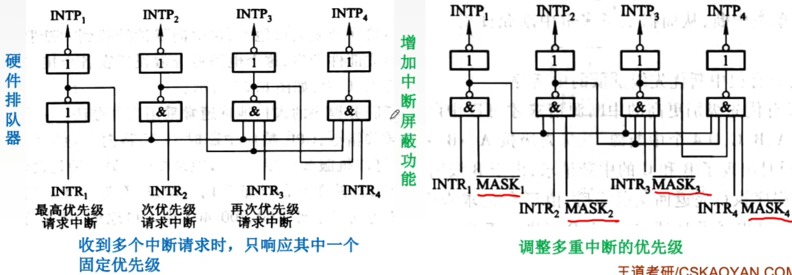

屏蔽字设置的规律：

1. 一般用'1'表示屏蔽，'0'表示正常申请。
2. 每个中断源对应一个屏蔽字（在处理该中断源的中断服务程序时，屏蔽寄存器中的内容为该中断源对应的屏蔽字）。
3. 屏蔽字中'1'越多，优先级越高。每个屏蔽字中至少有一个'1'（至少要能屏蔽自身的中断）。

# 程序中断方式

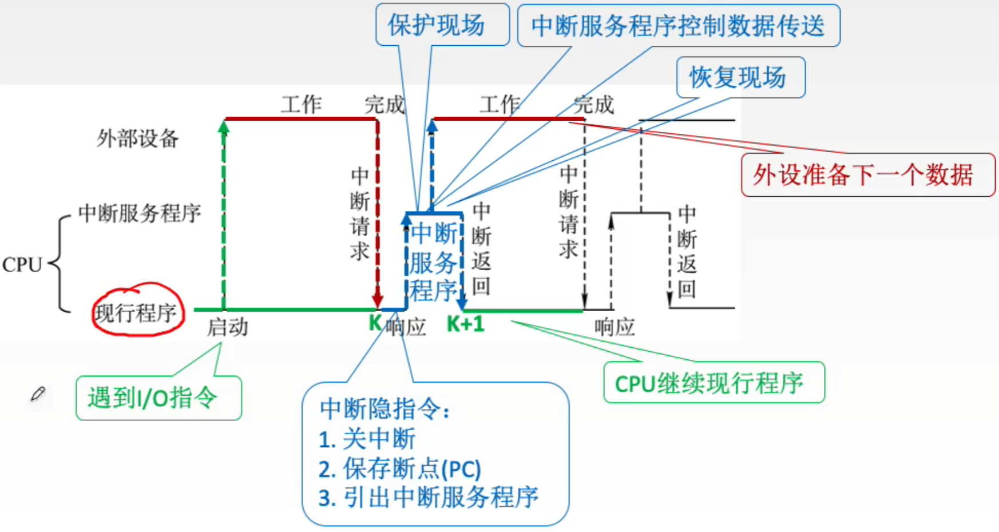

# DMA方式

DMA控制器与主存每次传送1个字。当传送完一整块数据后才向CPU发出中断请求

## DMA控制器

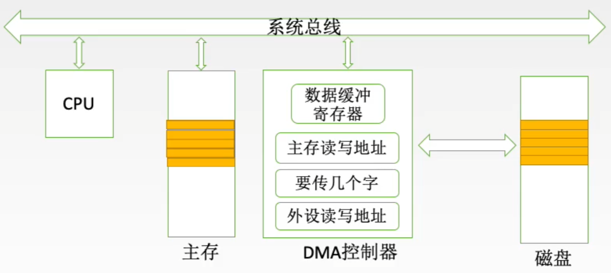

CPU向DMA控制器指明要输入还是输出；要传送多少个数据；数据在主存、外设中的地址。

传送前

1. 接受外设发出的DMA请求（外设传送一个字的请求），并向CPU发出总线请求。
2. CPU响应此总线请求，发出总线响应信号，接管总线控制权，进入DMA操作周期。

传送时

3. 确定传送数据的主存单元地址及长度，并能自动修改主存地址计数和传送长度计数。

4. 规定数据在主存和外设间的传送方向，发出读写等控制信号，执行数据传送操作。

传送后

5. 向CPU报告DMA操作的结束。

由控制和时序电路及状态标志组成，用于指定传送方向，修改传送参数，并对DMA请求信号和CPU响应信号进行协调和同步。

每当I/O设备准备好数据后给出一个控制信号，使DMA请求触发器置位。

简称AR，存放要交换数据的主存地址。

简称WC，用来记录传送数据的长度，计数溢出时，数据即传送完毕，自动发中断请求信号。

用于暂存每次传送的数据。

注：在DMA传送过程中，DMA控制器将接管CPU的地址总线、数据总线和控制总线，CPU的主存控制信号被禁止使用。而当DMA传送接受后，将恢复CPU的一切权利并开始执行其操作。

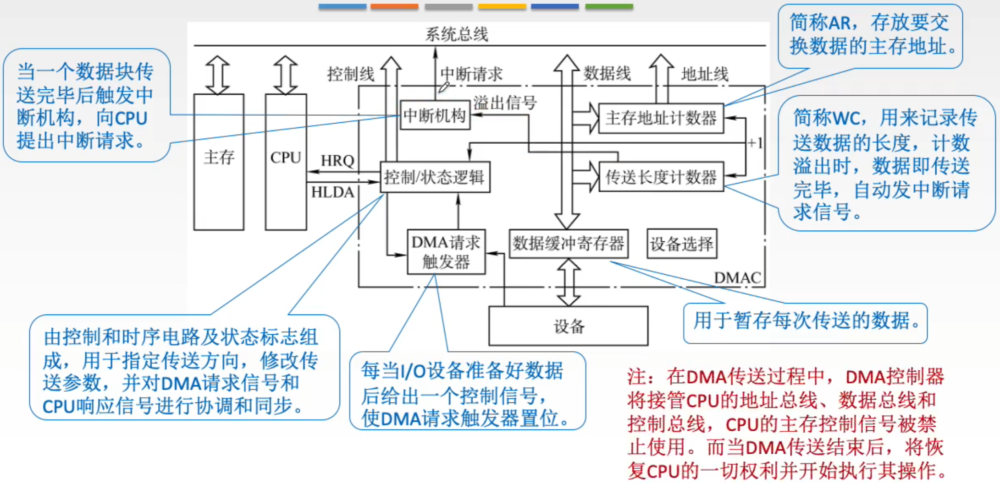

## DMA传送过程

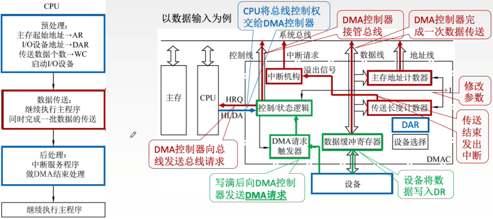

## DMA方式的特点

主存和DMA接口之间有一条直接数据通路。

由于DMA方式传送数据不需要经过CPU，因此不必中断现行程序，I/O与主机并行工作，程序和传送并行工作。

DMA方式具有下列特点：

1. 它使主存与CPU的固定联系脱钩，主存既可被CPU访问，又可被外设访问。
2. 在数据块传送时，主存地址的确定、传送数据的计数等都由硬件电路直接实现。
3. 主存中要开辟专用缓冲区，及时供给和接收外设的数据。
4. DMA传送速度快，CPU和外设并行工作，提高了系统效率。
5. DMA在传送开始前要通过程序进行预处理，结束后要通过中断方式进行后处理。

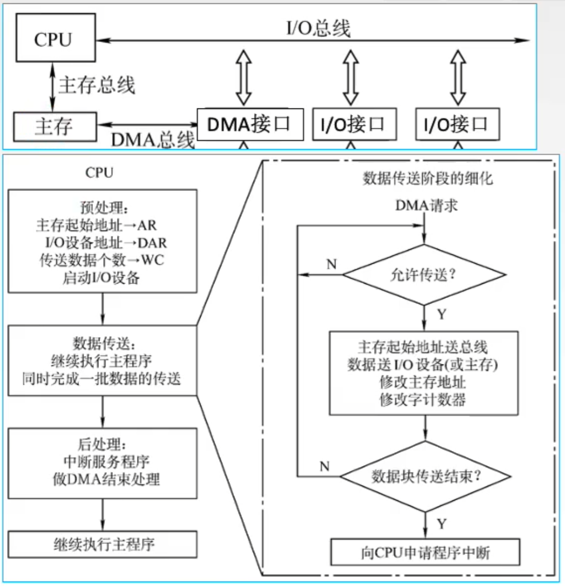

## DMA传送方式

主存和DMA控制器之间有一条数据通路，因此主存和I/O设备之间交换信息时，不通过CPU。但当I/O设备和CPU同时访问主存时，可能发生冲突，为了有效地使用主存，DMA控制器与CPU通常采用以下3种方法使用主存。

1. 停止CPU访问主存
2. DMA与CPU交替访存
3. 周期挪用（周期窃取）

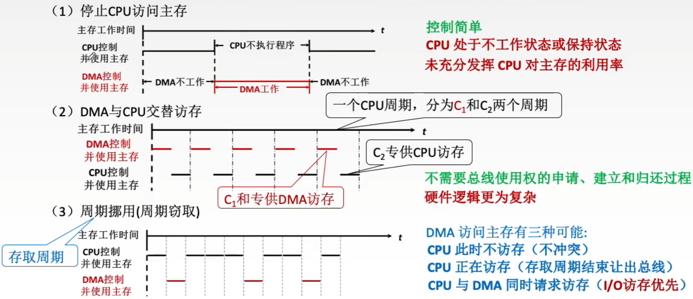

## DMA方式与中断方式

|          | 中断                                    | DMA                                             |
| -------- | --------------------------------------- | ----------------------------------------------- |
| 数据传送 | 程序控制 程序的切换>保存和恢复现场 | 硬件控制 CPU只需进行预处理和后处理         |
| 中断请求 | 传送数据                                | 后处理                                          |
| 响应     | 指令执行周期结束后响应中断              | 每个机器周期结束均可，总线空闲时即可响应DMA请求 |
| 场景     | CPU控制，低速设备                       | DMA控制器控制，高速设备                         |
| 优先级   | 优先级低于DMA                           | 优先级高于中断                                  |
| 异常处理 | 能处理异常事件                          | 仅传送数据                                      |

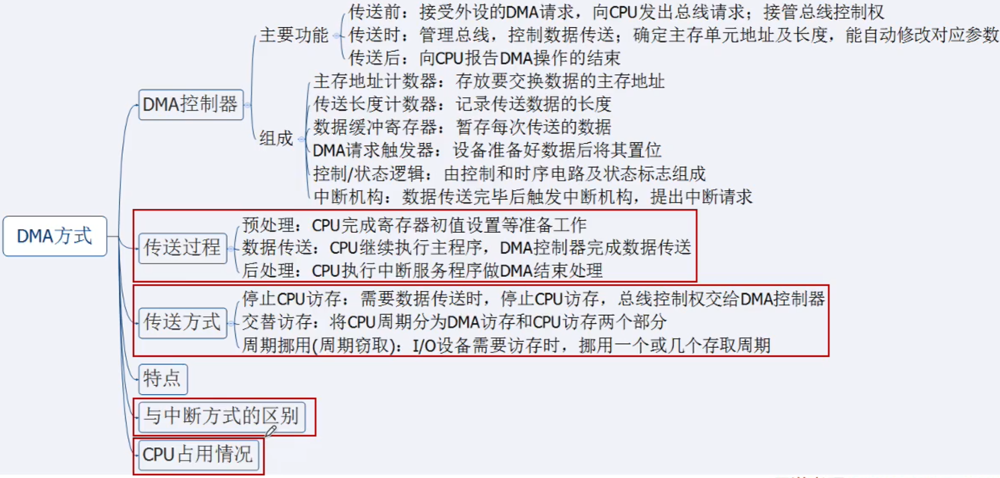