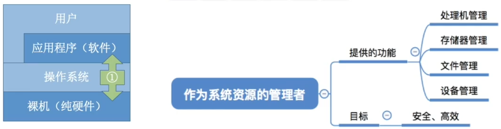

# 操作系统的概念、功能

## 操作系统的概念（定义）

操作系统（Operating System, OS）是指控制和管理整个计算机系统的硬件和软件资源，并合理地组织调度计算机的工作和资源的分配；以提供给用户和其他软件方便的接口和环境；它是计算机系统中最基本的系统软件。

1. 操作系统是系统资源的管理者
2. 向上层提供方便易用的服务
3. 是最接近硬件的一层软件

### 作为系统资源的管理者

执行一个程序前需要将该程序放到内存中，才能被CPU处理。

### 向上层提供方便易用的服务

硬件只听得懂二进制指令，硬件对外暴露了“丑陋”、不友好的交互接口

在硬件之上安装了操作系统，操作系统对外暴露了“美丽”、友好的交互接口

封装思想：操作系统把一些丑陋的硬件功能封装成简单易用的服务，使用户能更方便地使用计算机，用户无需关心底层硬件的原理，只需要对操作系统发出命令即可

GUI：图形化用户接口（Graphical User Interface）很多现代操作系统都提供GUI

用户可以使用形象的图形界面进行操作，而不再需要记忆复杂的命令、参数。

联机命令接口实例（Windows系统） 联机命令接口=交互式命令接口

特点：用户说一句，系统跟着做一句

脱机命令接口实例（Windows系统）脱机命令接口=批处理命令接口

特点：用户说一堆，系统跟着做一堆

程序接口：可以在程序中进行系统调用来使用程序接口。普通用户不能直接使用程序接口，只能通过程序代码间接使用。

如：写C语言“Hello world”程序时，在printf函数的底层就使用到了操作系统提供的显式相关的“系统调用”

系统调用类似于函数调用，是应用程序请求操作系统服务的唯一方式

在有的教材中：

系统调用=广义指令

### 作为最接近硬件的层次

需要实现对硬件机器的拓展

没有任何软件支持的计算机成为裸机。在裸机上安装的操作系统，可以提供资源管理功能和方便用户的服务功能，将裸机改造成功能更强、使用更方便的机器

通常把覆盖了软件的机器成为扩充机器，又称之为虚拟机

操作系统对硬件机器的拓展：将CPU、内存、磁盘、显示器、键盘等硬件合理地组织起来，让各种硬件能够相互协调配合，实现更多更复杂的功能。

# 操作系统的特征

# 操作系统的发展与分类