# 操作系统的特征

## 并发

并发：指两个或多个事件在同一时间间隔内发生。这些事件宏观上是同时发生的，但微观上是交替发生的。

常考易混概念 并行：指两个或多个事件在同一时刻同时发生。

操作系统的并发性指计算机系统中“同时”运行着多个程序，这些程序宏观上看是同时运行着的，而微观上看是交替运行的。

操作系统就是伴随着“多道程序技术”而出现的。因此，操作系统和程序并发是一起诞生的。

注意（重要考点）：

单核CPU同一时刻只能执行一个程序，各个程序只能并发地执行

多核CPU同一时刻可以同时执行多个程序，多个程序可以并行地执行

即使是对于4核CPU来说，只要有4个以上的程序需要“同时”运行，那么并发性依然是必不可少的，因此并发性是操作系统一个最基本的特性。

## 共享

共享即资源共享，是指系统中的资源可供内存中多个并发执行的进程共同使用。

互斥共享方式：系统中的某些资源，虽然可以提供给多个进程使用，但一个时间段内只允许一个进程访问该资源

同时共享方式：系统中的某些资源，允许一个时间段内由多个进程“同时”对它进行访问

所谓的“同时”往往是宏观上的，而在微观上，这些进程可能是交替地对该资源进行访问的（即分时共享）

## 并发和共享的关系

并发性指计算机系统中同时存在着多个运行着的程序。

共享性是指系统中的资源可供内存中多个并行执行的进程共同使用。

使用QQ发送文件A，同时使用微信发送文件B。

1. 两个进程正在并发执行（并发性）
2. 需要共享地访问硬盘资源（共享性）

如果失去并发性，则系统中只有一个程序正在运行，则共享性失去存在的意义

如果失去共享性，则QQ和微信不能同时访问硬盘资源，就无法实现同时发送文件，也就无法并发

## 虚拟

虚拟是指把一个物理上的实体变为若干个逻辑上的对应物。物理实体（前者）是实际存在的，而逻辑上对应物（后者）是用户感受到的。

背景知识：一个程序需要放入内存并给它分配CPU才能执行

虚拟技术中的“空分复用技术”

虚拟技术中的“时分复用技术”。微观上处理及在各个微小的时间段内交替着为各个进程服务

显然，如果失去了并发性，则一个时间段内系统中只需运行一道程序，那么就失去了实现虚拟性的意义了。因此，没有并发性，就谈不上虚拟性。

## 异步

异步是指，在多道程序环境下，允许多个程序并发执行，但由于资源有限，进程的执行不是一贯到底的，而是走走停停，以不可预知的速度向前推进，这就是进程的异步性。

由于并发运行的程序会争抢着使用系统资源，而系统中的资源有限，因此进程的执行不是一贯到底的，而是走走停停的，以不可预知的速度向前推进。

如果失去了并发性，即系统只能串行地运行各个程序，那么每个程序的执行会一贯到底。只有系统拥有并发性，才有可能导致异步性。

重要考点：

理解并发和并行的区别

并发和共享互为存在条件

没有并发和共享，就谈不上虚拟和异步，因此并发和共享是操作系统的两个最基本的特征

# 操作系统的发展与分类

学习提示：要重点关注和理解各类操作系统主要想解决的是什么问题，各自的优缺点。

## 手工操作阶段

主要缺点：用户独占全机、人机速度矛盾导致资源利用率极低

## 批处理阶段 单道批处理系统

引入脱机输入/输出技术（用外围机+磁带完成），并由监督程序负责控制作业的输入、输出

操作系统雏形

主要优点：缓解了一定程度的人机速度矛盾，资源利用率有所提升。

主要缺点：内存中仅能有一道程序运行，只有该程序运行结束之后才能调入下一道程序。CPU有大量的时间是在空闲等待I/O完成。资源利用率依然很低。

## 批处理阶段 多道批处理系统

每次往内存中读入多道程序

操作系统正式诞生，用于支持多道程序并发运行

主要优点：多道程序并发执行，共享计算机资源。资源利用率大幅提升，CPU和其他资源更能保持“忙碌”状态，系统吞吐量增大。

主要缺点：用户响应时间长，没有人机交互功能（用户提交自己的作业之后就只能等待计算机处理完成，中间不能控制自己的作业执行。eg：无法调试程序/无法在程序运行过程中输入一些参数）

## 分时操作系统

分时操作系统：计算机以时间片为单位轮流为各个用户/作业服务，各个用户可通过终端与计算机进行交互。

主要优点：用户请求可以被即时响应，解决了人机交互问题。允许多个用户同时使用一台计算机，并且用户对计算机的操作相互独立，感受不到别人的存在。

主要缺点：不能优先处理一些紧急任务。操作系统对各个用户/作业都是完全公平的，循环地为每个用户/作业服务一个时间片，不区分任务的紧急性。

## 实时操作系统

实时操作系统：

主要优点：能够优先响应一些紧急任务，某些紧急任务不需时间片排队。

在实时操作系统的控制下，计算机系统接收到外部信号后及时进行处理，并且要在严格的时限内处理完事件。实时操作系统的主要特点是及时性和可靠性。

## 其他几种操作系统

# 操作系统的运行机制

## 预备知识：程序是如何运行的？

## 内核程序v.s.应用程序

## 特权指令v.s.非特权指令

## 内核态v.s.用户态

## 内核态、用户态的切换

# 数据结构在学什么

- 怎么用程序代码把显示世界的问题信息化
- 如何用计算机高效地处理这些信息从而创造价值

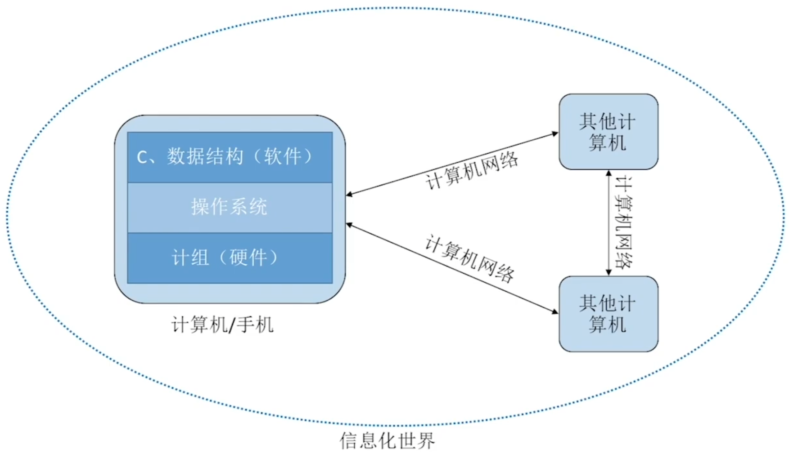

# 数据结构的基本概念

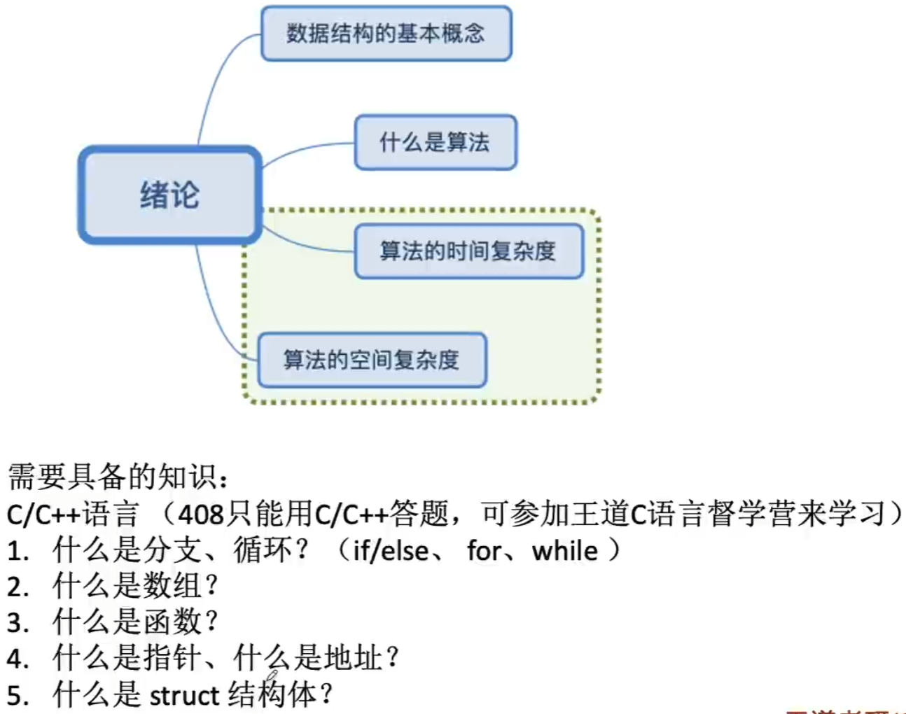

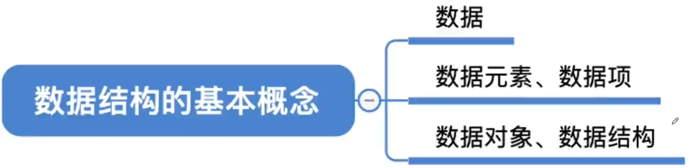

数据：

数据是信息载体，是描述客观事物属性的数、字符及所有能输入到计算机中并被计算机程序识别和处理的符号的集合。数据是计算机程序加工的原料。

## 早期计算机处理的数据

世界上第一台通用计算机ENIAC

早期的计算机 只用于处理纯数值型问题

## 现代计算机处理的数据

现代计算机 经常处理非数值型问题

对于非数值的问题：

1. 我们关心每个个体的具体信息
2. 我们还关心个体之间的关系

## 数据元素 描述一个个体

数据元素、数据项：

数据元素是数据的基本单位，通常作为一个整体进行考虑和处理。

一个数据元素可由若干数据项组成，数据项是构成数据元素的不可分割的最小单位。

## 什么是数据对象

数据对象是具有相同性质的数据元素的集合，是数据的一个子集。

对于非数值型的问题：

1. 我们关心每个个体的具体信息
2. 我们还关心个体之间的关系

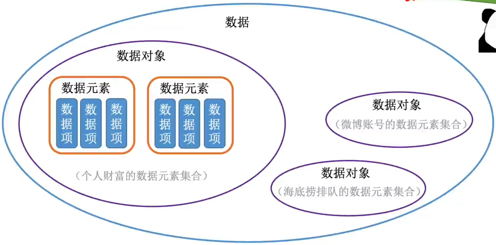

数据对象是具有相同性质的数据元素的集合，是数据的一个子集。

数据结构是相互之间存在一种或多种特定关系的数据元素的集合。

同样的数据元素，可组成不同的数据结构

不同的数据元素，可组成相同的数据结构

## 什么是数据结构

线性数据结构 排行榜

网状数据结构 朋友圈

同一个数据对象里的数据元素，可以组成不同的数据结构

数据结构这门课着重关注的是数据元素之间的关系，和对这些数据元素的操作，而不关心具体的数据项内容

# 数据结构的三要素

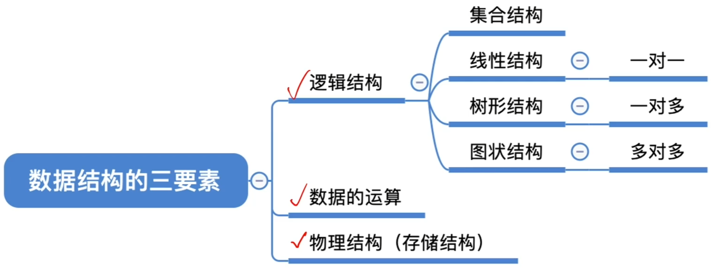

## 逻辑结构

逻辑结构 数据元素之间的逻辑关系是什么？

集合 各个元素同属一个集合，别无其他关系

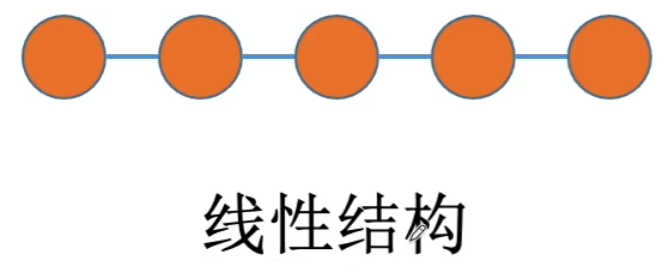

线性结构 数据元素之间是一对一的关系。

除了第一个元素，所有元素都有唯一前驱；

除了最后一个元素，所有元素都有唯一后继

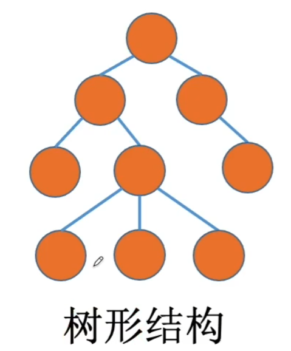

数据元素之间是一对多的关系

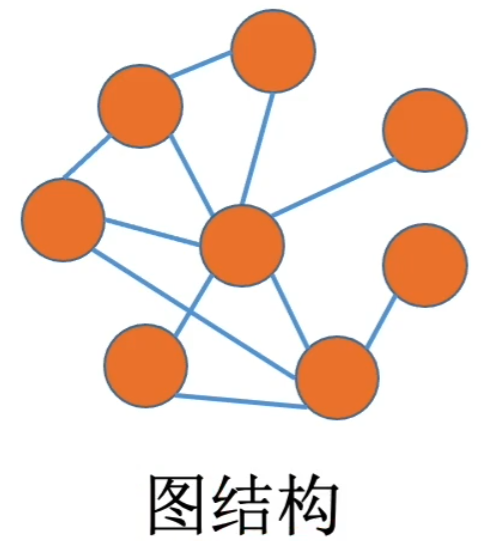

数据元素之间是多对多的关系

## 数据的运算

数据的运算 针对于某种逻辑结构，结合实际需求，定义基本运算

逻辑结构 线性结构

基本运算：

1. 查找第i个数据元素
2. 在第i个位置插入新的数据元素
3. 删除第i个位置的数据元素

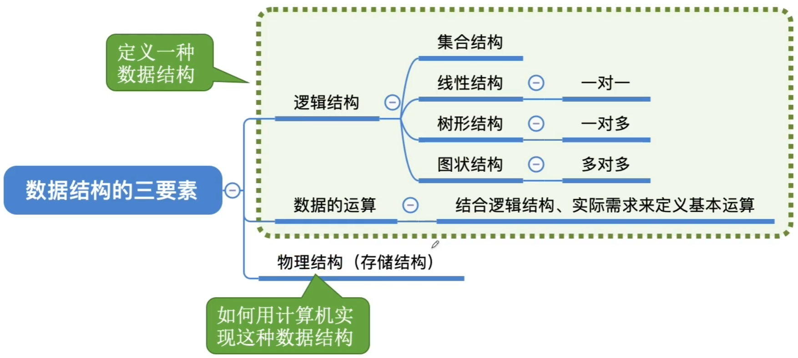

## 物理结构

数据的物理结构（存储结构）如何用计算机表示数据元素的逻辑关系？

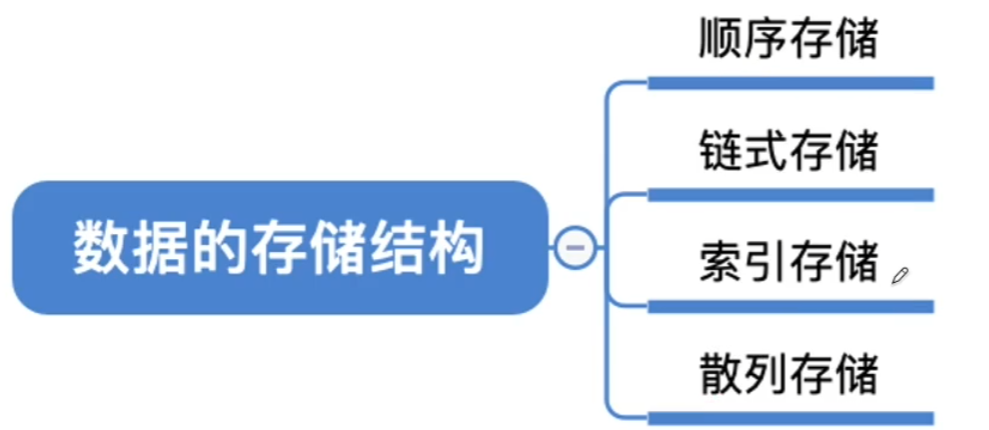

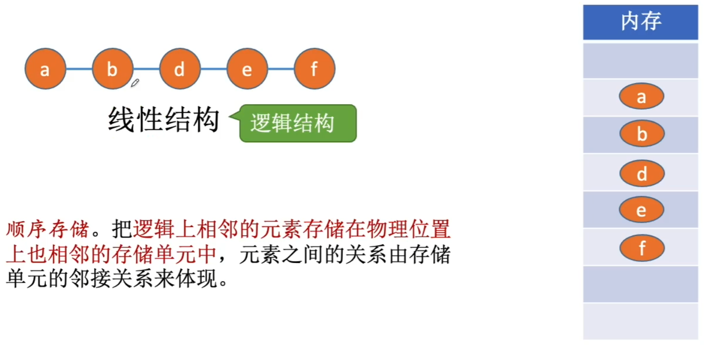

顺序存储。把逻辑上相邻的元素存储在物理位置上也相邻的存储单元中，元素之间的关系由存储单元的邻接关系来体现。

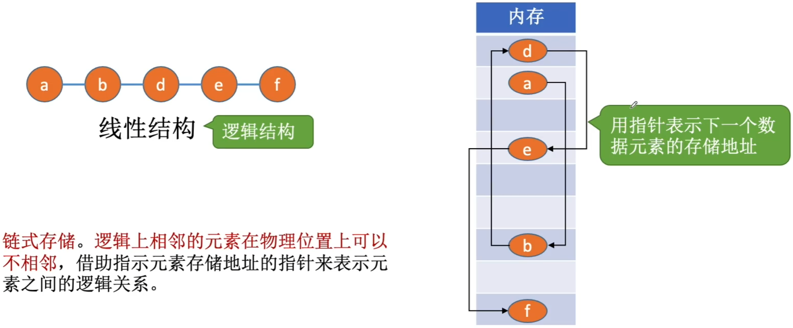

链式存储。逻辑上相邻的元素在物理位置上可以不相邻，借助指示元素存储地址的指针来表示元素之间的逻辑关系。

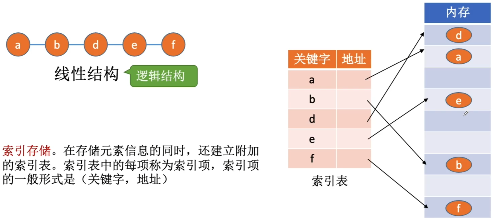

索引存储。在存储元素信息的同时，还建立附加的索引表。索引表中的每项称为索引项，索引项的一般形式是（关键字，地址）

散列存储。根据元素的关键字直接计算出该元素的存储地址，又称哈希（Hash）存储

1. 若采用顺序存储，则各个数据元素在物理上必须是连续的；若采用非顺序存储，则各个元素在物理上可以是离散的。
2. 数据的存储结构会影响存储空间分配的方便程度
3. 数据的存储结构会影响对数据运算的速度 eg：在b和d之间插入新元素c

运算的定义是针对逻辑结构的，指出运算的功能；

运算的实现是针对存储结构的，指出运算的具体操作步骤。

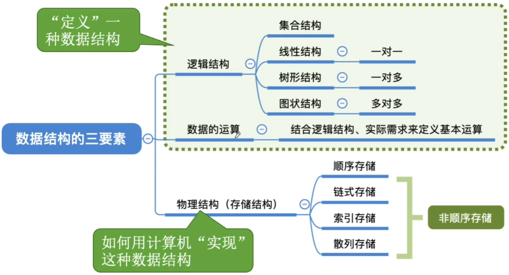

## 数据类型、抽象数据类型

数据类型是一个值的集合和定义在此集合上的一组操作的总称。

1. 原子类型。其值不可再分的数据类型。
2. 结构类型。其值可以再分解为若干成分（分量）的数据类型。

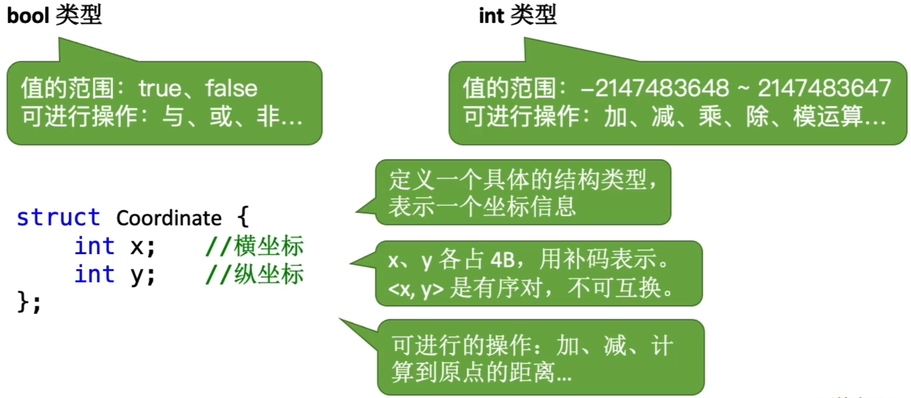

抽象数据类型（Abstract Data Type, ADT）是抽象数据组织及与之相关的操作。

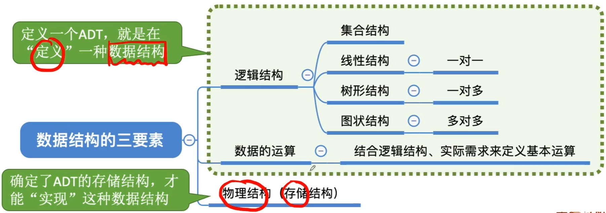

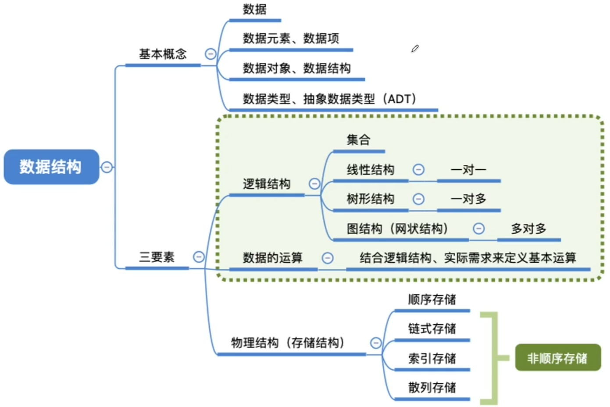