# 算法的基本概念

程序 = 数据结构 + 算法

如何用数据正确地描述现实世界的问题，并存入计算机

如何高效地处理这些数据，以解决实际问题

算法（Algorithm）是对特定问题求解步骤的一种描述，它是指令的有限序列，其中的每条指令表示一个或多个操作

## 算法的特性

有穷性。一个算法必须总在执行有穷步之后结束，且每一步都可在有穷时间内完成。

注：算法必须是有穷的，而程序可以是无穷的

用有限步骤解决某个特定的问题

如：微信是程序，不是算法

确定性。算法中每条指令必须有确切的含义，对于相同的输入只能得出相同的输出。

可行性。算法中描述的操作都可以通过已经实现的基本运算执行有限次来实现。

输入。一个算法有零个或多个输入，这些输入取自于某个特定的对象的集合。

输出。一个算法有一个或多个输出，这些输出是与输入有着某种特定关系的量。

## “好”算法的特质

设计算法时要尽量追求的目标

1. 正确性。算法应能够正确地解决求解问题。

2. 可读性。算法应具有良好的可读性，以帮助人们理解。

3. 健壮性。输入非法数据时，算法能适当地做出反应或进行处理，而不会产生莫名其妙的输出结果。 

4. 高效率与低存储量需求

   花的时间少。时间复杂度低

   不费内存。空间复杂度低

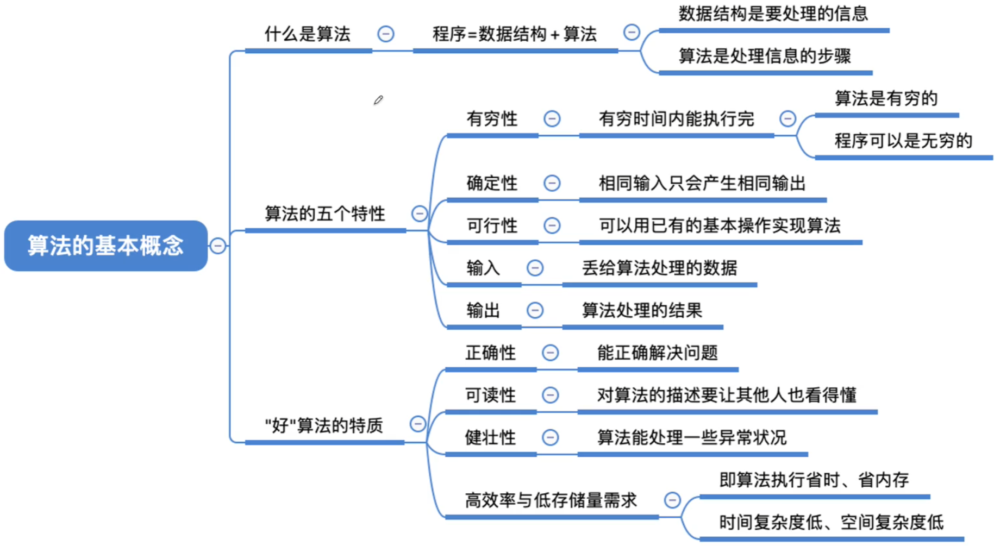

程序设计：

设计一个好的数据结构

设计一个好的算法

算法必须具备的特性

设计算法时要尽量追求的目标

# 算法的时间复杂度

如何评估算法时间开销？

让算法先运行，事后统计运行时间？

存在什么问题？

能否排除与算法本身无关的外界因素

- 和机器性能有关，如：超级计算机v.s.单片机
- 和编程语言有关，越高级的语言执行效率越低
- 和编译程序产生的机器指令质量有关
- 有些算法是不能事后再统计的，如：导弹控制算法

算法时间复杂度

事先预估算法时间开销T(n)与问题规模n的关系（T表示“time”）

问题1：是否可以忽略表达式某些部分？

当问题规模n足够大时...

大O表示“同阶”，同等数量级。即：当n->∞时，二者之比为常数

结论：可以只考虑阶数高的部分

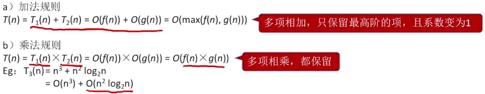

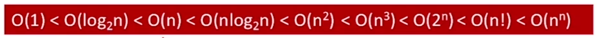

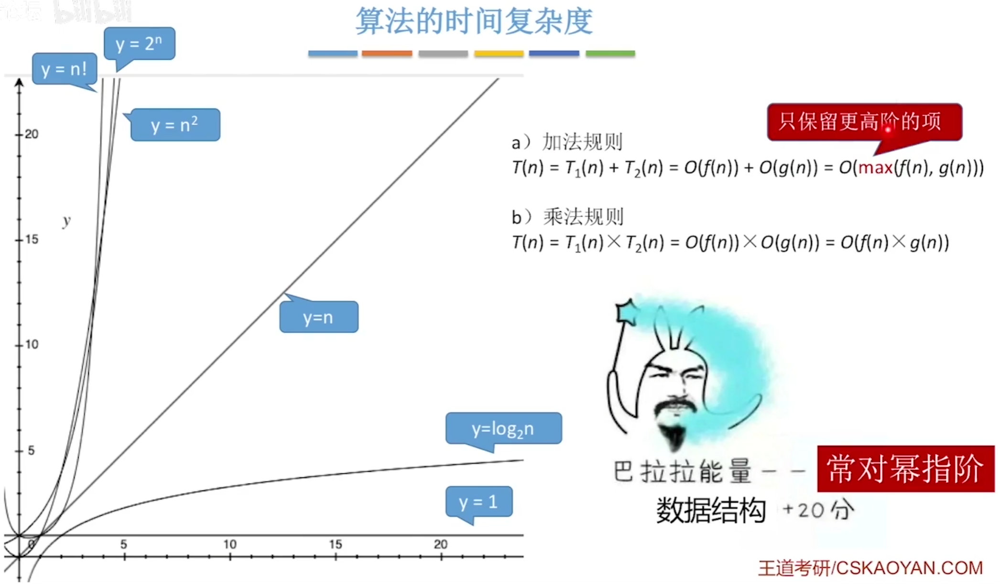

问题1：是否可以忽略表达式某些部分？

只考虑阶数，用大O记法表示

问题2：如果有好几千行代码，按这种方法需要一行一行数？ 

只需考虑最深层循环的循环次数与n的关系

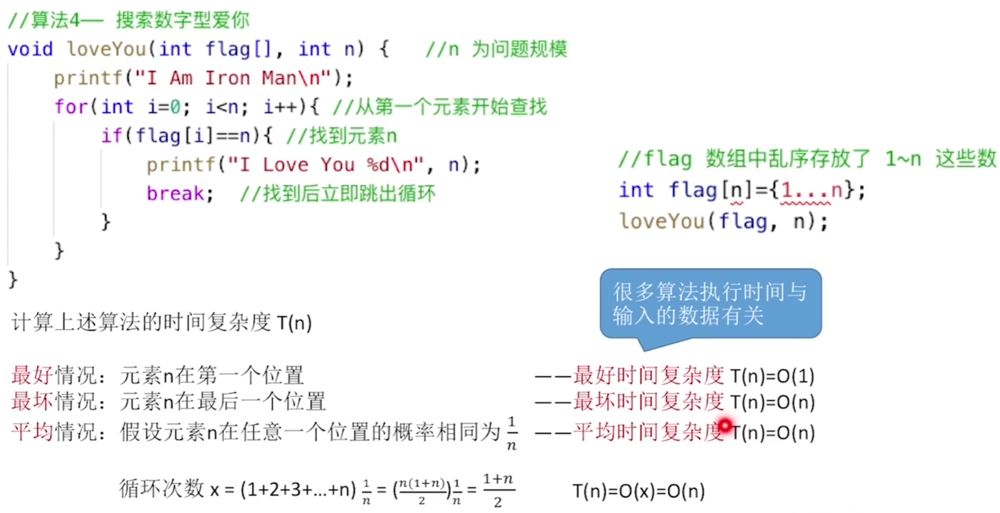

最坏时间复杂度：最坏情况下算法的时间复杂度

平均时间复杂度：所有输入示例等概率出现的情况下，算法的期望运行时间

最好时间复杂度：最好情况下算法的时间复杂度

算法的性能问题只有在n很大时才会暴露出来。

# 算法的空间复杂度

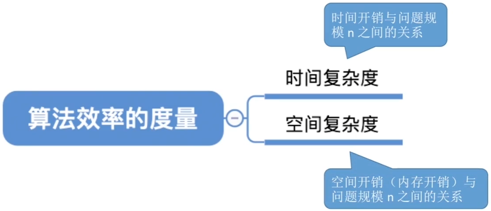

## 程序运行时的内存需求

无论问题规模怎么变，算法运行所需的内存空间都是固定的常量，算法空间复杂度为

S(n) = O(1)

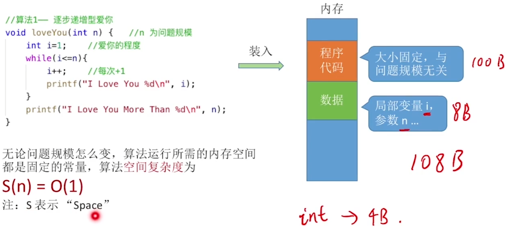

算法原地工作 算法所需内存空间为常量

只需关注存储空间的大小 与问题规模相关的变量

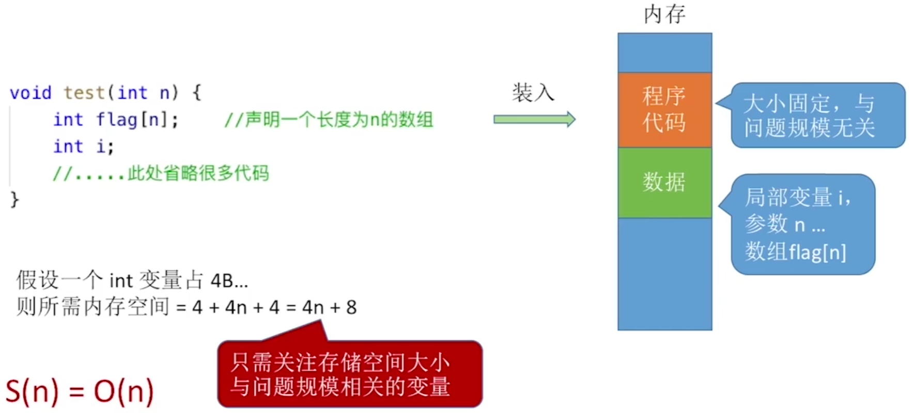

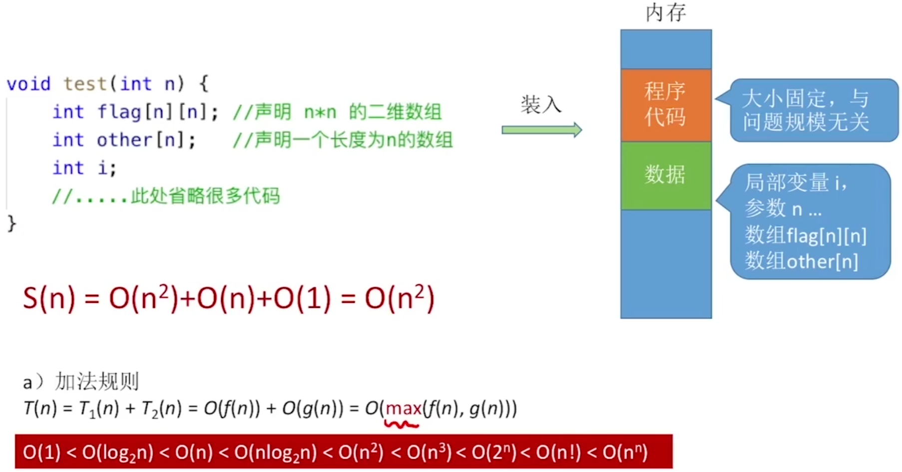

## 函数递归调用带来的内存开销

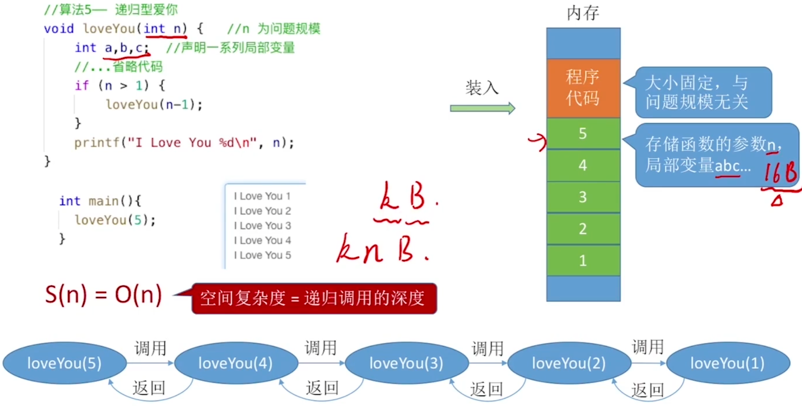

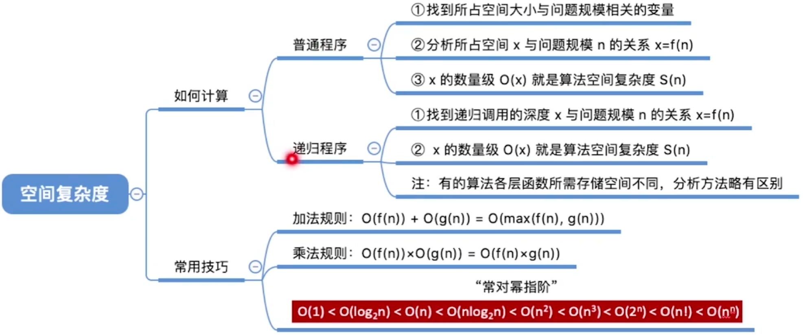