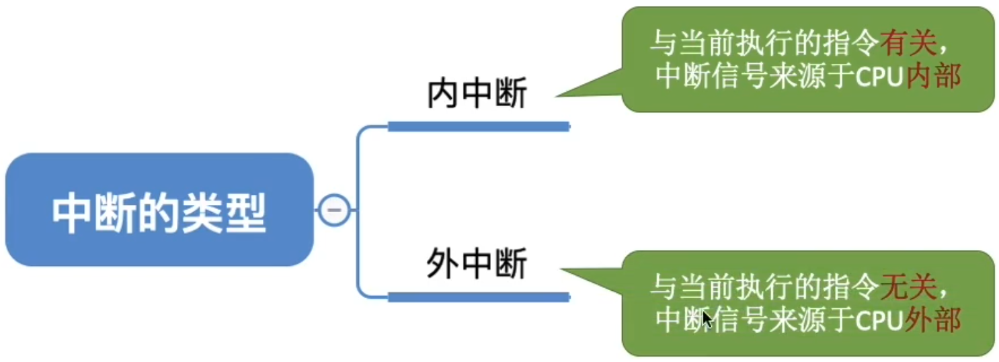
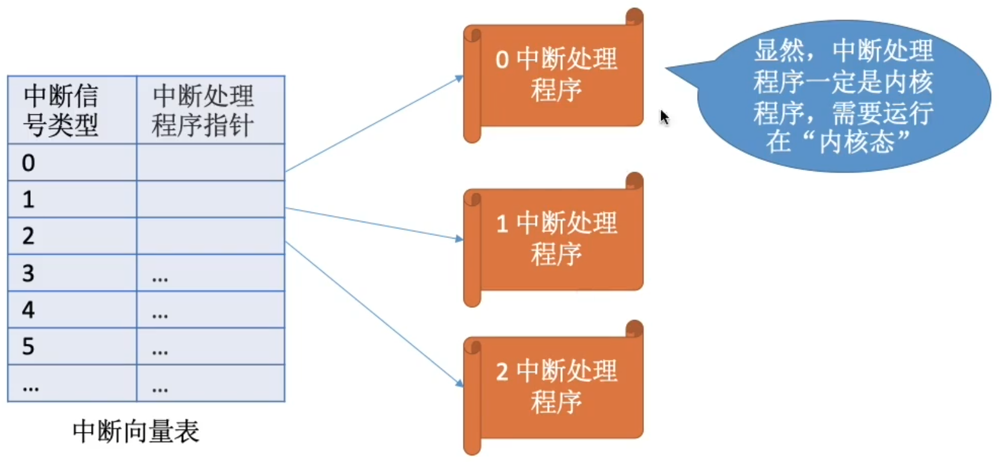
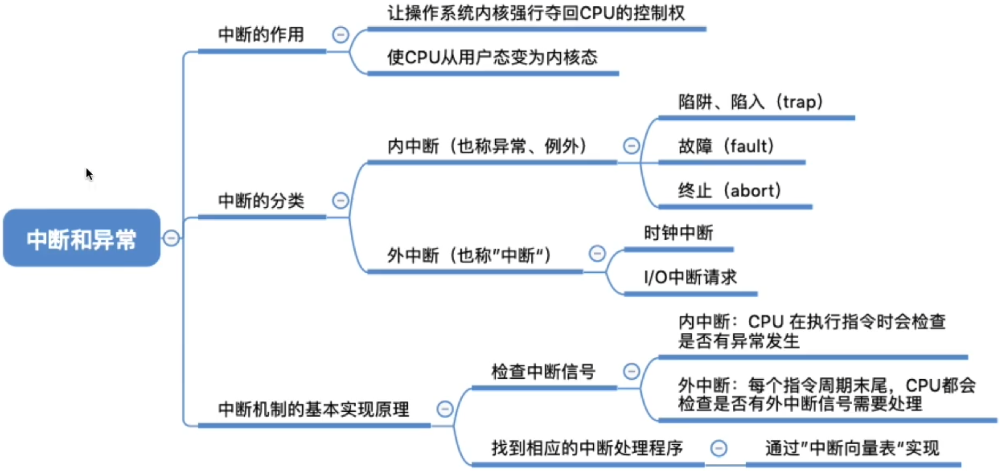
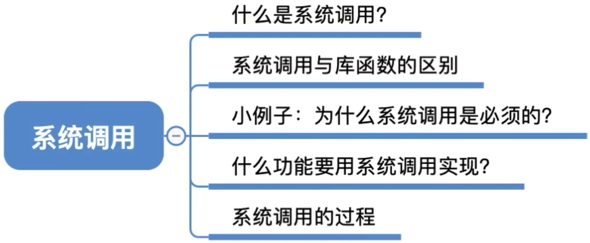
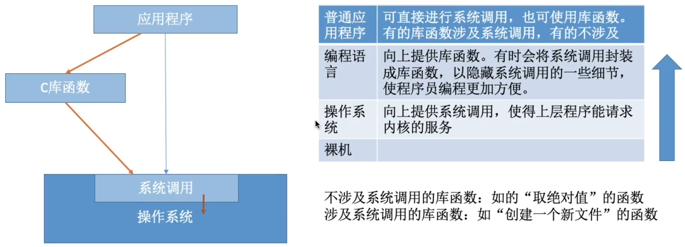
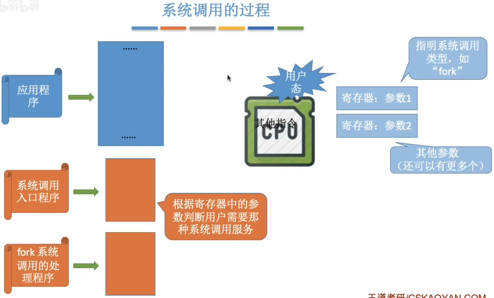
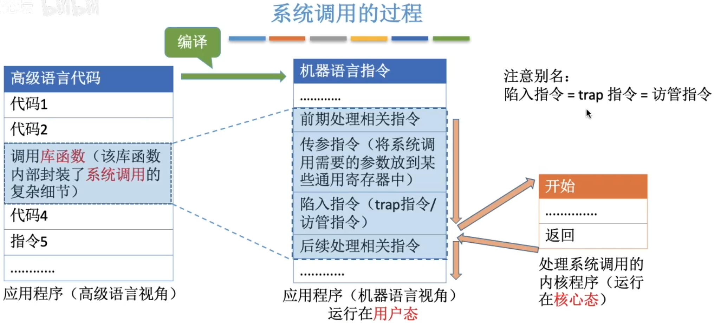
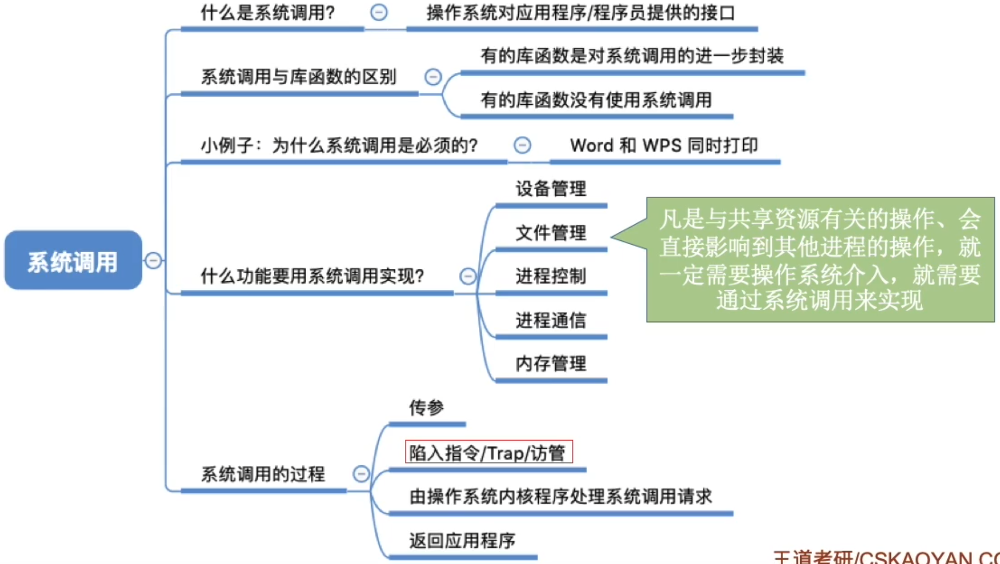

# 算法的基本概念

程序 = 数据结构 + 算法

如何用数据正确地描述现实世界的问题，并存入计算机

如何高效地处理这些数据，以解决实际问题

算法（Algorithm）是对特定问题求解步骤的一种描述，它是指令的有限序列，其中的每条指令表示一个或多个操作

## 算法的特性

有穷性。一个算法必须总在执行有穷步之后结束，且每一步都可在有穷时间内完成。

注：算法必须是有穷的，而程序可以是无穷的

用有限步骤解决某个特定的问题

如：微信是程序，不是算法

确定性。算法中每条指令必须有确切的含义，对于相同的输入只能得出相同的输出。

可行性。算法中描述的操作都可以通过已经实现的基本运算执行有限次来实现。

输入。一个算法有零个或多个输入，这些输入取自于某个特定的对象的集合。

输出。一个算法有一个或多个输出，这些输出是与输入有着某种特定关系的量。

## “好”算法的特质

设计算法时要尽量追求的目标

1. 正确性。算法应能够正确地解决求解问题。

2. 可读性。算法应具有良好的可读性，以帮助人们理解。

3. 健壮性。输入非法数据时，算法能适当地做出反应或进行处理，而不会产生莫名其妙的输出结果。 

4. 高效率与低存储量需求

   花的时间少。时间复杂度低

   不费内存。空间复杂度低

程序设计：

设计一个好的数据结构

设计一个好的算法

算法必须具备的特性

设计算法时要尽量追求的目标

# 算法的时间复杂度

如何评估算法时间开销？

让算法先运行，事后统计运行时间？

存在什么问题？

能否排除与算法本身无关的外界因素

- 和机器性能有关，如：超级计算机v.s.单片机
- 和编程语言有关，越高级的语言执行效率越低
- 和编译程序产生的机器指令质量有关
- 有些算法是不能事后再统计的，如：导弹控制算法

算法时间复杂度

事先预估算法时间开销T(n)与问题规模n的关系（T表示“time”）

问题1：是否可以忽略表达式某些部分？

当问题规模n足够大时...

大O表示“同阶”，同等数量级。即：当n->∞时，二者之比为常数

结论：可以只考虑阶数高的部分

问题1：是否可以忽略表达式某些部分？

只考虑阶数，用大O记法表示

问题2：如果有好几千行代码，按这种方法需要一行一行数？ 

只需考虑最深层循环的循环次数与n的关系

最坏时间复杂度：最坏情况下算法的时间复杂度

平均时间复杂度：所有输入示例等概率出现的情况下，算法的期望运行时间

最好时间复杂度：最好情况下算法的时间复杂度

算法的性能问题只有在n很大时才会暴露出来。

# 算法的空间复杂度

## 程序运行时的内存需求

无论问题规模怎么变，算法运行所需的内存空间都是固定的常量，算法空间复杂度为

S(n) = O(1)

算法原地工作 算法所需内存空间为常量

只需关注存储空间的大小 与问题规模相关的变量

## 函数递归调用带来的内存开销

# 中断和异常

## 中断的作用

CPU上会运行两种程序，一种是操作系统内核程序，一种是应用程序

是整个系统的管理者

在合适的情况下，操作系统内核会把CPU的使用权主动让给应用程序（第二章进程管理相关内容）

“中断”是让操作系统内核夺回CPU使用权的唯一途径

“中断“会使CPU由用户态变为内核态，使操作系统重新夺回对CPU的控制权

如果没有“中断”机制，那么一旦应用程序上CPU运行，CPU就会一直运行这个应用程序

内核态->用户态：执行一条特权指令 修改PSW的标志位为“用户态”，这个动作意味着操作系统将主动让出CPU使用权

用户态->内核态：由“中断”引发，硬件自动完成变态过程，触发中断信号意味着操作系统将强行夺回CPU的使用权

## 中断的类型

## 内中断的例子

与当前执行的指令有关 中断信号来源于CPU内部

例子1：试图在用户态下执行特权指令

例子2：执行除法指令时发现除数为0

若当前执行的指令是非法的，则会引发一个中断信号

例子3：有时候应用程序想请求操作系统内核的服务，此时会执行一条特殊的指令 陷入指令，该指令会引发一个内部中断信号

执行“陷入指令”，意味着应用程序主动地将CPU控制权还给操作系统内核。“系统调用”就是通过陷入指令完成的

## 外中断的例子

与当前执行的指令无关 中断信号来源于CPU外部

例子1：时钟中断 由时钟部件发来的中断信号

时钟部件每个一个时间片（如50ms）会给CPU发送一个时钟中断信号

操作系统内核决定接下来让另一个应用程序上CPU运行

例子2：I/O中断 由输入/输出设备发来的中断信号

当输入输出任务完成时，向CPU发送中断信号

处理I/O中断的内核程序

每一条指令执行结束时，CPU都会例行检查是否有外中断信号

大多数的教材、试卷中，“中断”特指狭义的中断，即外中断。而内中断一般称为“异常”

与当前执行的指令有关，中断信号来自CPU内部

与当前执行的指令无关，中断信号来自CPU外部

由陷入指令引发，是应用程序故意引发的

由错误条件引起的，可能被内核程序修复。内核程序修复故障后会把CPU使用权还给应用程序，让它继续执行下去。如：缺页异常。

由致命错误引起，内核程序无法修复该错误，因此一般不再将CPU使用权还给引发终止的应用程序。如：整数除0、非法使用特权指令

## 中断机制的基本原理

不同的中断信号，需要用不同的中断处理程序来处理。当CPU检测到中断信号后，会根据中断信号的类型去查询“中断向量表”，以此来找到相应的中断处理程序在内存中的存放位置。

显然，中断处理程序一定是内核程序，需要运行在“内核态”

# 系统调用

## 什么是系统调用，有何作用？

操作系统作为用户和计算机硬件之间的接口，需要向上提供一些简单易用的服务。主要包括命令接口和程序接口。其中，程序接口由一组系统调用组成。

“系统调用”是操作系统提供给应用程序（程序员/编程人员）使用的接口，可以理解为一种可供应用程序调用的特殊函数，应用程序可以通过系统调用来请求获得操作系统内核的服务

## 系统调用与库函数的区别

| 普通应用程序 | 可直接进行系统调用，也可使用库函数。 有的库函数涉及系统调用，有的不涉及 |
| ------------ | ------------------------------------------------------------ |
| 编程语言     | 向上提供库函数。有时会将系统调用封装成库函数，以隐藏系统调用的一些细节，使程序员编程更加方便。 |
| 操作系统     | 向上提供系统调用，使得上层程序能请求内核的服务               |
| 裸机         |                                                              |

不涉及系统调用的库函数：如“取绝对值”的函数

涉及系统调用的库函数：如“创建一个新文件”的函数

## 小例子：为什么系统调用是必须的？

思考：如果两个进程可以随意地、并发地共享打印机资源，会发生什么情况？

两个进程并发运行，打印机设备交替地收到WPS和Word两个进程发来的打印请求，结果两篇论文的内容混杂在一起了...

解决方法：由操作系统内核对共享资源进行统一的管理，并向上提供”系统调用“，用户进程想要使用打印机这种共享资源，只能通过系统调用向操作系统内核发出请求。内核会对各个请求进行协调处理。

## 什么功能要用到系统调用？

应用程序通过系统调用请求操作系统的服务。而系统中的各种共享资源都由操作系统内核统一掌管，因此凡是与共享资源有关的操作（如存储分配、I/O操作、文件管理等），都必须通过系统调用的方式向操作系统内核提出服务请求，由操作系统内核代为完成。这样可以保证系统的稳定性和安全性，防止用户进行非法操作。1111111

## 系统调用的过程

注意：

1. 陷入指令是在用户态执行的，执行陷入指令之后立即引发一个内中断，使CPU进入核心态
2. 发出系统调用请求是在用户态，而对系统调用的相应处理在核心态下进行

注意别名：

陷入指令=trap指令=访管指令

凡是与共享资源有关的操作、会直接影响到其他进程的操作，就一定需要操作系统介入，就需要通过系统调用来实现

