# 操作系统体系结构（上）

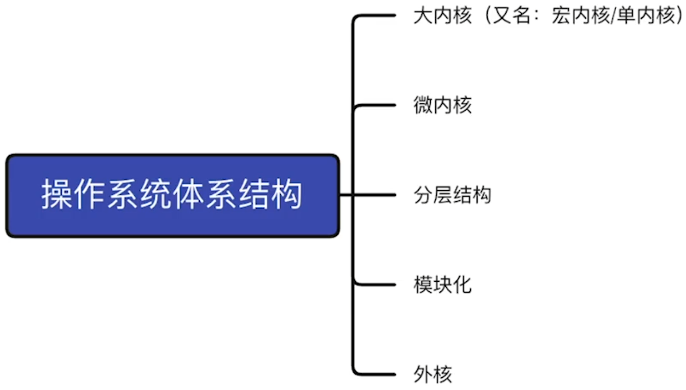

## 操作系统的内核

利用时钟中断实现计时功能

原语是一种特殊的程序，具有原子性。也就是说，这段程序的运行必须一气呵成，不可被“中断”

Ubuntu、CentOS的开发团队，其主要工作是实现非内核功能，而内核都是用了Linux内核

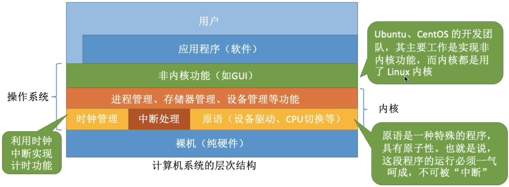

内核是操作系统最基本、最核心的部分。

实现操作系统内核功能的那些程序就是内核程序。

与硬件关联较紧密的模块

这些管理工作更多的是对数据结构的操作，不会直接涉及硬件

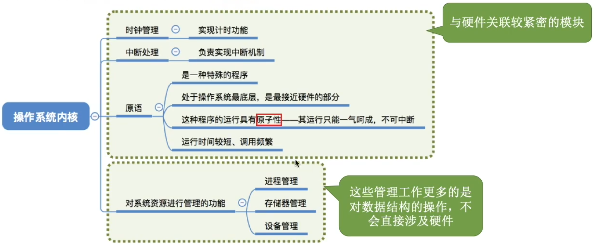

注意：

操作系统内核需要运行在内核态

操作系统的非内核功能运行在用户态

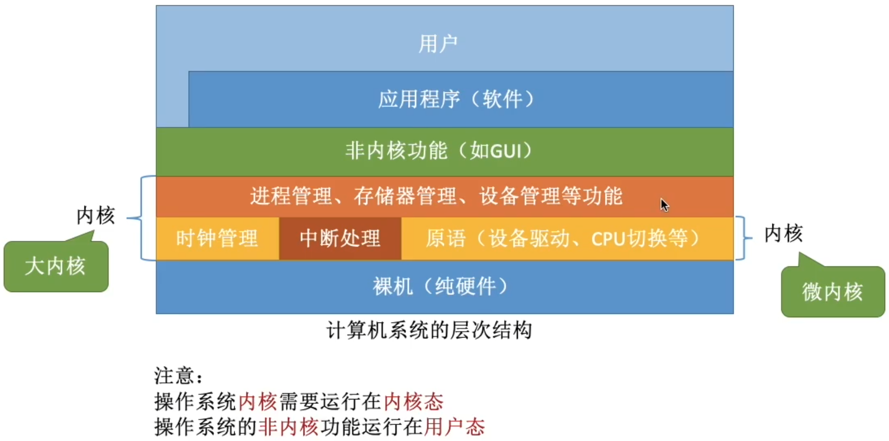

一个故事：现在，应用程序想要请求操作系统的服务，这个服务的处理同时涉及到进程管理、存储管理、设备管理

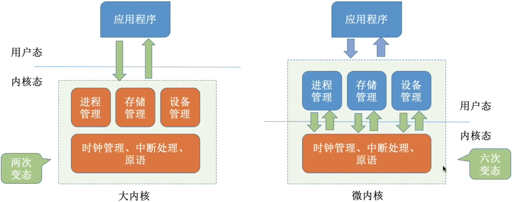

注意：变态的过程是有成本的，要消耗不少时间，频繁地变态会降低系统性能

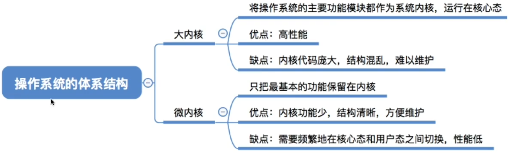

典型的大内核/宏内核/单内核 操作系统：Linux、UNIX

典型的微内核操作系统：Windows NT

# 操作系统体系结构（下）

了解各种体系结构的特性，了解各自的优缺点

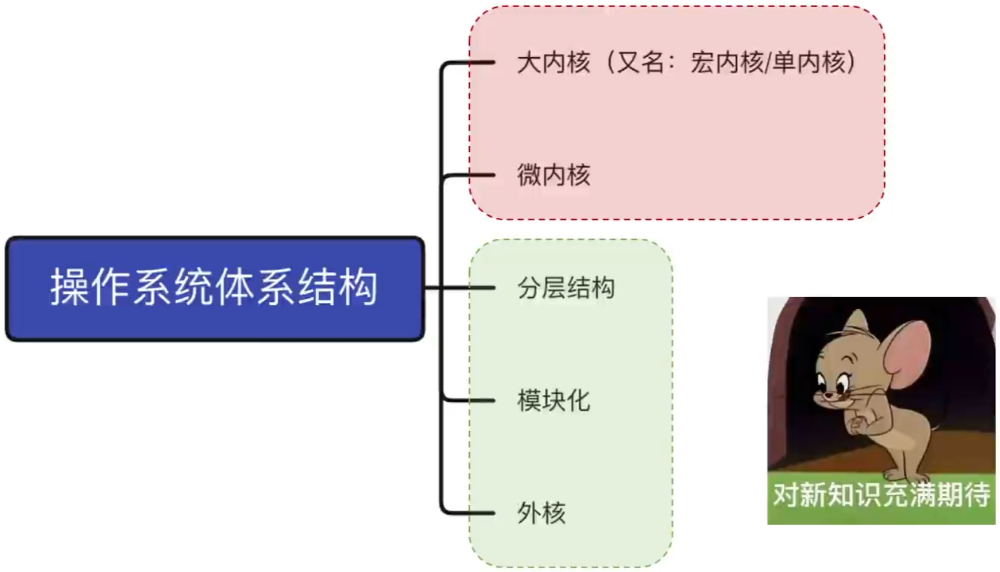

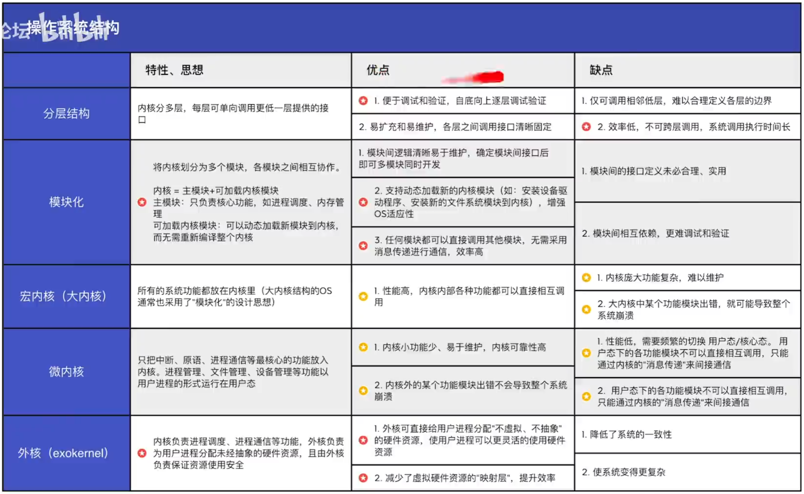

## 分层结构

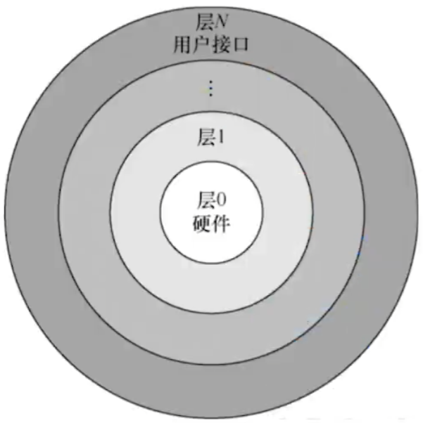

最底层是硬件，最高层是用户接口

每层可调用更低一层

## 结构化

模块化是将操作系统按功能划分为若干个具有一定独立性的模块。每个模块具有某方面的管理功能，并规定好各模块间的接口，使各模块之间能通过接口进行通信。还可以进一步将各模块细分为若干个具有一定功能的子模块，同样也规定好各子模块之间的接口。把这种设计方法称为模块、接口法，图中所示为由模块、子模块等组成的模块化操作系统结构。

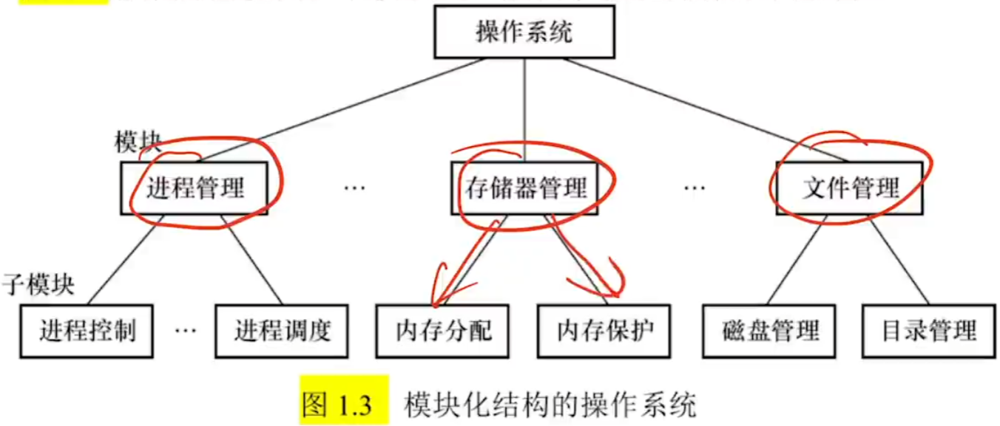

## 外核（exokernel）

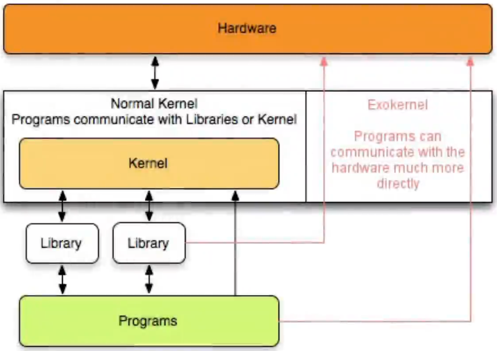

# 操作系统引导

操作系统引导（boot）开机的时候，怎么让操作系统运行起来？

## 操作系统引导（开机过程）

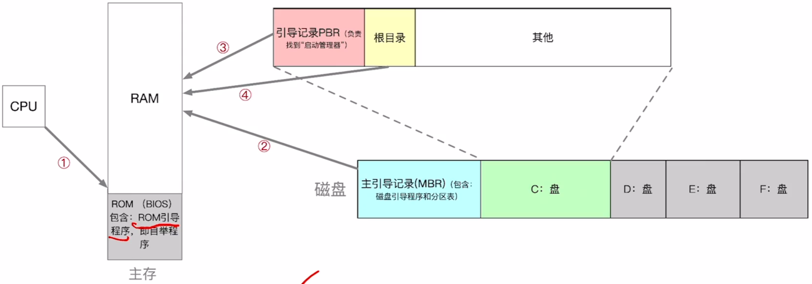

操作系统引导：

1. CPU从一个特定主存地址开始，取指令，执行ROM中的引导程序（先进行硬件自检，再开机）
2. 将磁盘的第一块 主引导记录读入内存，执行磁盘引导程序，扫描分区表
3. 从活动分区（又称主分区，即安装了操作系统的分区）读入分区引导记录，执行其中的程序
4. 从根目录下找到完整的操作系统初始化程序（即启动管理器）并执行，完成“开机”的一系列工作

# 虚拟机

## 传统计算机

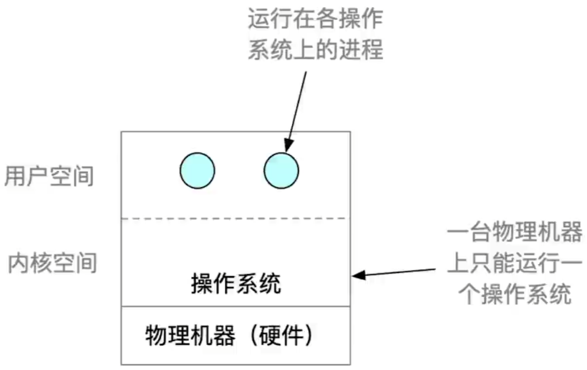

虚拟机：使用虚拟化技术，将一台物理机器虚拟化为多台虚拟机器（Virtual Machine, VM），每个虚拟机器都可以独立运行一个操作系统

同义术语：虚拟机管理程序/虚拟机监控程序/Virtual Machine Monitor/Hypervisor

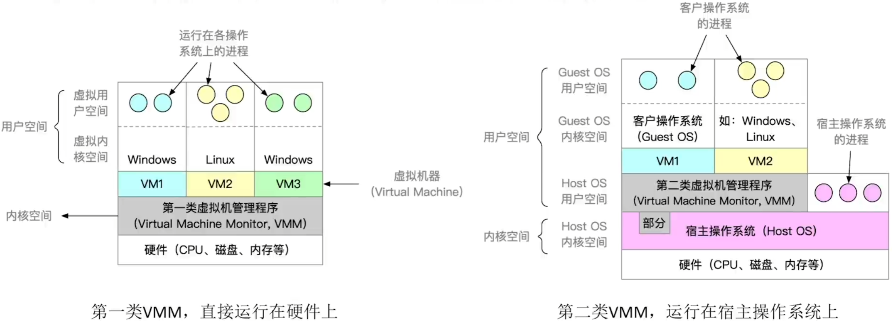

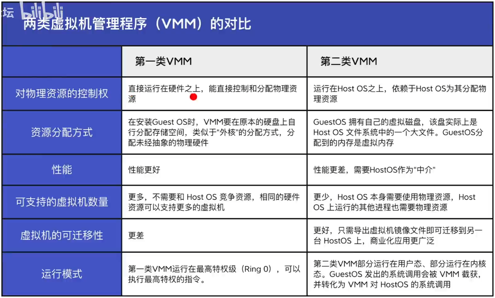

## 支持虚拟化的CPU通常分更多指令等级

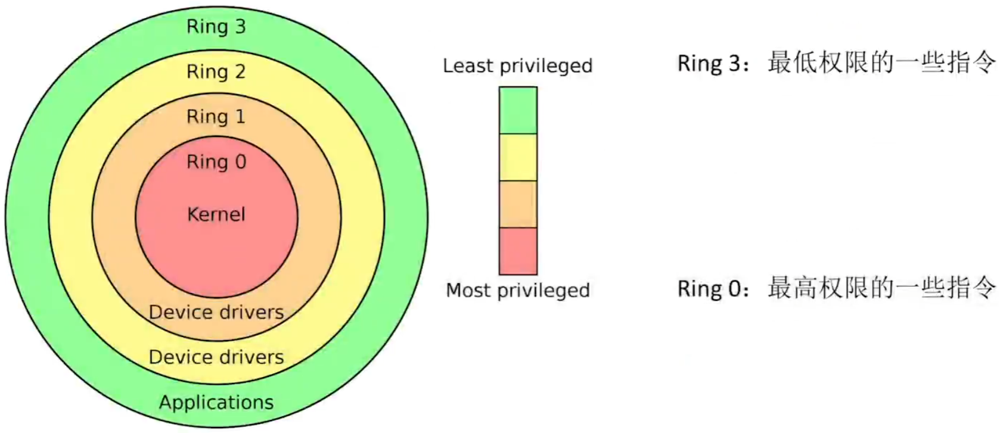