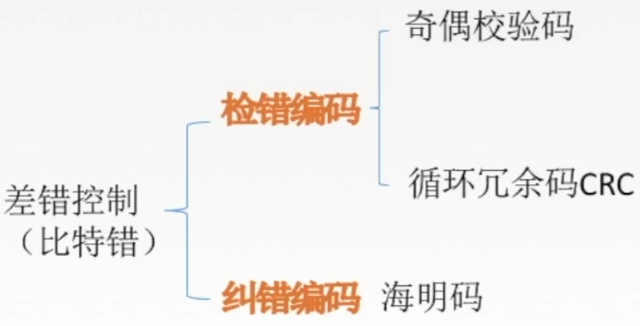

# 操作系统体系结构（上）

## 操作系统的内核

利用时钟中断实现计时功能

原语是一种特殊的程序，具有原子性。也就是说，这段程序的运行必须一气呵成，不可被“中断”

Ubuntu、CentOS的开发团队，其主要工作是实现非内核功能，而内核都是用了Linux内核

内核是操作系统最基本、最核心的部分。

实现操作系统内核功能的那些程序就是内核程序。

与硬件关联较紧密的模块

这些管理工作更多的是对数据结构的操作，不会直接涉及硬件

注意：

操作系统内核需要运行在内核态

操作系统的非内核功能运行在用户态

一个故事：现在，应用程序想要请求操作系统的服务，这个服务的处理同时涉及到进程管理、存储管理、设备管理

注意：变态的过程是有成本的，要消耗不少时间，频繁地变态会降低系统性能

典型的大内核/宏内核/单内核 操作系统：Linux、UNIX

典型的微内核操作系统：Windows NT

# 操作系统体系结构（下）

了解各种体系结构的特性，了解各自的优缺点

## 分层结构

最底层是硬件，最高层是用户接口

每层可调用更低一层

## 结构化

模块化是将操作系统按功能划分为若干个具有一定独立性的模块。每个模块具有某方面的管理功能，并规定好各模块间的接口，使各模块之间能通过接口进行通信。还可以进一步将各模块细分为若干个具有一定功能的子模块，同样也规定好各子模块之间的接口。把这种设计方法称为模块、接口法，图中所示为由模块、子模块等组成的模块化操作系统结构。

## 宏内核、微内核

## 外核（exokernel）

# 操作系统引导

操作系统引导（boot）开机的时候，怎么让操作系统运行起来？

## 操作系统引导（开机过程）

操作系统引导：

1. CPU从一个特定主存地址开始，取指令，执行ROM中的引导程序（先进行硬件自检，再开机）
2. 将磁盘的第一块 主引导记录读入内存，执行磁盘引导程序，扫描分区表
3. 从活动分区（又称主分区，即安装了操作系统的分区）读入分区引导记录，执行其中的程序
4. 从根目录下找到完整的操作系统初始化程序（即启动管理器）并执行，完成“开机”的一系列工作

# 虚拟机

## 传统计算机

虚拟机：使用虚拟化技术，将一台物理机器虚拟化为多台虚拟机器（Virtual Machine, VM），每个虚拟机器都可以独立运行一个操作系统

同义术语：虚拟机管理程序/虚拟机监控程序/Virtual Machine Monitor/Hypervisor

## 支持虚拟化的CPU通常分更多指令等级

# 数据链路层功能概述

## 数据链路层的研究思想

## 数据链路层基本概念

结点：主机、路由器

链路：网络中两个结点之间的物理通道，链路的传输介质主要有双绞线、光纤和微波。分为有线链路、无线链路。

数据链路：网络中两个结点之间的逻辑通道，把实现控制数据传输协议的硬件和软件加到链路上就构成数据链路。

帧：链路层的协议数据单元，封装网络层数据报。

数据链路层负责通过一条链路从一个结点向另一个物理链路直连的相邻结点传送数据报。

## 数据链路层功能概述

数据链路层在物理层提供服务的基础上向网络层提供服务，其最基本的服务是将源自网络层来的数据可靠地传输到相邻结点的目标机网络层。其主要作用是加强物理层传输原始比特流的功能，将物理层提供的可能出错的物理连接改造成为逻辑上无差错的数据链路，使之对网络层表现为一条无差错的链路。

功能一：为网络层提供服务。无确认无连接服务，有确认无连接服务，有确认面向连接服务。有连接一定有确认！

功能二：链路管理，即连接的建立、维持、释放（用于面向连接的服务）

功能三：组帧。

功能四：流量控制。

功能五：差错控制（帧错/位错）。

# 封装成帧和透明传输

## 封装成帧

封装成帧就是在一段数据的前后部分添加首部和尾部，这样就构成了一个帧。接收端在收到物理层上交的比特流后，就能根据首部和尾部的标记，从收到的比特流中识别帧的开始和结束。

首部和尾部包含许多的控制信息，他们的一个重要作用：帧定界（确定帧的界限）。

帧同步：接收方应当能从接收到的二进制比特流中区分出帧的起始和终止。

组帧的四种方法：

1. 字符计数法
2. 字符（节）填充法
3. 零比特填充法
4. 违规编码法

## 透明传输

透明传输是指不管所传数据是什么样的比特组合，都应当能够在链路上传送。因此，链路层就“看不见”有什么妨碍数据传输的东西。

当所传数据中的比特组合恰巧与某一个控制信息完全一样时，就必须采取适当的措施，使收方不会将这样的数据误认为是某种控制信息。这样才能保证数据链路层的传输是透明的。

## 字符计数法

帧首部使用一个计数字段（第一个字节，八位）来标明帧内字符数。

痛点：鸡蛋装在一个篮子里了。

## 字符填充法

1. 当传送的帧是由文本文件组成时（文本文件的字符都是从键盘上输入的，都是ASCII码）。不管从键盘上输入什么字符都可以放在帧里传过去，即透明传输。

2. 当传送的帧是由非ASCII码的文本文件组成时（二进制代码的程序或图像等）。

   就要采用字符填充方法实现透明传输。

## 零比特填充法

操作：

1. 在发送端，扫描整个信息字段，只要连续5个1，就立即填入1个0。
2. 在接收端收到一个帧时，先找到标志字段确定边界，再用硬件对比特流进行扫描。发现连续5个1时，就把后面的0删除。

保证了透明传输：在传送的比特流中可以传送任意比特组合，而不会引起对帧边界的判断错误。

## 违规编码法

曼彻斯特编码

可以用“高-高”，“低-低”来定界帧的起始和终止。

由于字节计数法中Count字段的脆弱性（其值若有差错将导致灾难性后果）及字符填充实现上的复杂性和不兼容性，目前较普遍使用的帧同步法是比特填充和违规编码法。

# 差错控制（检错编码）

## 差错从何而来？

概括来说，传输中的差错都是由于噪声引起的。

全局性

1. 由于线路本身电器特性所产生的随机噪声（热噪声），是信道固有的，随机存在的。

   解决方法：提高信噪比来减少或避免干扰。（对传感器下手）

局部性

2. 外界特定的短暂原因所造成的冲击噪声，是产生差错的主要原因。

   解决方法：通常利用编码技术来解决。

链路层为网络层提供服务：无确认无连接服务，有确认无连接服务，有确认面向连接服务。

通信质量好 有限传输链路

通信质量差的无线传输链路

## 数据链路层的差错控制

## 冗余编码

在数据发送之前，先按某种关系附加上一定的冗余位，构成一个符合某一规则的码字后再发送。当要发送的有效数据变化时，相应的冗余位也随之变化，使码字遵从不变的规则。接收端根据收到码字是否仍符合原规则，从而判断是否出错。

## 编码vs编码

数据链路层编码和物理层的数据编码与调制不同。物理层编码针对的是单个比特，解决传输过程中比特的同步等问题，如曼彻斯特编码。而数据链路层的编码针对的是一组比特，它通过冗余码的技术实现一组二进制比特串在传输过程是否出现了差错。

## 检错编码 奇偶校验码

奇偶校验码

n-1位信息元

1位校验元

如果一个字符S的ASCII编码从低到高依次为1100101，采用奇校验，在下述收到的传输后字符中，那种错误不能检测？

奇偶校验码特点：

只能检查出奇数个比特错误，检错能力为50%。

## 检错编码 CRC循环冗余码

1. 准备待传有效数据
2. 每个组都加上冗余码构成帧再发送
3. 接收方检验

接收端检错过程

把收到的每一帧都除以同样的除数，然后检查得到的余数R。

1. 余数为0，判定这个帧没有差错，接受。
2. 余数为不为0，判定这个帧有差错（无法确定到位），丢弃。

FCS的生成以及接收端CRC检验都是由硬件实现，处理很迅速，因此不会延误数据的传输。

在数据链路层仅仅使用循环冗余检验CRC差错检测技术，只能做到对帧的无差错接收，即“凡是接收端数据链路层接受的帧，我们都能以接近于1的概率认为这些帧在传输过程中没有产生差错”。接收端丢弃的帧虽然曾收到了，但是最终还是因为有差错被丢弃。“凡是接收端数据链路层接收的帧均无差错”。

“可靠传输”：数据链路层发送端发送什么，接收端就收到什么。

链路层使用CRC检验，能够实现无比特差错的传输，但这还不是可靠传输。

# 差错控制（纠错编码）

## 纠错编码 海明码

1. 确定校验码位数r
2. 确定校验码和数据的位置
3. 求出校验码的值
4. 检错并纠错

## 海明距离

两个合法编码（码字）的对应比特取值不同的比特数称为这两个码字的海明距离（码距），一个有效编码集中，任意两个合法编码（码字）的海明距离的最小值称为该编码集的海明距离（码距）。