# 电路的基本原理、加法器设计

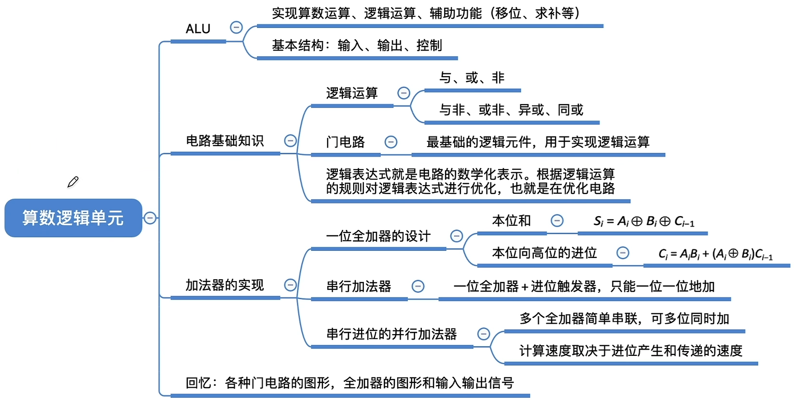

## 算术逻辑单元

Arithmetic and Logic Unit

算术运算：加、减、乘、除等

逻辑运算：与、或、非、异或等

辅助功能：移位、求补等

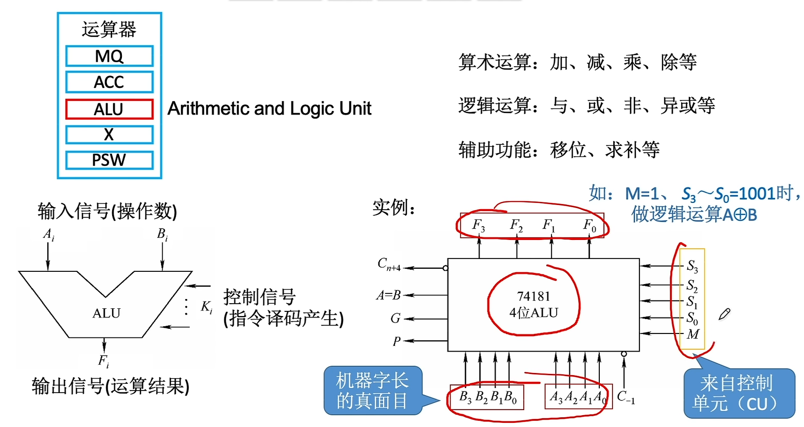
$$
\begin{align}
S_i&=A_i\bigoplus B_i\bigoplus C_{i-1}\\
C_i&=A_iB_i+(A_i\bigoplus B_i)C_{i-1}
\end{align}
$$

## 一位全加器

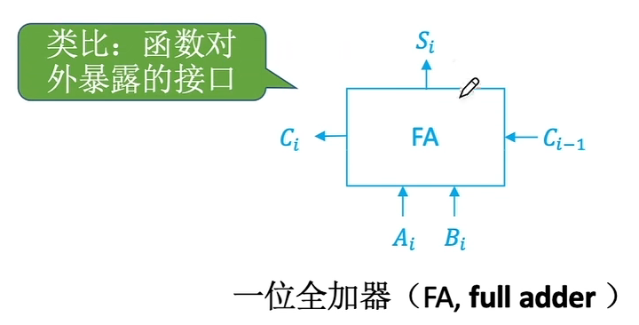

## 串行加法器

串行加法器：只有一个全加器，数据逐位串行送入加法器中进行运算。进位触发器用来寄存进位信号，以便参与下一次运算。

如果操作数长n位，加法就要分n次进行，每次产生一位和，并且串行逐位地送回寄存器。

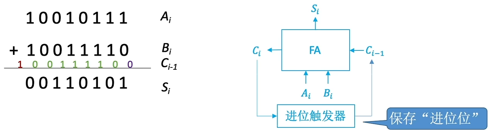

## 并行加法器

串行进位的并行加法器：把n个全加器串接起来，就可进行两个n位数的相加。

串行进位又称为行波进位，每一级进位直接依赖于前一级的进位，即进位信号是逐级形成的。
$$
\begin{align}
C_i&=A_iB_i+(A_i\bigoplus B_i)C_{i-1}\\
S_i&=A_i\bigoplus B_i\bigoplus C_{i-1}
\end{align}
$$
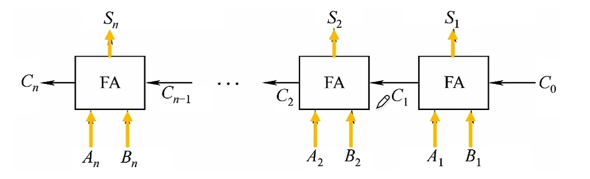

# 并行进位加法器

$$
\begin{align}
G_i&=A_i B_i\\
P_i&=A_i\bigoplus B_i\\
C_i&= A_iB_i+(A_i\bigoplus B_i)C_{i-1}=G_i+P_iC_{i-1}
\end{align}
$$

并行进位的并行加法器：各级进位信号同时形成，又称为先行进位、同时进位

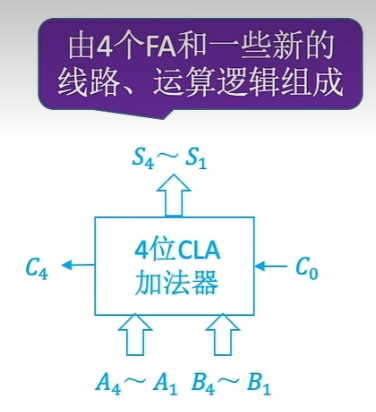

# 补码加减运算器

## 加法器原理

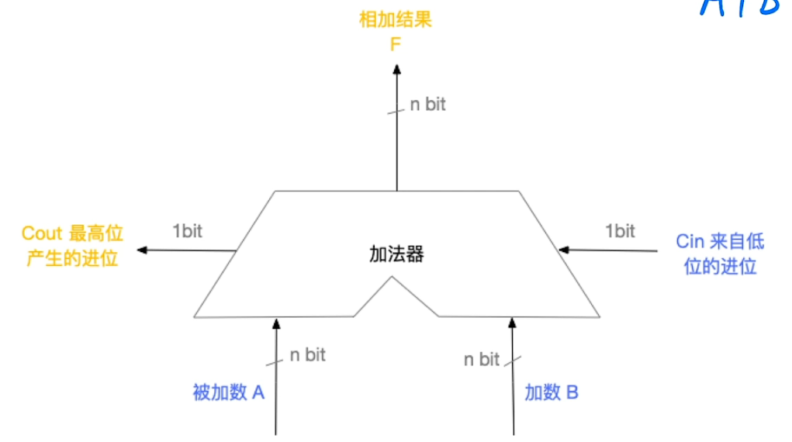

   

## 补码加/减法运算方法

n bit补码X+Y，按位相加即可

n bit补码X-Y，将减数Y全部按位取反，末位+1的到[-Y]补，减法变加法

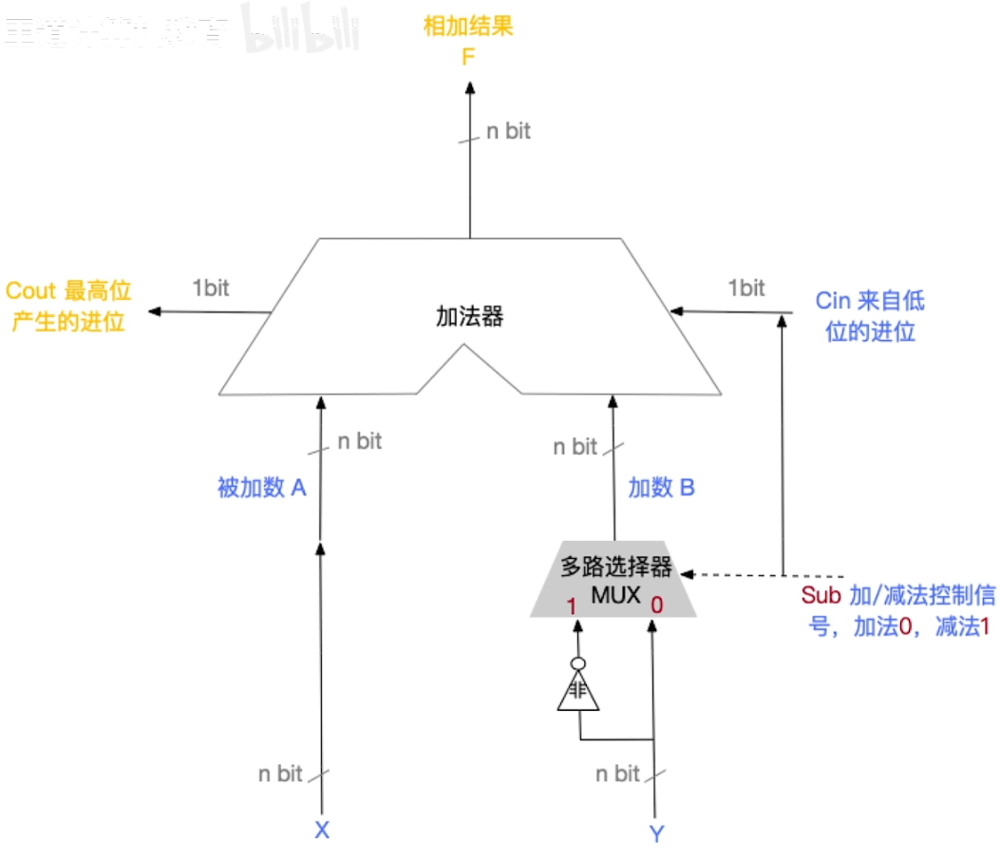

无符号整数的加法/减法也可用该电路实现

n bit无符号数X+Y，按位相加即可

n bit无符号数X-Y，将减数Y全部按位取反，末位+1，减法变加法

# 加减运算和溢出判断

## 原码的加减运算

原码的加法运算：

1. 正+正 -> 绝对值做加法，结果为正
2. 负+负 -> 绝对值做加法，结果为负
3. 正+负 -> 绝对值大的减绝对值小的，符号同绝对值大的数
4. 负+正 -> 绝对值大的减绝对值小的，符号同绝对值大的数

原码的减法运算，”减数“符号取反，转变为加法：

1. 正-负 -> 正+正
2. 负-正 -> 负+负
3. 正-正 -> 正+负
4. 负+正 -> 负-负

## 补码的加减运算

对于补码来说，无论加法还是减法，最后都会转变成加法，由加法器实现运算，符号位也参与运算

## 溢出判断

 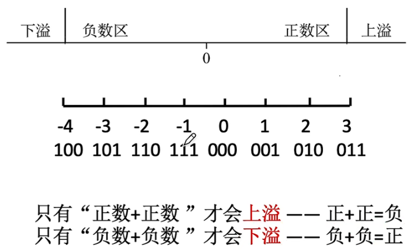

1. 采用一位符号位

   设A的符号为As，B的符号为Bs，运算结果的符号为Ss，则溢出逻辑表达式为
   $$
   V=A_sB_s\overline{S_s}+\overline{A_s}\overline{B_x}S_s
   $$
   若V=0，表示无溢出；

   若V=1，表示有溢出。

2. 采用一位符号位，根据数据位进位情况判断溢出

   |      | 符号位的进位Cs | 最高数值位的进位C1 |
   | ---- | -------------- | ------------------ |
   | 上溢 | 0              | 1                  |
   | 下溢 | 1              | 0                  |

   即：Cs与C1不同时有溢出

   处理”不同“的逻辑符号：异或

   溢出逻辑判断表达式为
   $$
   V=C_s\bigoplus C_1
   $$
   若V=0，表示无溢出；

   若V=1，表示有溢出。

3. 采用双符号位

   正数符号位为00，负数符号位为11

   记两个符号位为Ss1Ss2，则
   $$
   V=S_{S1}\bigoplus S_{S2}
   $$
   若V=0，表示无溢出；

   若V=1，表示有溢出。

实际存储时只存储1个符号位，运算时会复制一个符号位

双符号位补码又称：模4补码

单符号位补码又称：模2补码

## 符号扩展

int->long，短数据->长数据。多出来的那些位应该怎么填补？

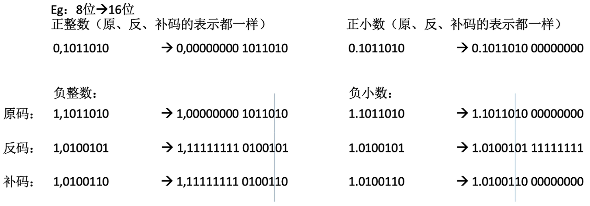

定点整数的符号扩展：

在原符号位和数值位中间添加新位，正数都添0；负数原码添0，负数反、补码添1

定点小数的符号扩展：

在原符号位和数值位后面添加新位，正数都添0；负数原、补码添0，负数反码添1

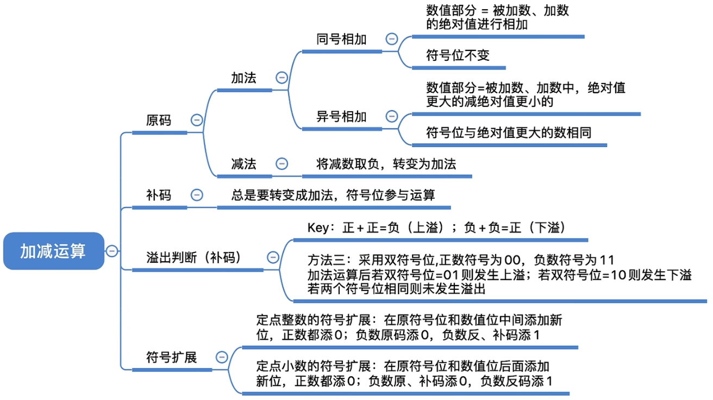

# 标志位的生成

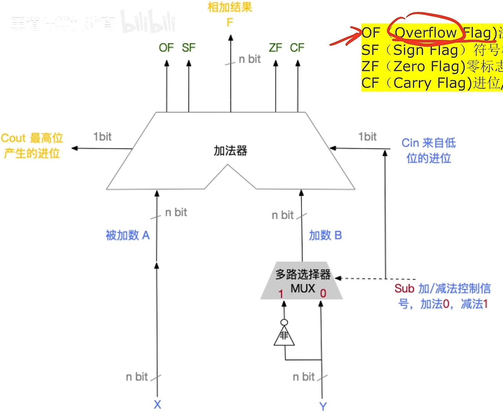

- OF Overflow Flag

  溢出标志。溢出时为1，否则置0。

- SF Sign Flag

  符号标志。结果为负时置1，否则置0。

- ZF Zero Flag

  零标志，运算结果为0时ZF位置1，否则置0。

- CF Carry Flag

  进位/借位标志，进位/借位时置1，否则置0。

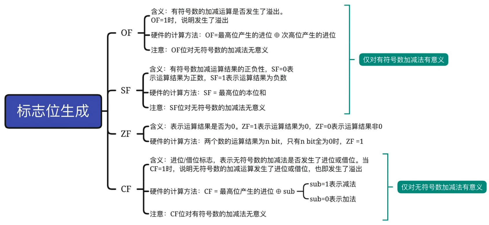

# 定点数的移位运算

## 算术移位

移位：通过改变各个数码位和小数点的相对位置，从而改变各数码位的位权。可用移位运算实现乘法、除法

### 原码的算术移位

符号位保持不变，仅对数值位进行移位。

右移：高位补0，低位舍弃。若舍弃的位=0，则相当于除以2；若舍弃的位不等于0，则会丢失精度

左移：低位补0，高位舍弃。若舍弃的位=0，则相当于乘以2；若舍弃的位不等于0，则会出现严重误差

定点小数同理

### 反码的算术移位

正数的反码与原码相同，因此对正数反码的移位运算也和原码相同。

右移：高位补0，低位舍弃。

左移：低位补0，高位舍弃。

负数的反码数值位与原码相反，因此负数反码的移位运算规则如下，

右移：高位补1，低位舍弃。

左移：低位补1，高位舍弃。

### 补码的算术移位

正数的补码与原码相同，因此对正数补码的移位运算也和原码相同。

右移：高位补0，低位舍弃。

左移：低位补0，高位舍弃。

负数补码=反码末位+1

导致反码最右边几个连续的1都因进位而变为0，直到进位碰到第一个0为止。

规律：负数补码中，最右边的1及其右边同原码。最右边的1的左边同反码、

负数补码的算术移位规则如下：

右移（同反码）：高位补1，低位舍弃。

左移（同原码）：低位补0，高位舍弃。

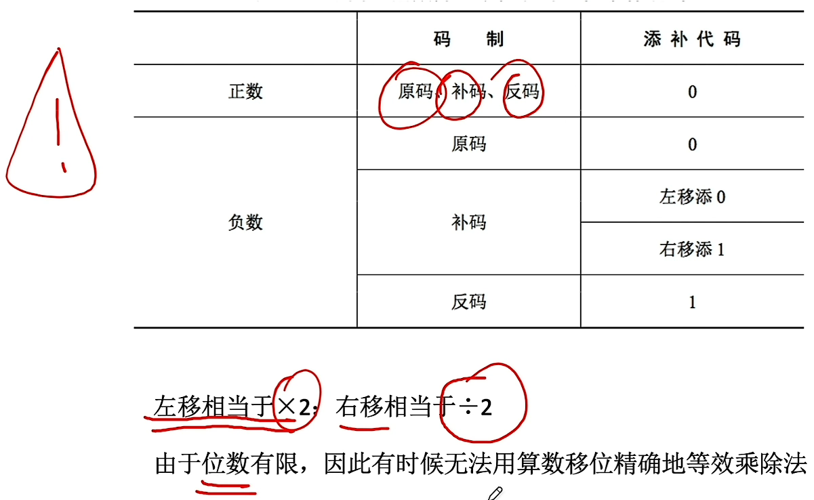

## 逻辑移位

逻辑右移：高位补0，低位舍弃。

逻辑左移：低位补0，高位舍弃。

可以把逻辑移位看作是对“无符号数”的算术移位

## 循环移位

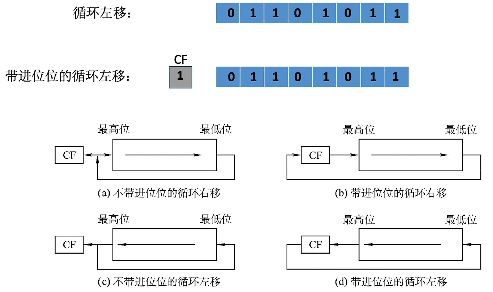

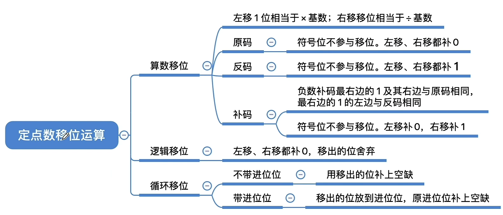

注意：由于原、反、补码位数有限，因此某些时候算术移位不能精确等效乘法除法

# 原码的乘法运算

考虑用机器实现：

- 实际数字有正负，符号位如何处理？
- 乘积的位数扩大一倍，如何处理？
- 4个位积都要保存下来最后统一相加？

符号单独处理：符号位
$$
x_s\bigoplus y_s
$$
数值位取绝对值进行乘法计算

## 运算器的基本组成

运算器：用于实现算术运算（如：加减乘除）、逻辑运算（如：与或非）

|      |                                                        |
| ---- | ------------------------------------------------------ |
| ACC  | 累加器，用于存放操作数，或运算结果。                   |
| MQ   | 乘商寄存器，在乘、除运算时，用于存放操作数或运算结果。 |
| X    | 通用的操作数寄存器，用于存放操作数                     |
| ALU  | 算术逻辑单元，通过内部复杂的电路实现算术运算、逻辑运算 |

|      |                            | 加         | 减         | 乘             | 除           |
| ---- | -------------------------- | ---------- | ---------- | -------------- | ------------ |
| ACC  | Accumulator                | 被加数、和 | 被减数、差 | 乘积高位       | 被除数、余数 |
| MQ   | Multiple-Quotient Register | \          | \          | 乘数、乘积低位 | 商           |
| X    | \                          | 加数       | 减数       | 被乘数         | 除数         |

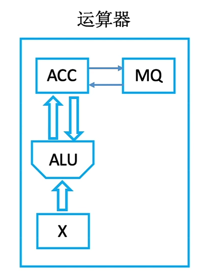

## 原码一位乘法

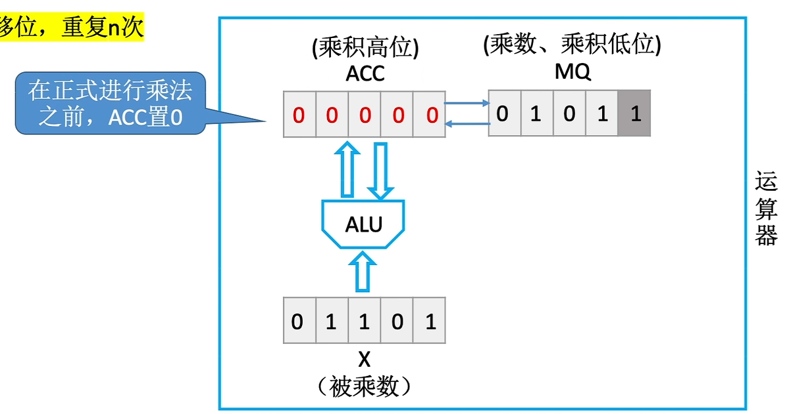

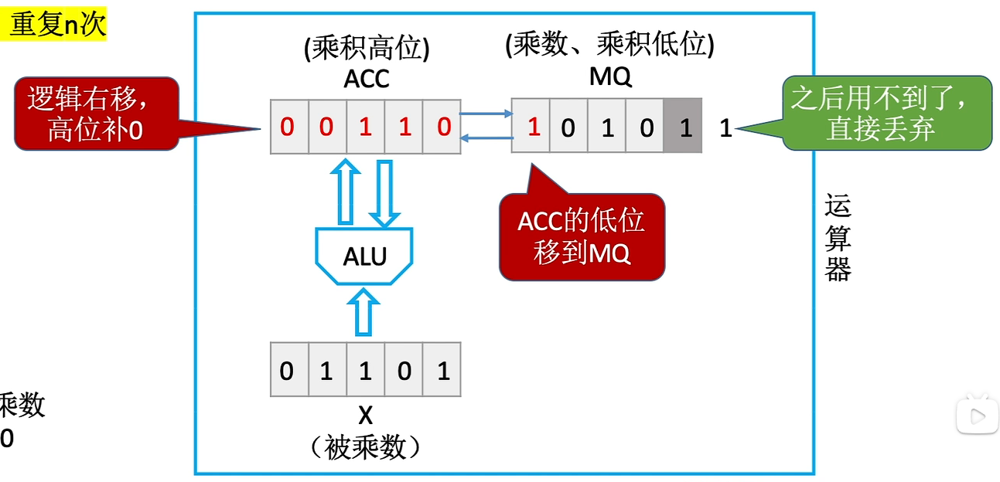

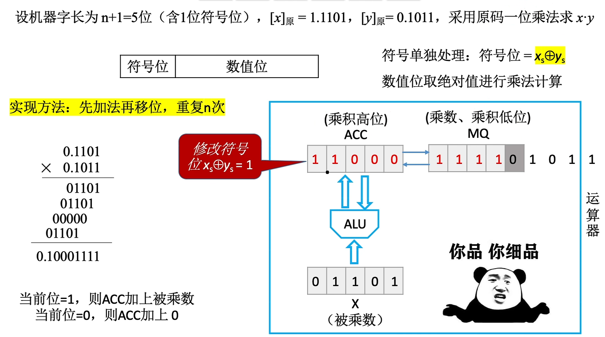

- 乘数的符号位不参与运算，可以省略
- 原码一位乘可以只用单符号位
- 答题时最终结果最好写为原码机器数

原码一位乘法：机器字长n+1，数值部分占n位

符号位通过异或确定；数值部分通过被乘数和乘数绝对值的n轮加法、移位完成

根据当前乘数中参与运算的位确定ACC加什么。若当前运算位=1则
$$
(ACC)+[|x|]_原
$$
若=0，则ACC+0。

每轮加法后ACC、MQ的内容统一逻辑右移

符号位
$$
P_s=x_s\bigoplus y_s=1\bigoplus 0=1
$$
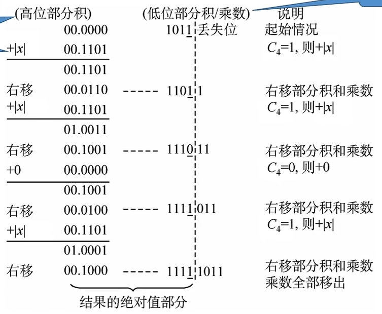

# 补码的乘法运算

1. 原码一位乘法

   - 进行n轮加法、移位

   - 每次移位是逻辑右移

   - 每次加法可能+0、+[|x|]_原

   - 根据当前MQ中的最低位来确定加什么

     MQ中最低位=1时，
     $$
     ACC+[|x|]_原
     $$
     MQ中最低位=0时，
     $$
     ACC+0
     $$

2. 补码一位乘法

   - 进行n轮加法、移位

   - 每次移位是补码的算术右移

   - 最后再多来一次加法+0、+[x]\_补、+[-x]\_补

   - 根据当前MQ中的最低位、辅助位来确定加什么

     辅助位-MQ中最低位=1时，
     $$
     ACC+[x]_补
     $$
     辅助位-MQ中最低位=0时，
     $$
     ACC+0
     $$
     辅助位-MQ中最低位=-1时，
     $$
     ACC+[-x]_补
     $$

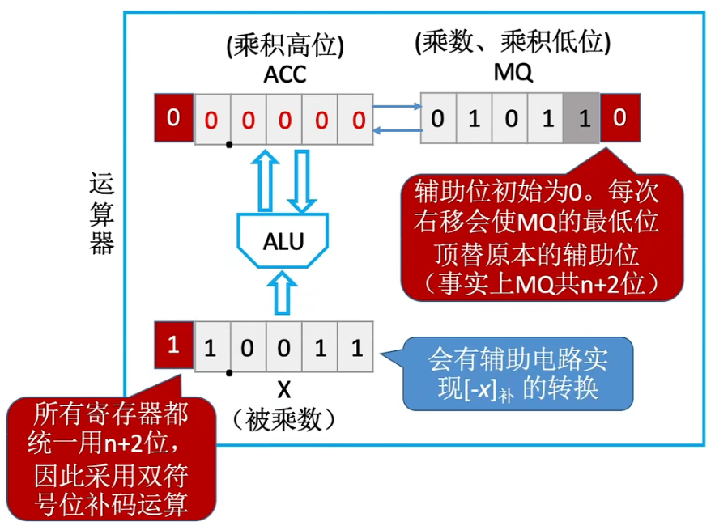

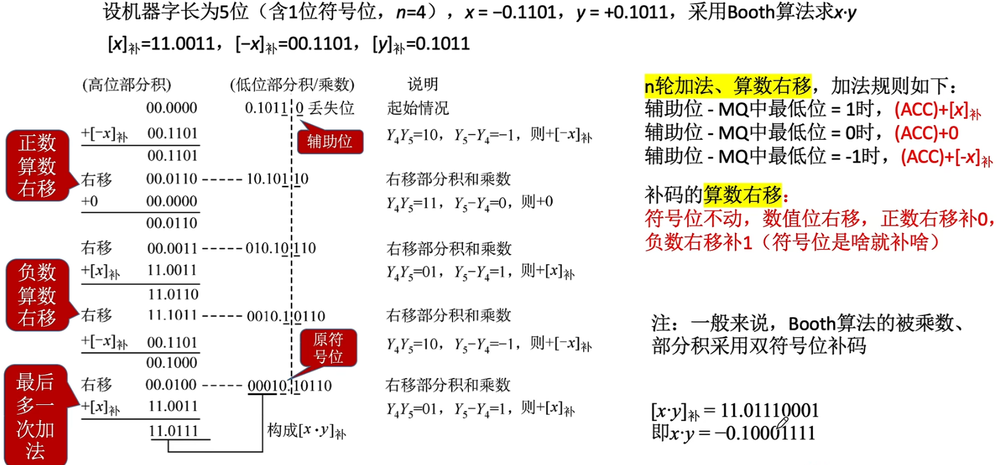

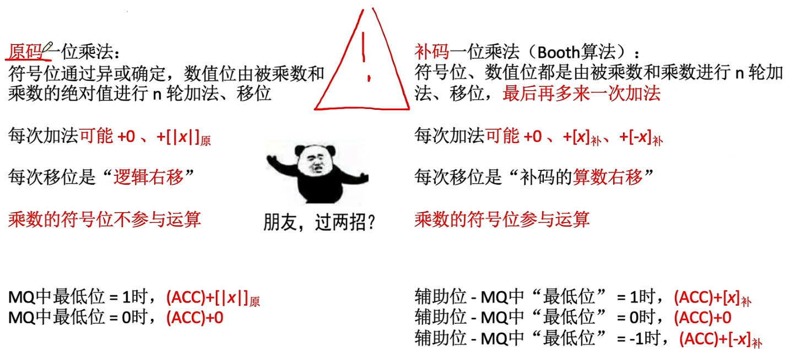

# 原码的除法运算

原码除法：恢复余数法

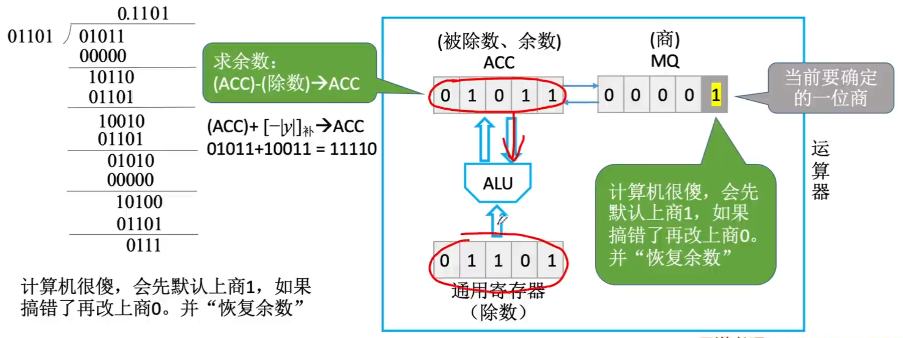

符号位
$$
x_s\bigoplus y_s
$$
数值位取绝对值进行除法计算

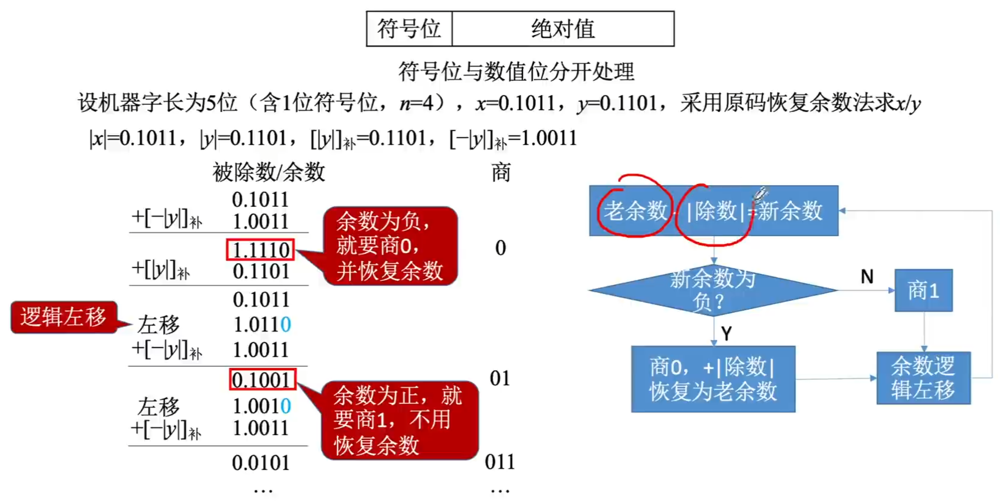

# 补码的除法运算

# C语言类型转换

# 数据的存储和排列

# 浮点数的表示

# IEEE 754

# 浮点数的运算